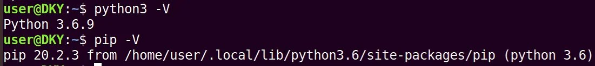

			 							 
PaddleOCR GitHub：https://github.com/PaddlePaddle/PaddleOCR
## 概述
本文主要介绍 GPU 版本的 PaddleOCR 环境搭建及使用方法。

- 目前 PaddlePaddle 仅支持 NVIDIA 显卡的 CUDA 驱动。
- 处理器架构是 x86_64（或称作 x64、Intel 64、AMD64）架构，目前 PaddlePaddle 不支持 arm64 架构。
## 安装 NVIDIA 显卡驱动
注：若 Ubuntu 系统已经安装显卡驱动，可忽略本小节。
关于安装显卡驱动，网上有各种各样的教程，但经过本人测试，最稳定的还是通过命令行进行安装。此方法较为简单，无需手动去英伟达官网下载驱动程序，直接使用命令即可。
首先将系统软件源进行替换，以清华源为例。

| 1

 | sudo gedit /etc/apt/sources.list |
| --- | --- |

编辑上述文件，将其内容替换为：

| 1
2
3
4
5
6
7
8
9
10
11
12
13

 | # 默认注释了源码镜像以提高 apt update 速度，如有需要可自行取消注释
deb https://mirrors.tuna.tsinghua.edu.cn/ubuntu/ bionic main restricted universe multiverse
# deb-src https://mirrors.tuna.tsinghua.edu.cn/ubuntu/ bionic main restricted universe multiverse
deb https://mirrors.tuna.tsinghua.edu.cn/ubuntu/ bionic-updates main restricted universe multiverse
# deb-src https://mirrors.tuna.tsinghua.edu.cn/ubuntu/ bionic-updates main restricted universe multiverse
deb https://mirrors.tuna.tsinghua.edu.cn/ubuntu/ bionic-backports main restricted universe multiverse
# deb-src https://mirrors.tuna.tsinghua.edu.cn/ubuntu/ bionic-backports main restricted universe multiverse
deb https://mirrors.tuna.tsinghua.edu.cn/ubuntu/ bionic-security main restricted universe multiverse
# deb-src https://mirrors.tuna.tsinghua.edu.cn/ubuntu/ bionic-security main restricted universe multiverse
# 预发布软件源，不建议启用
# deb https://mirrors.tuna.tsinghua.edu.cn/ubuntu/ bionic-proposed main restricted universe multiverse
# deb-src https://mirrors.tuna.tsinghua.edu.cn/ubuntu/ bionic-proposed main restricted universe multiverse |
| --- | --- |

接下来依次执行：

| 1
2
3

 | sudo apt update
sudo apt upgrade
sudo ubuntu-drivers autoinstall |
| --- | --- |

网络良好的情况下即可快速安装显卡驱动。
安装好后进行验证：

出现上述内容就表示显卡驱动安装成功了。
## 检查 Python 以及 pip 版本

- Python 的版本要求 3.5.1+/3.6/3.7
- Python 具有 pip, 且 pip 的版本要求 9.0.1+
- Python 和 pip 要求是 64 位版本

对 pip 进行换源，同样以清华源为例：

| 1
2

 | pip install pip -U
pip config set global.index-url https://pypi.tuna.tsinghua.edu.cn/simple |
| --- | --- |

确认 Python 和 pip 是 64 bit，并且处理器架构是 x86_64（或称作 x64、Intel 64、AMD64）架构：

| 1

 | python3 -c "import platform;print(platform.architecture()[0]);print(platform.machine())" |
| --- | --- |

下面的第一行输出的是“64bit”，第二行输出的是“x86_64”、“x64”或“AMD64”即可。
## 安装 CUDA
这里安装 CUDA 10.0 版本，首先进入官网：https://developer.nvidia.com/cuda-10.0-download-archive
按照下图所示选择对应的系统环境，Install Type 选择 runfile (local)，然后点击 Download 进行下载。

下载完成后，执行sudo sh cuda_10.0.130_410.48_linux.run即可开始安装。
安装开始后，首先会出现很长的阅读说明，使用Ctrl + C可直接跳过。
接下来按照步骤进行安装即可，大致流程如下：

---

- 是否同意条款？

输入accept，然后回车。

- Install NVIDIA Accelerated Graphics Driver for ... ?

这里切记不要安装显卡驱动，因为显卡驱动已经安装了最新版本，重复安装此旧版本会导致显卡驱动安装失败。输入n，然后回车。

- Install the CUDA 10.0 Toolkit?

输入y，然后回车。

- Enter Toolkit Location

默认即可，直接回车。

- Do you want to install a symbolic link at /usr/local/cuda?

输入y，然后回车。

---

安装完成后，配置环境变量，在~/.bashrc文件的末尾加上：

| 1
2
3

 | export CUDA_HOME=/usr/local/cuda-10.0
export LD_LIBRARY_PATH=${CUDA_HOME}/lib64
export PATH=${CUDA_HOME}/bin:${PATH} |
| --- | --- |

使用命令source ~/.bashrc使其生效。
使用命令nvcc -V查看安装的版本信息：

出现上述信息则表示 CUDA 安装成功。
## 安装 cuDNN
进入官网：https://developer.nvidia.com/rdp/cudnn-download
下载 cuDNN 需要登录 Nvidia 账号，没有的话可以免费注册。
进入历史版本发布页面：https://developer.nvidia.com/rdp/cudnn-archive
点击“Download cuDNN v7.6.5 (November 5th, 2019), for CUDA 10.0”，再点击“cuDNN Library for Linux”就可以下载了。
下载完成后文件名为：cudnn-10.0-linux-x64-v7.6.5.32.tgz
解压：

| 1

 | tar -zxvf cudnn-10.0-linux-x64-v7.6.5.32.tgz |
| --- | --- |

使用以下命令复制解压后的文件到 CUDA 目录下：

| 1
2

 | cp cuda/lib64/* /usr/local/cuda-10.0/lib64/
cp cuda/include/* /usr/local/cuda-10.0/include/ |
| --- | --- |

至此，cuDNN 安装完成。
## 安装 PaddlePaddle Fluid v2.0
直接使用 pip 进行安装即可：

| 1

 | python3 -m pip install paddlepaddle-gpu==2.0.0b0 |
| --- | --- |

## 克隆 PaddleOCR 代码
| 1

 | git clone https://github.com/PaddlePaddle/PaddleOCR |
| --- | --- |

若网络不佳，可以使用码云上的托管：

| 1

 | git clone https://gitee.com/paddlepaddle/PaddleOCR |
| --- | --- |

## 安装第三方库
| 1
2

 | cd PaddleOCR
pip install -r requirments.txt |
| --- | --- |

## 下载识别模型
以超轻量级模型为例，进入 PaddleOCR 目录下依次执行：

| 1
2
3
4
5
6
7
8

 | mkdir inference && cd inference
# 下载超轻量级中文OCR模型的检测模型并解压
wget https://paddleocr.bj.bcebos.com/20-09-22/mobile/det/ch_ppocr_mobile_v1.1_det_infer.tar && tar xf ch_ppocr_mobile_v1.1_det_infer.tar
# 下载超轻量级中文OCR模型的识别模型并解压
wget https://paddleocr.bj.bcebos.com/20-09-22/mobile/rec/ch_ppocr_mobile_v1.1_rec_infer.tar && tar xf ch_ppocr_mobile_v1.1_rec_infer.tar
# 下载超轻量级中文OCR模型的文本方向分类器模型并解压
wget https://paddleocr.bj.bcebos.com/20-09-22/cls/ch_ppocr_mobile_v1.1_cls_infer.tar && tar xf ch_ppocr_mobile_v1.1_cls_infer.tar
cd .. |
| --- | --- |

解压完毕后应有如下文件结构：
|-inference
?|-ch_ppocr_mobile_v1.1_det_infer
??|- model
??|- params
?|-ch_ppocr_mobile_v1.1_rec_infer
??|- model
??|- params
?|-ch_ppocr_mobile-v1.1_cls_infer
??|- model
??|- params
全部模型详见：https://github.com/PaddlePaddle/PaddleOCR/blob/develop/doc/doc_ch/models_list.md
## 单张图像或者图像集合预测
以下代码实现了文本检测、识别串联推理。相关参数说明：

- 参数image_dir指定单张图像或者图像集合的路径
- 参数det_model_dir指定检测 inference 模型的路径
- 参数rec_model_dir指定识别 inference 模型的路径
- 参数use_angle_cls指定是否使用方向分类器
- 参数cls_model_dir指定方向分类器 inference 模型的路径
- 参数use_space_char指定是否预测空格字符

可视化识别结果默认保存到./inference_results文件夹。

| 1
2
3
4
5
6
7
8

 | # 预测image_dir指定的单张图像
python3 tools/infer/predict_system.py --image_dir="./doc/imgs/11.jpg" --det_model_dir="./inference/ch_ppocr_mobile_v1.1_det_infer/"  --rec_model_dir="./inference/ch_ppocr_mobile_v1.1_rec_infer/" --cls_model_dir="./inference/ch_ppocr_mobile_v1.1_cls_infer/" --use_angle_cls=True --use_space_char=True
# 预测image_dir指定的图像集合
python3 tools/infer/predict_system.py --image_dir="./doc/imgs/" --det_model_dir="./inference/ch_ppocr_mobile_v1.1_det_infer/"  --rec_model_dir="./inference/ch_ppocr_mobile_v1.1_rec_infer/" --cls_model_dir="./inference/ch_ppocr_mobile_v1.1_cls_infer/" --use_angle_cls=True --use_space_char=True
# 如果想使用CPU进行预测，需设置use_gpu参数为False
python3 tools/infer/predict_system.py --image_dir="./doc/imgs/11.jpg" --det_model_dir="./inference/ch_ppocr_mobile_v1.1_det_infer/"  --rec_model_dir="./inference/ch_ppocr_mobile_v1.1_rec_infer/" --cls_model_dir="./inference/ch_ppocr_mobile_v1.1_cls_infer/" --use_angle_cls=True --use_space_char=True --use_gpu=False |
| --- | --- |

以预测单张图像为例：

| 1

 | python3 tools/infer/predict_system.py --image_dir="./doc/imgs/11.jpg" --det_model_dir="./inference/ch_ppocr_mobile_v1.1_det_infer/"  --rec_model_dir="./inference/ch_ppocr_mobile_v1.1_rec_infer/" --cls_model_dir="./inference/ch_ppocr_mobile_v1.1_cls_infer/" --use_angle_cls=True --use_space_char=True |
| --- | --- |

检测结果：

 																								 						

> 来自: [基于 Ubuntu 18.04 的 PaddleOCR 环境搭建及使用 | 码农家园](https://www.codenong.com/js23f622081661/)

