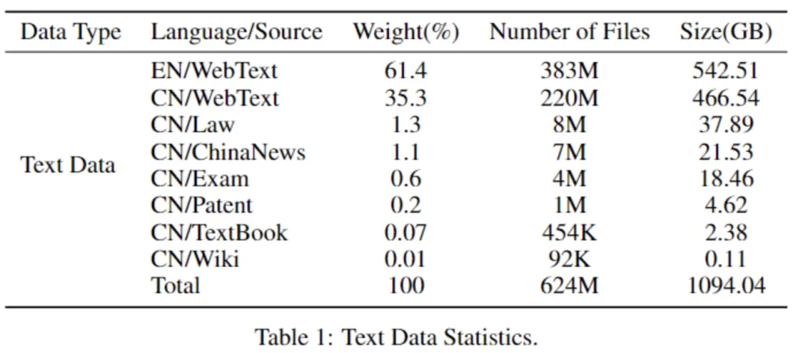
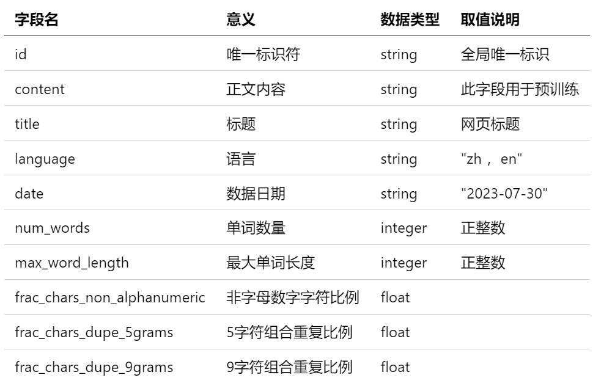
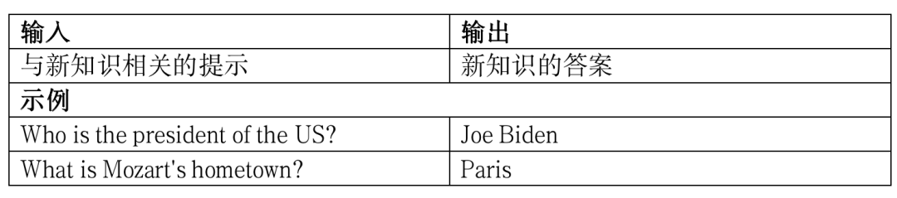
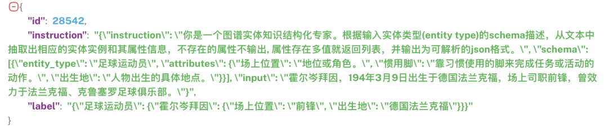

今天是2024年5月16日，星期四，北京，天气晴。
本文来讲讲2个问题，一个是中文开源大规模训练数据的几点启发，一个是两个知识图谱与大模型练手项目，这个可以跟之前所说的KDD-RAG竞赛一起看。
供大家一起参考。
## **问题1:中文开源大规模训练数据的几点启发**
关于中文开源预训数据集，我们已经说过很多，而这些数据那么多的背景下，我们从中能够获得的启示可以想象，**包括数据来源的选择、数据处理的方式，数据存储的格式以及数据时效性上的控制等，这实际上是数据工程上的范畴**。
另外就是，现在公开的中文数据集越来越多，但对于我们而言，怎么用的这个目标很重要。通常会有几个用处：
一个是可以用来改善llama中文问题，llama在处理中文上的能力并不是很够，因此，包括chinesellama等汉化模型，都会使用预训练数据进行增量训练；
一个是直接作为预训练数据进行训练，得到一个base模型；
一个是作为领域预训练数据的一个底裤，领域大模型需要做训练的话，需要大量的领域数据，在这种场景下可以使用该数据集作为底库利用关键词回捞领域数据，比如通过对数据进行打标签处理【有些数据集已经早有标签】，做文本分类模型，或者使用领域关键词进行过滤，得到比如医学、金融、教育等；
一个是作为领域RAG-QA数据的生成来源。当前RAG问答中，为了提高某些特定领域case的问答效果，通常会根据特定的文档通过self-qa或者refgpt的方式快速生成QA对；
一个是作为领域文档生成任务的素材。不同领域的文本有着不同的特点，而创作过程中最重要的就是找到对应的相关素材数据，这个素材数据，可以以这些训练数据为底库，然后配合召回系统进行召回；
一个是作为领域词表和术语的挖掘，这个在词表编撰上是有天然帮助的；
一个是作为历时词语考察的，这个北京语言大学有做流行语，但这依赖于原始数据当中带有时间标签；
当然还有很多其他的用处，大家也可以展开想象。
下面来看看一些现有的公开中文训练数据集。
**1、万卷数据集**
书生·万卷文本数据集1.0由来自网页、百科、书籍、专利、教材、考题等不同来源的清洗后预训练语料组成，数据总量超过5亿个文档，数据大小超过1TB。

地址：https://opendatalab.org.cn/OpenDataLab/WanJuan1_dot_0
**2、wudao数据集**
悟道文本数据集采用20多种规则从100TB原始网页数据中清洗得出最终数据集，包含教育、科技等50+个行业数据标签，可以支持多领域预训练模型的训练。目前开放200GB。
地址：https://openi.pcl.ac.cn/BAAI/WuDao-Data
**3、MVBNC数据集**
MNBVC数据集包括主流文化，也包括各个小众文化甚至火星文的数据。MNBVC数据集包括新闻、作文、小说、书籍、杂志、论文、台词、帖子、wiki、古诗、歌词、商品介绍、笑话、糗事、聊天记录等一切形式的纯文本中文数据。数据均来源于互联网收集。
地址：https://github.com/esbatmop/MNBVC
**4、OpenNewsArchive**
早上看到一个新的数据集，**新闻数据集OpenNewsArchive**，也可看看，27GB，共计880万篇主流新闻报道，包含财经、健康、军事、体育、房产、社会、学术等多个板块分类的新闻内容，数据集中包含的新闻发布日期主要集中在2023年，相较于其他已知的开放新闻数据集，具有较高的时效性，：https://opendatalab.com/OpenDataLab/OpenNewsArchive
在这里，可以稍微提一下的是，**对于我们对数据管理上的一些启示，对于每一条文本记录的数据，我们通常会设计多个字段，例如标题、正文、字符长度、语言类别、唯一id等**。

该数据集中提到的最大单词长度、非字母数字字符比例、5字符组合重合比例，9字符组合重复比例等，可以作为一个筛选项供参考。
```
{
"id": "Bl4ERwIANjygAeAMbr6A",
"content": "如今的NBA，来到一个群雄争霸的时代，因为老一辈超级球星还没完全跌落神坛，像詹姆斯、杜兰特、库里、哈登、欧文等球员，仍能带领球队保持一定的竞争力，与此同时，各新生代年轻球星也冉冉升起，要逐渐成为联盟未来的门面了，最有潜力的当属锡安、亚历山大、福克斯、文班亚马这些球员。",
"title": "轰57+15+8！你们才是NBA最强二人组！东部豪门崛起",
"language": "zh",
"date": "2023-10-19",
"num_words": 870,
"max_word_length": 6,
"frac_chars_non_alphanumeric": 0.10888443553774214,
"frac_chars_dupe_5grams": 0,
"frac_chars_dupe_9grams": 0
}
```
## **问题2:两个知识图谱与大模型练手项目**
关于知识图谱与大模型练手项目。CCKS 2023评测竞赛，https://sigkg.cn/ccks-ijckg2024/evaluation/，大家感兴趣的，可以参加下，里面提到的几个赛题还是很有意思的。
一个是**大模型知识编辑评测**，知识编辑这个方向很新，这，大模型知识编辑方法一般可分为内部更新和外部干预方法。内部更新方法通过定位等方式来对大模型参数进行局部更新，外部干预法则在保留大模型原参数的前提下植入参数补丁或进行提示增强。
知识编辑的目标是通过修改大模型中的特定知识以缓解知识谬误问题。知识编辑通常包含三个基本的设定：**知识新增、知识修改和知识删除。知识新增旨在让大模型习得新知识。知识修改旨在改变已存储在大模型内部的知识。知识删除旨在让大模型遗忘已习得的知识。** 对应的任务形式如下：编辑大模型中的知识，然后给定相关的提示，大模型输出对应知识的答案。

**关于评估侧的指标设计，也有意思，会有些测试上的启发，（这块可以直接）例如：**
成功率，编辑后的模型正确回答提示问题本身且对具有相似表达的输入给出正确答案的概率。
局部性，**没有改变与被编辑知识无关的知识的概率；**
流畅度，衡量编辑后模型的生成能力。即计算bi-gram和tri-gram熵的加权平均值来评估文本生成的多样性。该值的降低表明生成文本的重复性增加。
迁移性，因为知识并不是孤立的，当知识被修正时，模型理应推理出修正的下游影响。该指标评估编辑后的模型能否解决编辑对实际应用的影响，包括编辑某个头实体的知识后，**用别名或同义词替换提示中的头实体，以评估编辑后模型在该头实体描述上的表现**；**组合性和推理，要求编辑后模型对更改后的事实进行推理**。例如，当我们将美国现任总统从Donald Trump改为Joe Biden时，“美国第一夫人是谁？”的答案也需要被改变；**逻辑泛化，与被修改的事实在语义上相关的变化，是编辑预期会发生的变化，评估它们是否确实被修改了**。例如，当（头实体, 关系, 尾实体）被修改时，知识的反向关系（尾实体，反向关系，头实体）也应随之改变。
这块的细节，可以看：http://sigkg.cn/ccks-ijckg2024/wp-content/uploads/2024/05/%E4%BB%BB%E5%8A%A1%E4%B8%80%EF%BC%9A%E5%A4%A7%E6%A8%A1%E5%9E%8B%E7%9F%A5%E8%AF%86%E7%BC%96%E8%BE%91%E8%AF%84%E6%B5%8B.docx，这个任务书。
一个是大模型零样本知识抽取，这个是大模型落地知识图谱的一个范式，**我们之前已经讲过oneke,knowlm等模型，以及iepile等信息抽取数据集，这些数据集可以用来做抽取任务的微调**。这个里面提到的零样本知识抽取，聚焦于设计策略，使得大型预训练模型能够直接对新领域或不熟悉的任务进行操作，无需依赖手动标注的训练数据集。
在任务设计上，要求模型能够理解和遵循抽取指令—一个明确的命令，指导模型找到并格式化所需信息。任务输入包括两部分内容：一是需要处理的文本（input），二是定义了输出结构和内容要求的抽取指令（instruction）。输出是一个结构化的结果，根据抽取指令中提出的格式要求生成。

具体任务书可以查看：http://sigkg.cn/ccks-ijckg2024/wp-content/uploads/2024/05/%E4%BB%BB%E5%8A%A1%E4%BA%8C%EF%BC%9A%E5%A4%A7%E6%A8%A1%E5%9E%8B%E9%9B%B6%E6%A0%B7%E6%9C%AC%E7%9F%A5%E8%AF%86%E6%8A%BD%E5%8F%96%E8%AF%84%E6%B5%8B.docx
## **总结**
本文主要讲了2个问题，一个是中文开源大规模训练数据的几点启发，一个是两个知识图谱与大模型练手项目，开源的项目，相关的竞赛越来越多，但怎么从中找到一些可以启发的点，包括规范的做法这些，都值得关注。
## **参考文献**
1、https://sigkg.cn/ccks-ijckg2024/evaluation/
## **关于我们**
老刘，刘焕勇，NLP开源爱好者与践行者，主页：https://liuhuanyong.github.io。
老刘说NLP，将定期发布语言资源、工程实践、技术总结等内容，欢迎关注。
**对于想加入更优质的知识图谱、事件图谱、大模型AIGC实践、相关分享的，可关注公众号，在后台菜单栏中点击会员社区->会员入群加入。**

> 来自: [大规模中文开源文本训练数据集的几点启发：兼看两个知识图谱与大模型的练手竞赛](https://mp.weixin.qq.com/s/JDkKlD9IKvagCYucPey6UQ)

