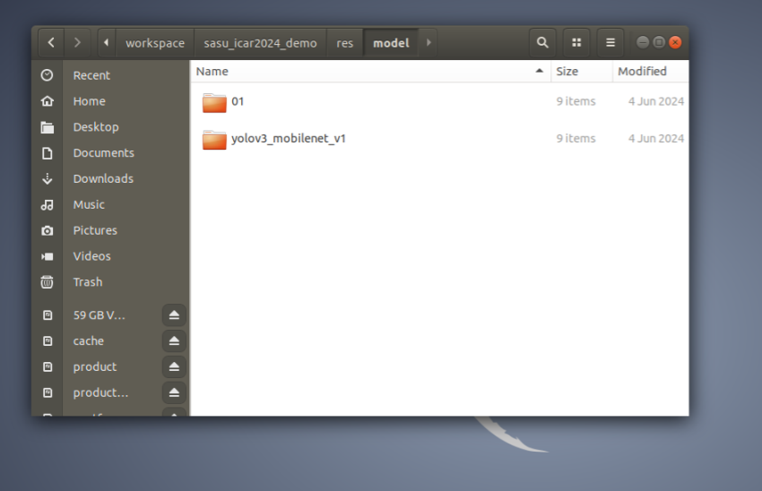

- 开手机热点，电脑，板卡连接到同一个局域网下,查找板卡的ip地址
- finalshell连接板卡 or ssh root@ip
- 连接之后finalshell终端开启vncserver
```
sudo vncserver
```

- 打开vncviewer,然后连接到板卡，密码 edgeboard，连接之后进入Ubuntu密码是root

- 官方代码在sasu_icar2024_demo文件夹中

     路径：root/workspace/sasu_icar2024_demo/res/model/yolov3_mobilenet_v1
```
cd workspace/sasu_icar2024_demo/build/
cmake ../src/
make icar -j
./icar /root/workspace/sasu_icar2024_demo/res/model/yolov3_mobilenet_v1
```




- 上赛道测试代码
```
cd ~/workspace/new_edge_model-副本-含有任务区，入库
cd src/build
#必须要编译时间
date -s "2024-06-06 00:20:00"
cmake ..
make icar -j 
./icar ~/workspace/inference
#之后就会看到帧率

```


