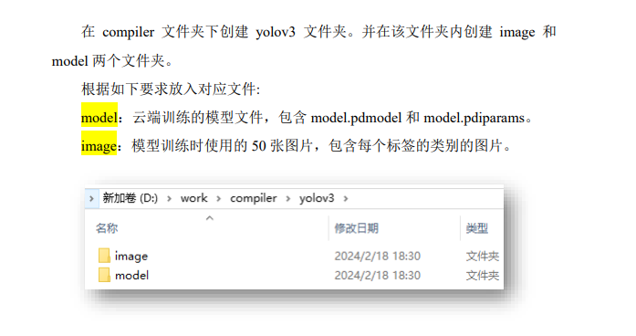

```
sudo yum update -y
sudo yum install -y yum-utils device-mapper-persistent-data lvm2
sudo yum-config-manager --add-repo https://download.docker.com/linux/centos/docker-ce.repo
sudo yum install -y docker-ce docker-ce-cli containerd.io
sudo systemctl start docker
sudo systemctl enable docker

sudo docker --version

sudo curl -L "https://mirrors.aliyun.com/docker-toolbox/linux/compose/1.9.0/docker-compose-Linux-x86_64" -o /usr/local/bin/docker-compose
sudo chmod +x /usr/local/bin/docker-compose
sudo ln -s /usr/local/bin/docker-compose /usr/bin/docker-compose

docker-compose --version

sudo docker pull pphub/ppnc2.0:v1.0.1
mkdir work
sudo docker run -it --cap-add=SYS_PTRACE --name ppnc2.0_docker -v /root/work:/home/edgeboard/workspace pphub/ppnc2.0:v1.0.1 /bin/bash
sudo docker start ppnc2.0_docker
sudo docker exec -it ppnc2.0_docker /bin/bash

source /opt/compiler/scripts/activate_env.sh
mv /home/compiler/ /home/edgeboard/workspace
```

```
cd /home/edgeboard/workspace/compiler
```

```
python3 compile.py ./config.json
```
```
最痛苦的一集，最后一步竟然报错了
```

