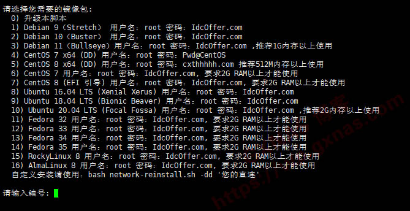

## 好用的一键dd安装Linux系统脚本
2023年3月8日  3条评论  6.7k次阅读  3人点赞  博主 
一键dd安装Linux系统脚本，暂时只支持Debian 9/10/11、Ubuntu 18.04/20.04、Fedora 32+、RockyLinux 8/9、AlmaLinux 8和CentOS 7/8系统的网络重装，脚本自动适配境内境外系统源（境内使用阿里云，境外使用官方），理论上各种VPS通用（不限于腾讯云、阿里云），**脚本不带任何私货！**
[](https://wp.gxnas.com/wp-content/uploads/2023/03/1678241786-dd.jpg)
使用命令：
```
wget -N --no-check-certificate https://down.vpsaff.net/linux/dd/network-reinstall-os.sh && \
chmod +x network-reinstall-os.sh && ./network-reinstall-os.sh
```

---

脚本来源：https://www.idcoffer.com/archives/4870

> 来自: [好用的一键dd安装Linux系统脚本 - GXNAS博客](https://wp.gxnas.com/13051.html)

