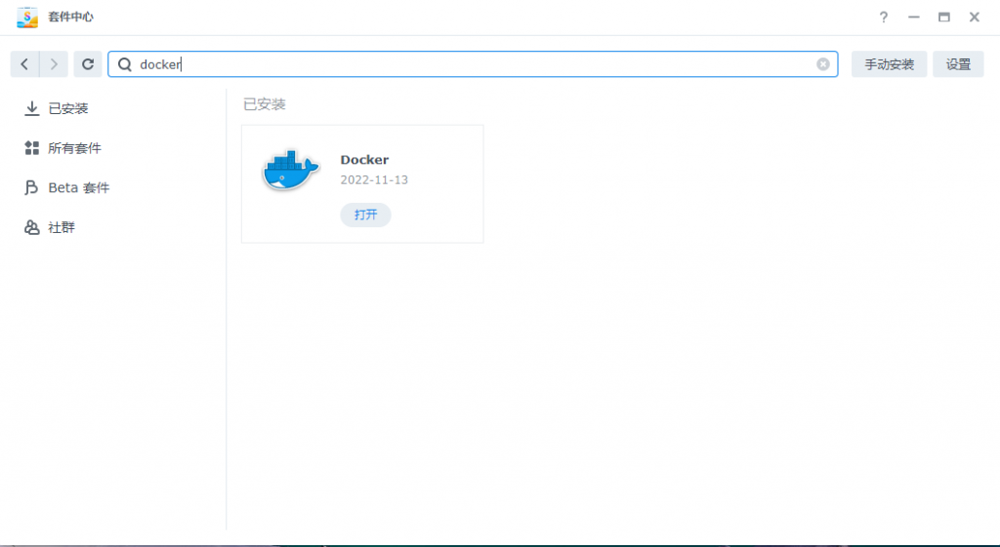
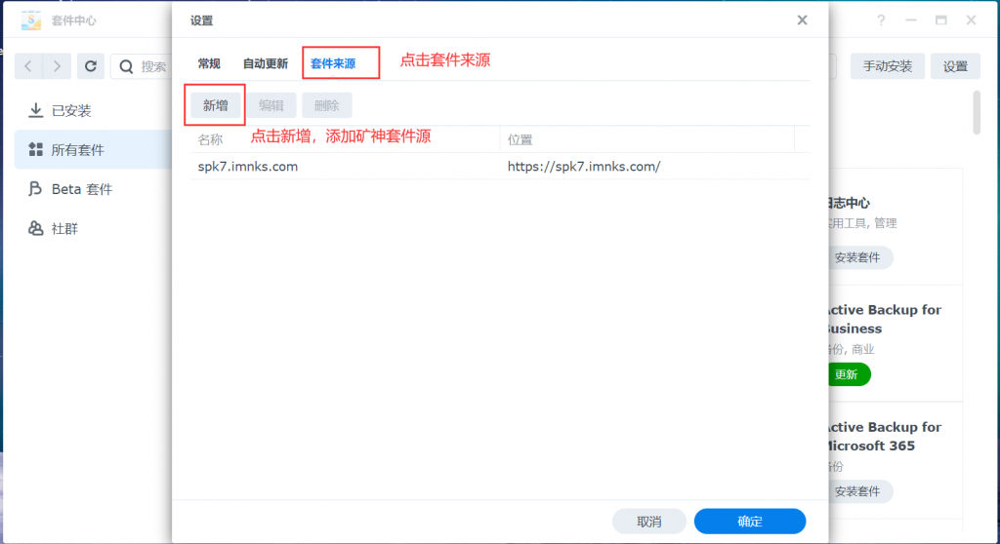

### 官网
[Webos私有云 | Webos私有云](https://os.tenfell.cn/doc/)
### linux环境部署 

---

> 一键命令

```
if [ -f /usr/bin/curl ];then curl -sSO https://support.tenfell.cn/install.sh;else wget -O install.sh https://support.tenfell.cn/install.sh;fi;bash install.sh
```
| 如果已用上方一键部署命令 无需再看下方 |
| --- |

#### 📚自部署快捷步骤 

---

1.安装JDK环境，已有JDK可跳过
```
yum install java-1.8.0-openjdk
```

2.拉去安装包
```
wget https://hub.gitmirror.com/https://github.com/fs185085781/webos/releases/download/v1.0.0/webos.zip
```

3.解压
```
unzip webos.zip
```

4.进入API目录
```
cd api
```

| 如果找不到请自行进入安装目录 如 cd /www/wwwroot/webos/api |
| --- |

5.重新启动程序
```
sh restart.sh
```

6.浏览器访问 [http://网址:8088](http://xn--ses554g:8088/)
#### 📚访问地址 
> 访问地址: [127.0.0.1:8088](http://127.0.0.1:8088/) (如果浏览器不跳转 请访问: [127.0.0.1:8088/webos/init](http://127.0.0.1:8088/webos/init))


---


### 群辉环境部署 
:::info
最后面可以一键在套件中心安装！！！！
:::

---

#### 📚安装前准备 
**1.一台Linux服务器（NAS，云服务器，软路由等）2.设备可正常接入网络**
#### 📚**群辉篇**
**（一）群辉docker套件安装**
**打开你群辉DSM桌面，在套件中心下载docker套件并安装**

**（二）webos镜像下载**
**打开docker套件，点击注册表，在右上角搜索fs185085781/webos并双击选择latest下载**

:::info
这一步会出现注册表失败的问题，我就是，原因是无法科学上网，参考教程
[https://blog.csdn.net/m0_52861000/article/details/135603292](https://blog.csdn.net/m0_52861000/article/details/135603292)
实测有效


1. cmd   
2. ssh admin123@10.10.1.40
3. password :Admin1417
4. sudo -i  #获取root权限，必须要这个
5. docker search webos  
6. #如果要获取其他的，比如说**Uptime Kuma，要加引号，docker search "Uptime Kuma"**
7. docker pull fs185085781/webos
:::

**（三）部署webos**

1. **打开File Station在docker共享文件夹下建立webos（名称可随意）文件夹**


1. 返回docker套件，点击映像，双击刚刚下载好的fs185085781/webos


1. **按下图步骤操作**

第一步

第二步

第三步

第四步

- 添加目录映射
- 主机目录可自己修改
- 容器目录：/webos/api/rootPath（必须按这个填写）
- 插件目录：/webos/web/apps（需要插件持久化的加上这条映射）


第五步

- 点击完成即可


（四）webos系统安装
上述步骤没问题的话，应该可以在docker套装中，容器栏目看到运行起来的webos容器的，然后浏览器输入[http://你群辉ip](http://xn--ip-0p3co44pkvq/):你设置的端口访问，进行系统安装，如果遇到容器运行失败，请按步骤检查
数据库缓存的设置
数据库分为：Sqllite和Mysql
缓存分为：内存和Redis
可根据自己情况选择，设置好后点击验证数据库和验证缓存，设置用户名密码点击保存按钮
注意：这里点击保存后别动它，安装需要一定时间，不可刷新页面，等待安装完成为止。

#### 📚群晖篇（套件安装） 
**2023年6月23日，webos更新群晖套件版，支持群晖套件一键安装，在此非常感谢**[我不是矿神大佬](https://imnks.com/)**的制作。**
**我不是矿神官网： [https://imnks.com/](https://imnks.com/)
**DSM6.x矿神SPK套件源：[https://spk.imnks.com/](https://spk.imnks.com/)
**DSM7.x矿神SPK套件源：[https://spk7.imnks.com/](https://spk7.imnks.com/)
**一、打开群晖套件中心，点击右上角设置添加套件源**

**二、添加矿神的套件源地址**

> **至此结束**


---

