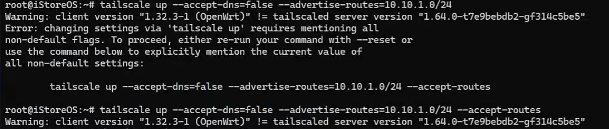

```shell
wget https://github.com/adyanth/openwrt-tailscale-enabler/releases/download/v1.60.0-e428948-autoupdate/openwrt-tailscale-enabler-v1.60.0-e428948-autoupdate.tgz
```

// 可以根据适合的openwrt版本选择合适的tgz包

```shell
tar x -zvC / -f openwrt-tailscale-enabler-v1.60.0-e428948-autoupdate.tgz
```

```shell
opkg update
opkg install libustream-openssl ca-bundle kmod-tun
```

```shell
/etc/init.d/tailscale start
```
//网关根据自己的填写
```shell

tailscale up --accept-dns=false --advertise-routes=10.10.1.0/24 --accept-routes
```


参考链接
[https://github.com/adyanth/openwrt-tailscale-enabler/](https://github.com/adyanth/openwrt-tailscale-enabler/)

