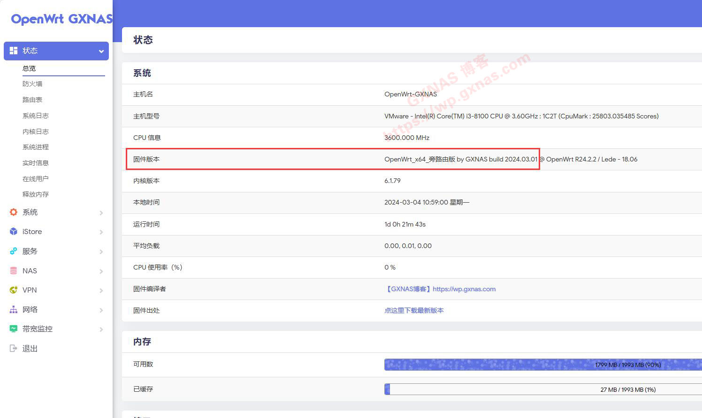
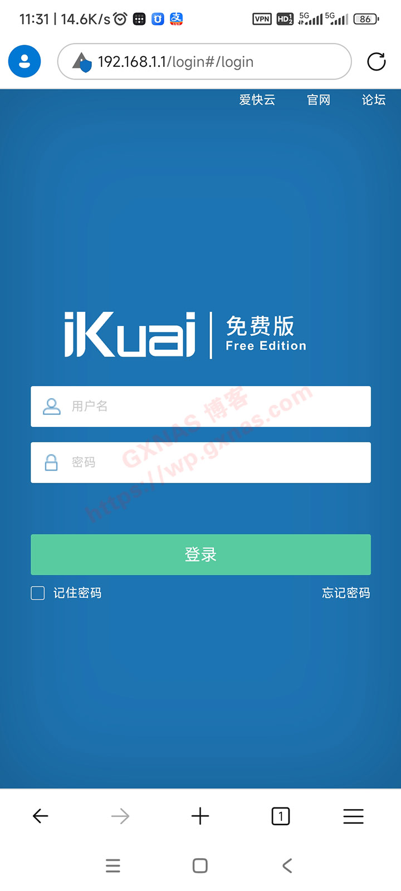
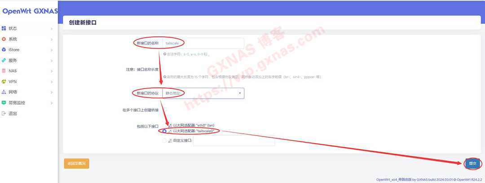

以前写过一篇关于群晖安装Tailscale的教程（如果还不了解Tailscale是什么的，去看“[这篇教程](https://wp.gxnas.com/12873.html)”），考虑到有些小伙伴的NAS并非7*24小时开机或者有些小伙伴没有使用群晖，因此博主把在OpenWrt安装Tailscale设置内网穿透的方法发出来，如果你在使用OpenWrt但是宽带没有公网又想远程访问的，可以按照本教程设置。
**【准备工作】**
在操作之前，需要做一些准备工作：
1、需要准备一个邮箱（支持：谷歌Gmail邮箱、微软outlook邮箱、微软hotmail邮箱、苹果Apple邮箱）或者一个账号（支持：github账号、passkey账号），如果你都没有，建议先去注册（推荐注册微软邮箱）：[https://outlook.live.com/owa/](https://outlook.live.com/owa/)
2、安装好OpenWrt软路由系统，并设置好网络环境，保证能正常运行和访问。

---

**【内网穿透的设置步骤】**
1、本教程使用的OpenWrt固件是博主于2024年3月1自行编译的（博主编译的全功能版、主路由版、旁路由版均可使用），如果你使用的OpenWrt固件并非博主编译的固件或者OpenWrt固件不带应用商店的有可能无法正常使用，如果你使用的OpenWrt固件版本低于该版本的建议升级到此版本或者升级到最新的版本；
[](https://wp.gxnas.com/wp-content/uploads/2024/03/1.jpg)
2、在OpenWrt左边菜单，iStore，全部软件，搜索栏输入tailscale回车，在下图位置显示的tailscale，点“安装”；[](https://wp.gxnas.com/wp-content/uploads/2024/03/2.jpg)
3、软件在安装中，请耐心等待；[](https://wp.gxnas.com/wp-content/uploads/2024/03/3.jpg)
4、安装完成后点右边绿色的按钮关闭本窗口；[](https://wp.gxnas.com/wp-content/uploads/2024/03/4.jpg)
5、点OpenWrt左边菜单，服务，Tailscale，右边显示的服务状态为“未运行”，由于直接在图形界面不好设置，所以需要到命令行去设置；[](https://wp.gxnas.com/wp-content/uploads/2024/03/5.jpg)
6、点OpenWrt左边菜单，系统，TTYD终端，输入超级管理员账号root以及密码，进入root状态下（如果你使用的OpenWrt固件不带TTYD终端，也可以在电脑上使用MobaXterm、Xshell、Putty之类的软件登录到OpenWrt的root状态下）；[](https://wp.gxnas.com/wp-content/uploads/2024/03/6.jpg)
7、输入以下命令回车，启动tailscale：
```
/etc/init.d/tailscale start
```
[](https://wp.gxnas.com/wp-content/uploads/2024/03/7.jpg)
8、输入以下命令回车，设置本设备为局域网出口，如果你的局域网不是192.168.1.X的网段，需要将命令中的192.168.1.0修改你的局域网实际的网段（假设你的openwrt的IP是10.10.10.222，那么命令应该写tailscale up --accept-dns=false --advertise-routes=10.10.10.0/24 --advertise-exit-node，注意命令行中有空格），运行后会弹出一个链接让我们登录，点击该链接：
```
tailscale up --accept-dns=false --advertise-routes=192.168.1.0/24 --advertise-exit-node
```
[](https://wp.gxnas.com/wp-content/uploads/2024/03/8.jpg)
9、在浏览器会弹出需要登录的窗口，登录tailscale（注意：所有的设备必须要登录同一个账号才可以组网）；[](https://wp.gxnas.com/wp-content/uploads/2024/03/9.jpg)
10、登录账号后，点“Connect”；[](https://wp.gxnas.com/wp-content/uploads/2024/03/10.jpg)
11、登录成功，耐心等待一会，会自动进入tailscale的管理后台；[](https://wp.gxnas.com/wp-content/uploads/2024/03/11.jpg)
12、在tailscale的管理后台，可以看到当前组网的设备清单（博主有NAS、台式电脑、OpenWrt旁路由、手机一共4台设备一起组网），其中名称为“openwrt-gxnas”的就是刚刚添加进入的Openwrt软路由，有个绿灯并显示Connected就表示该设备正常联网了，点右边三个小点；[](https://wp.gxnas.com/wp-content/uploads/2024/03/12.jpg)
13、选择“Disable key expiry”，设置该设备的密钥为永不过期；[](https://wp.gxnas.com/wp-content/uploads/2024/03/13.jpg)
14、看到该设备下方有显示“Expiry disabled”就设置成功，再继续点三个小点；[](https://wp.gxnas.com/wp-content/uploads/2024/03/14.jpg)
15、选择“Edit route settings”；[](https://wp.gxnas.com/wp-content/uploads/2024/03/15.jpg)
16、在“192.168.1.0/24”（第8个步骤命令中你写的网段是什么，这里就显示什么）和“Use as exit node”这两处打勾，再点“Save”；[](https://wp.gxnas.com/wp-content/uploads/2024/03/16.jpg)
17、输入命令回车，让tailscale开机自动启动：
```
/etc/init.d/tailscale enable
```
[](https://wp.gxnas.com/wp-content/uploads/2024/03/17.jpg)
18、输入命令回车，查看tailscale是否已经生成开机自动启动的服务，看到有/etc/rc.d/S**tailscale字样（注意S后面的数字不一定跟我的一样）就表示设置成功；
```
ls /etc/rc.d/S*tailscale*
```
[](https://wp.gxnas.com/wp-content/uploads/2024/03/18.jpg)
19、来测试一下远程访问的效果，关闭手机的WIFI使用手机流量来模拟远程访问，先在手机上打开tailscale（登录与OpenWrt同一个账号），然后在手机浏览器打开家里主路由内网IP看看，可以访问；[](https://wp.gxnas.com/wp-content/uploads/2024/03/19.jpg)
20、接着试一下openwrt旁路由的内网IP，OK的；[](https://wp.gxnas.com/wp-content/uploads/2024/03/20.jpg)
21、再试一下群晖NAS，全部使用内网IP，也是没有问题的，相当方便；[](https://wp.gxnas.com/wp-content/uploads/2024/03/21.jpg)
22、好了，操作到这里，你已经可以内网穿透回家，在外网访问家里局域网的设备了。

---

**【科学出国的设置步骤】**
如果你的OpenWrt不具备科学出国的环境，那么请无视此步骤的设置。
如果你使用的OpenWrt具备科学出国的环境，那么可以使tailscale网络内的设备通过OpenWrt代理来实现科学出国，设置步骤（本教程以手机app为例，其他客户端设置方法一样）：
1、打开tailscale手机app，先激活功能（左上角开关处于Active状态），然后点右上角三个小点的下拉菜单，选择“Use exit node...”；
[](https://wp.gxnas.com/wp-content/uploads/2024/03/7-1.jpg)
2、在弹出的小窗口选择在“【内网穿透的设置步骤】”第16步骤中设置的exit node出口设备名称（我这里的设备是“openwrt-gxnas”）；[](https://wp.gxnas.com/wp-content/uploads/2024/03/8-1.jpg)
3、tailscale手机app会多出一行绿色的状态栏，显示exit node出口设备和名称；[](https://wp.gxnas.com/wp-content/uploads/2024/03/9-1.jpg)
4、手机浏览器可以出国了。[](https://wp.gxnas.com/wp-content/uploads/2024/03/10-1.jpg)

---

**【外网互访局域网设备的设置步骤】**
如果你有多个局域网想组成虚拟局域网，每个局域网内的设备不需要安装tailscale客户端也可以相互访，那么除了做完“【内网穿透的设置步骤】”以外，在每个局域网内的exit node出口设备上，还需要设置以下地方：
1、在Openwrt的菜单，网络，接口，添加新接口；
[](https://wp.gxnas.com/wp-content/uploads/2024/03/1-1.jpg)
2、新接口的名称我写的是tailscale，新接口的协议选择“静态地址”，在“包括以下接口”处选择“以太网适配器：tailscale0”，提交；[](https://wp.gxnas.com/wp-content/uploads/2024/03/2-1.jpg)
3、登录【[tailscale后台](https://login.tailscale.com/admin/machines)】，找到“【内网穿透的设置步骤】”第16步骤中设置的exit node出口设备IP地址，记录下来（不要抄我的，写你的exit node出口设备实际IP）；[](https://wp.gxnas.com/wp-content/uploads/2024/03/3-1.jpg)
4、把上一步骤记录的IP地址（是哪个局域网的exit node出口设备IP就写哪个，别搞混淆了），填写到下图的“IPv4地址”处，IPv4子网掩码选“255.0.0.0”；[](https://wp.gxnas.com/wp-content/uploads/2024/03/4-1.jpg)
5、点击“防火墙设置”，创建/分配防火墙区域选择“LAN”，点“保存/应用”；[](https://wp.gxnas.com/wp-content/uploads/2024/03/5-1.jpg)
6、把以下三行内容复制，到“防火墙”、“自定义规则”处粘贴，再点一下“重启防火墙”；
```
iptables -I FORWARD -i tailscale0 -j ACCEPT
iptables -I FORWARD -o tailscale0 -j ACCEPT
iptables -t nat -I POSTROUTING -o tailscale0 -j MASQUERADE
```
[](https://wp.gxnas.com/wp-content/uploads/2024/03/6-1.jpg)
7、把需要做互通的网络，全部按照上面的设置好以后，所有局域网内的设备不需要安装tailscale客户端，相互之间都可以访问，实现大内网组网。

> 来自: [OpenWrt安装Tailscale设置内网穿透+科学出国+外网互访局域网设备 - GXNAS博客](https://wp.gxnas.com/14248.html)

