## 准备
- 群晖NAS
- 华硕路由器，前提配置好 AiMesh 和 网络环境
- 记住自己的路由器的 IP和网关 。
## 软件

1. 下载最新的 [iStoreOS 固件包](https://fw.koolcenter.com/iStoreOS/x86_64/) (以 21.02.3-2022102715-x86-64 为例）
2. 群晖安装最新的 [Virtual Machine Manager](https://www.synology.cn/zh-cn/dsm/feature/virtual_machine_manager)（以 DSM7.1.1 和 VM2.6.1-12139 演示，以下简称VM）
3. [iStoreOS文档](https://doc.linkease.com/zh/guide/istoreos/install.html)
4. [iStoreOS 插件包](https://github.com/AUK9527/Are-u-ok)（x86_64平台）
## 教程：
### 1、安装镜像
1、将下载好的 iStoreOS 固件 21.02.3-2022102715-x86-64.img.gz 文件解压得到 .img 固件镜像。
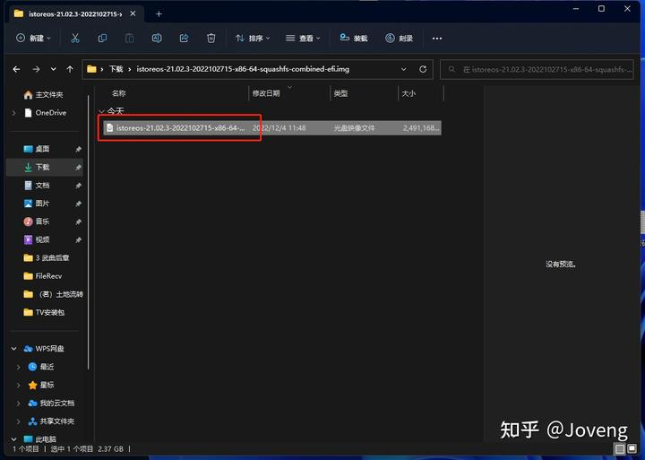
.img格式的固件
2、登入群晖后台 > 打开 VM > 检查 网络 和 储存空间 已 创建完毕。
> 此处不做解释

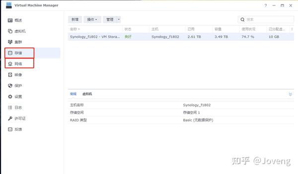
检查网络和空间是否创建
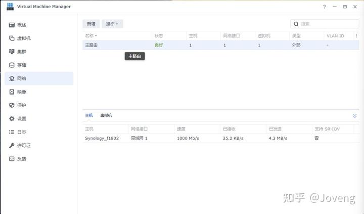
3、添加解压好的格式为 .img 的 iStoreOS固件包
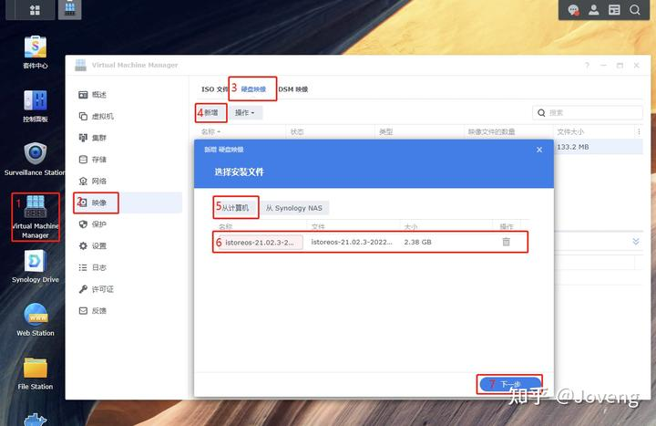
添加镜像

选择储存空间
状态良好表示已创建完成
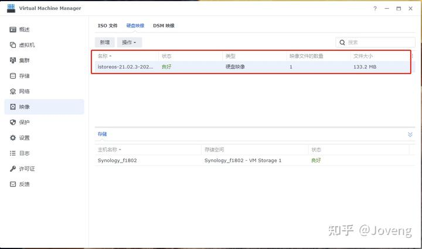
4、添加 iStoreOS
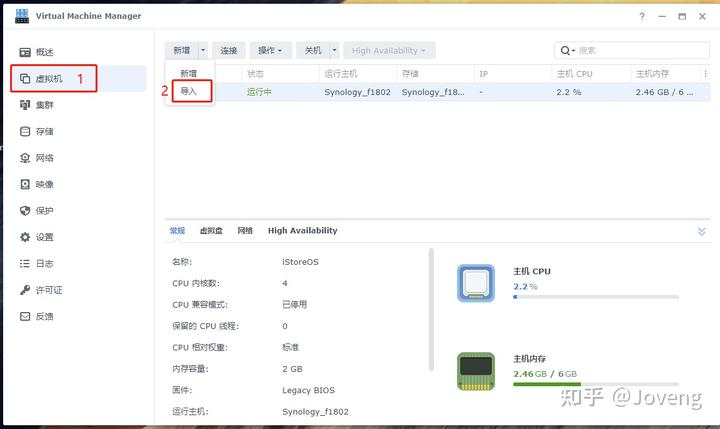
导入固件
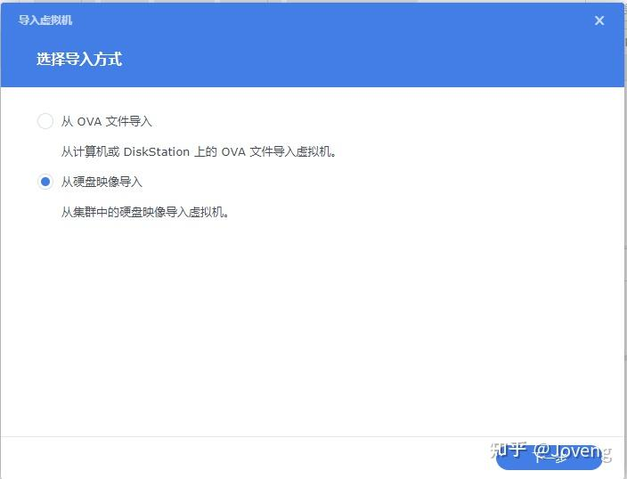
选择硬盘导入
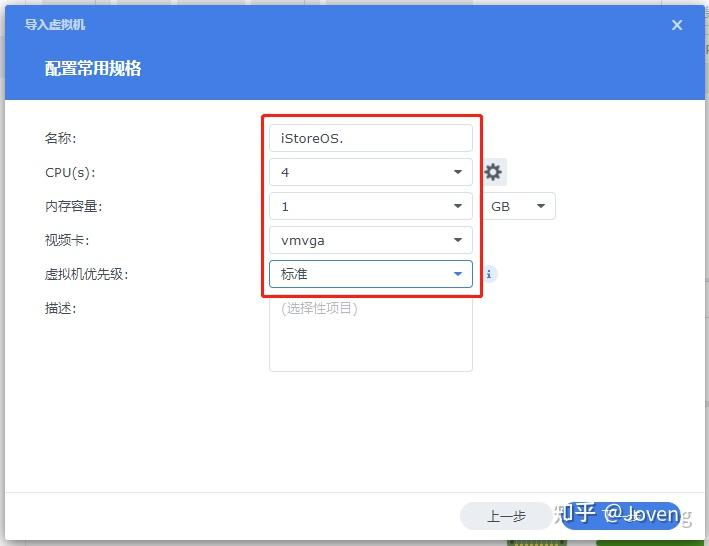
输入参数
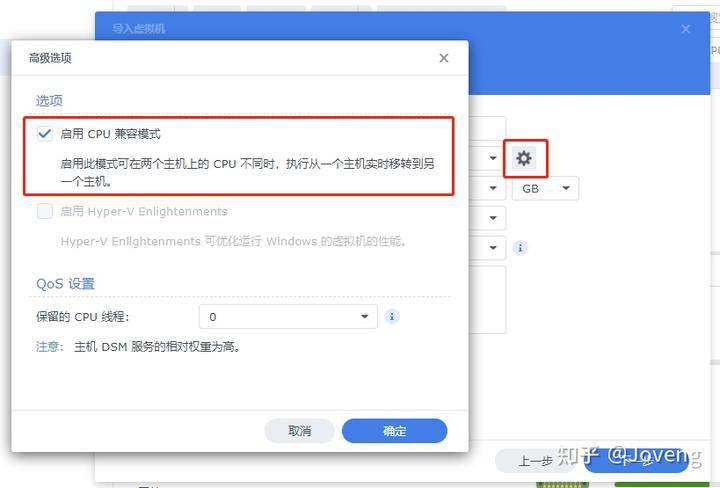
启动CPU兼容模式
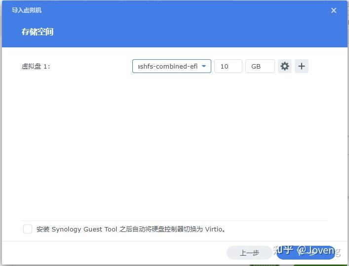
储存空间最小10G

选择你设置好的网络
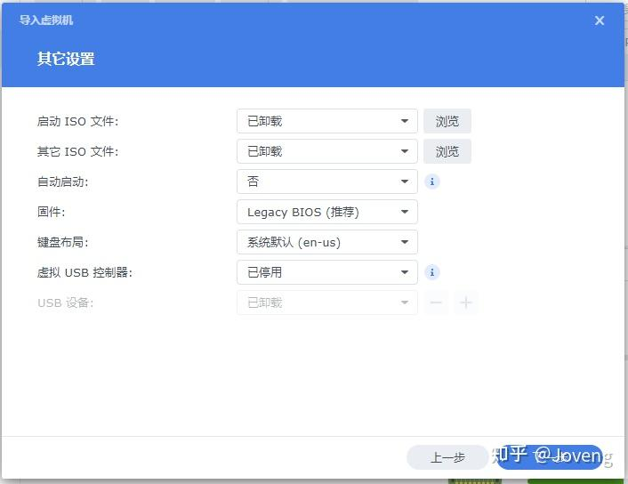
其他设置：默认参数
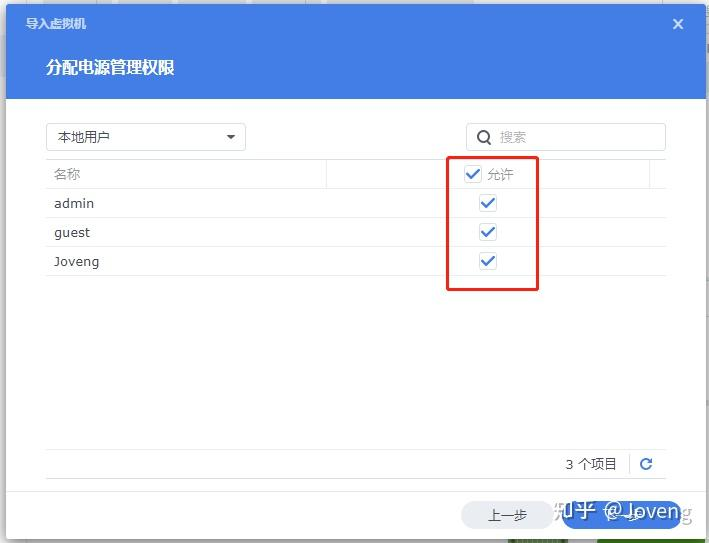
按需求选择
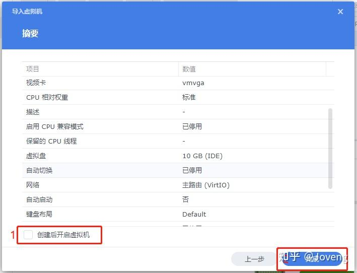
完成设置
### 2、配置 iStoreOS
1、连接 iStoreOS
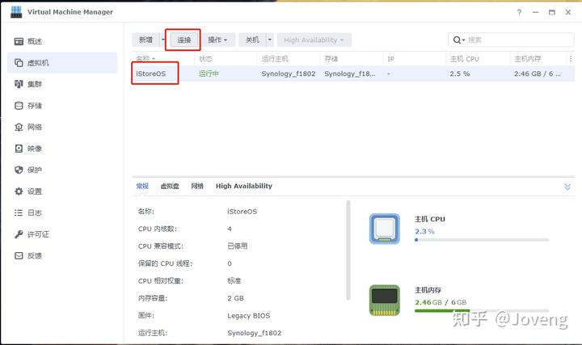
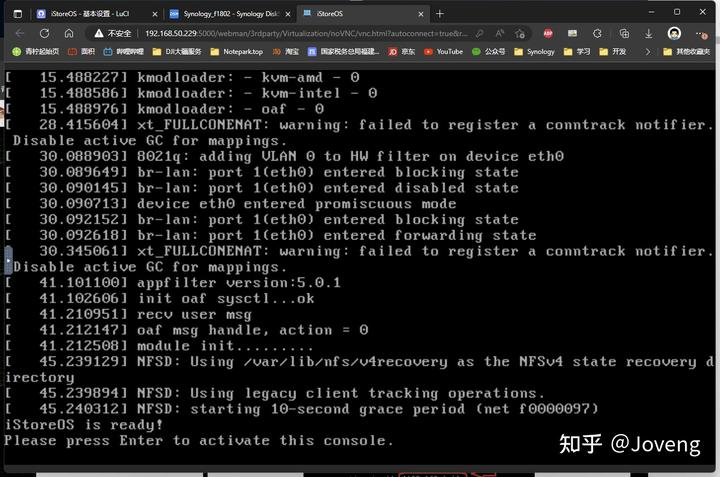
稍等片刻后，点回车
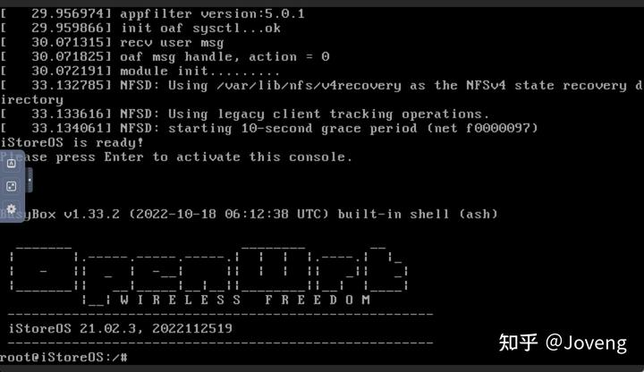
安装成功
6、为 iStoreOS 设置相同 网关 下的 IP地址
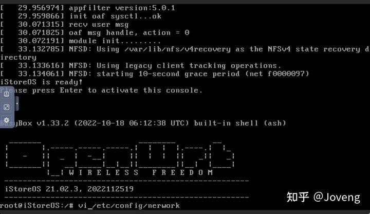
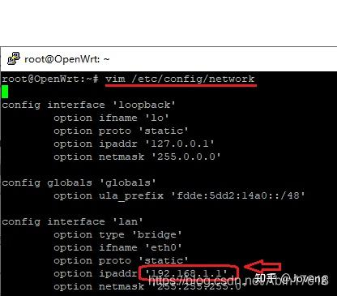
```
option gateway '192.168.50.1'
```
修改为（按需求修改）
```
option gateway '192.168.50.2'
```
修改后单击 esc > 输入 :wq >单击回车退出
继续输入 reboot ，点击 回车 重启
### 3、旁路由模式
7、进入iStoreOS，浏览器打开 192.168.50.2，初始密码：password，设定旁路由模式。
接下来可以观看视频教程（文图以方法二设置）
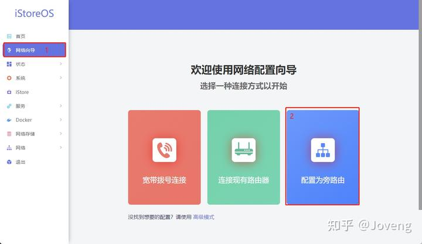
选择旁路由
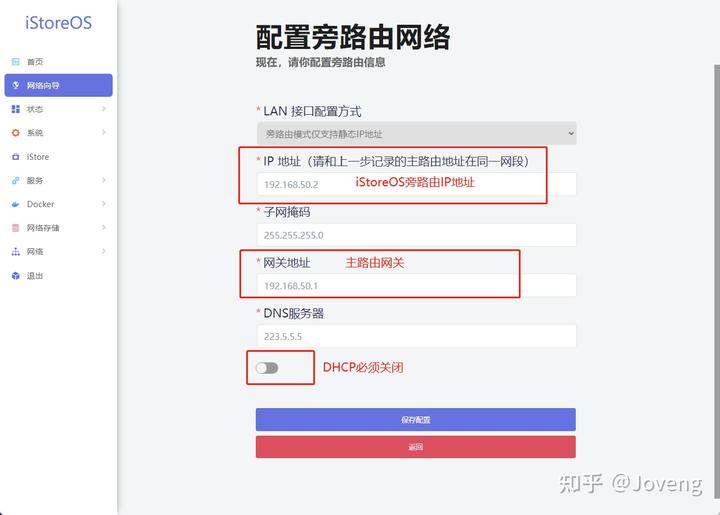
设置参数，保存参数
8、进入华硕路由器后台：192.168.50.1 或 [http://router.asus.com](http://router.asus.com/)
进入DHCP： 内部网络（LAN） > [DHCP 服务器](http://192.168.50.1/Advanced_DHCP_Content.asp)
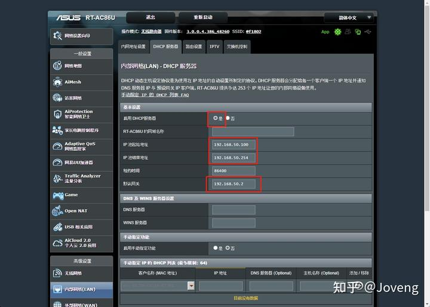
按图片参数设置并点击 应用本页面设置，即可。

> 来自: [群晖 安装 iStoreOS 作为 旁路由，华硕路由器,OpenWRT - 知乎](https://zhuanlan.zhihu.com/p/589065349)

