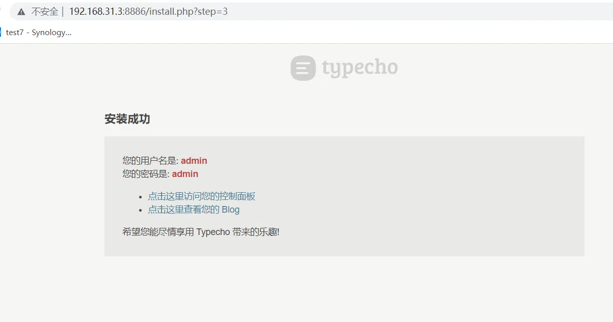

## 前言
本篇教程涉及到群晖web station套件的安装、设置、实例搭建并且通过两个例子静态网站【导航页】带交互网站例子【typecho博客】来了解web station的详细使用步骤，然后根据本文章举一反三，搭建自己喜欢的网站。
## 套件安装
1、 打开套件中心，搜索web station，点击安装套件。

2、 打开套件勾选不要提示此信息，然后点击确定。

3、 这里需要先配置环境安装一些后端套件，点击管理列对应的跳转图标会自动跳转到套件中心的相关套件安装界面，安装成功，状态会变为正常，这里为了后续的使用方便，将套件全部安装，服务相关套件后续我们按需安装即可。

## 静态导航页搭建

我这里搭建的静态网页为一个导航页，相关资源来源于网络（链接：[https://pan.baidu.com/s/1-4DByrAWrNZ5OgThlItvGQ](https://pan.baidu.com/s/1-4DByrAWrNZ5OgThlItvGQ)
提取码：1234 ）
1、登录群辉，打开file station 在web目录下新建demo1目录用来存放静态网页的相关文件（web目录在安装web sttion套件后会自动生成）。

2、将下载好的导航页资源解压，里面共有11个静态页面网站，我用web00.tgz来演示。

3、将web00压缩包拖动到nas新建立的demo1中。

4、拖动上传完成以后，鼠标右击文件，解压缩至此目录。（本文中资源需要解压两次）

5、解压以后如下所示，保留解压出来的文件，压缩包已经无用，为了节省空间直接删除掉。

6、打开套件web station，点击网页服务门户→新增→创建服务门户

7、弹出的页面选择虚拟主机。

8、选择基于端口，勾选http并输入未使用过得端口，文档目录选择创建的demo1。

9、因为是静态页面其他设置选项保持默认，然后点击右下角的新增即可，弹出的赋权对话框点击确定。

10、回到首页，可以看到自定义的门户下多了一个新增的虚拟主机。

## 静态导航页演示
1、打开浏览器输入http://192.168.31.3:8889/ （ip:端口），即可成功进入搭建的页面。

2、如果想用这个静态导航页的可以按照下面的配置设置自己的导航页，如果感觉静态的设置太麻烦可以参考我的动态导航页heimdall。

3、静态导航页搭建还是很简单的，只需要把相应的静态网站上传到nas目录然后，进行简单的设置即可。
## 动态网站搭建

typecho是一款特别好用的Markdown语法编辑软件，超级好用，而且可以把编辑的文章发布成博客，很人性化。

### typeco环境配置
1、登录群辉，打开套件中心，安装MariaDB10（数据库）、phpMyAdmin（数据库管理）两款套件。

2、安装MariaDB10的时候需要根据要求输入密码，可以用记事本保存下来后续会用到，端口保持默认即可。

3、打开phpMyAdmin。

4、输入步骤2配置的密码，用户名默认为root

5、成功登录数据库以后，需要给typecho创建数据库，点击数据库，在新建数据库中输入typecho然后点击右边的创建。

6、百度搜索Typecho ，进入官网下载正式版本，下载完成以后是一个名称为typecho.zip的压缩包。

7、登录群晖，打开file station，新建目录Typecho。

8、将步骤6下载文件拖动到Typecho目录，并解压。.

9、右击建立的文件夹，属性→权限→新增Everyone权限，勾选 应用到这个文件夹、子文件夹及文件。

10、还需要最后一步进行php的拓展设置，打开web station，脚本语言设置→选择php7.4，点击编辑→拓展名，勾选所有然后点击保存。

11、环境配置完成。
### typeco搭建
1、打开套件web station，点击网页服务门户→新增→创建服务门户

2、弹出的页面选择虚拟主机。

3、选择基于端口，勾选http并输入未使用过得端口，文档目录选择创建的Typecho，如下图选择相应的后端服务器和PHP，其他设置保持默认，然后点击新增。（php版本为环境配置中的php7.4版本）

4、回到首页，可以看到自定义的门户下多了一个新增的虚拟主机。

### typeco web端配置
1、打开浏览器输入ip：端口号，出现下面页面，点击我准备好了，开始下一步。

2、数据库适配器：Mysql原生函数适配器，数据用户名为 root，数据库密码为上面环境配置中设置的数据库密码，数据库名为typecho，其他保持默认 。

3、设置博客后台的用户名、密码、邮箱，然后点击继续安装。

4、如果出现下面界面即表示安装成功。

## 动态博客Typecho演示
1、浏览器地址输入http://192.168.31.3:8886（ip：端口）进入博客。

2、在端口后面加上/admin进入博客后台管理界面。

3、输入用户名和密码成功登录后台，后台提供了文章撰写、系统设置、主题插件管理等。

4、尝试写一篇文章测试一下。

5、点击发布文章，然后回到博客首页已经成功显示。

6、动态网站typecho博客搭建成功，此博客非常好用支持原生的markdown，这里不做介绍，大家有兴趣可以百度了解一下。
## 总结
总体来说利用群晖的web station套件可以很简单的搭建一个静态动态网站，利用群晖的反向代理功能，还可以轻松实现外网访问功能。还是很不错的，疫情在家隔离没事写写教程挺好。今天爆肝了3篇，希望大家多多支持关注，咱们下面文章再见。

> 来自: [群晖套件web staton的完全使用指南，静态网站（导航页）动态网站（typecho博客）搭建教程 - 折腾笔记](http://nas.zwbcc.cn:8090/archives/webstaton)

