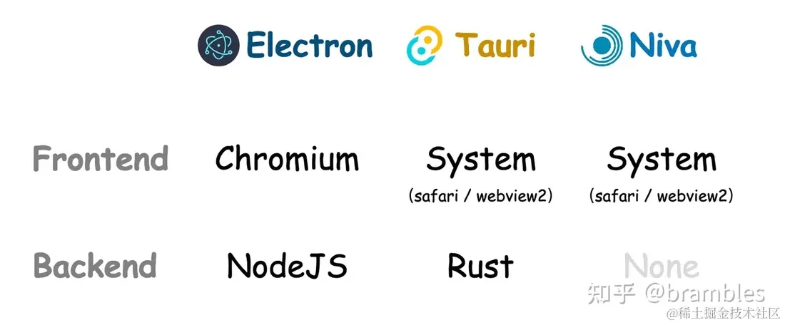

背景
Tauri 和 Electron 都是用于开发跨平台桌面应用程序的工具，因为最近使用ChatGPT在国内环境的确不够友好，又没有一个比较轻量简洁的工具可用，如是想自己造个轻量点的轮子，力争做到代码轻量，界面美观简洁，打出的安装包小，请求ChatGPT速度快，会话安全，不被封号。实现玩之后的效果是这样：项目地址在 这里 github.com/bravekingzh…

主要实现功能：
管理会话的能力
可以和ChatGPT实现多轮次对话
使用代理功能，方便没有梯子的童鞋
自定义主题，避免视觉疲劳
流式响应，这样可以很快速的得到响应，不用等太久
会话存储本地，避免丢失
代码着色功能
那么，既然决定要搞一个轻量版本的桌面端App，势必就需要做一些选型对比，目前开发桌面端大家可能比较熟悉的跨平台方案是Electron，但实际上，近年也出现了一个Tauri，隐隐有取Electron而代之的趋势，我们不妨来看看两者的优劣势，前期做好选型，在动手开始实施也不迟。

以下是 Tauri 和 Electron 的优劣势对比：

Tauri 的优势
更轻量级：相较于 Electron 更小巧，更快速，启动时间更短，占用资源更少。
安全性高：使用 Rust 语言编写程序，拥有内存安全、线程安全等多项安全保障措施。
可配置性强：Tauri 支持自定义界面和操作方式，开发者可以根据需要进行任意定制。
支持多窗口管理：Tauri 具有完善的多窗口管理机制，可以方便地创建、控制多个窗口。
跨平台支持广泛：Tauri 支持在 Linux、Windows 和 macOS 等主流操作系统下运行。
Tauri 的劣势
生态还不够完善：相比于 Electron，Tauri 目前还是一个较新的框架，其社区和生态还在逐步建设中。
开发学习曲线相对较陡：由于 Tauri 基于 Rust 编写，因此开发者需要具备一定的 Rust 编程基础才能上手开发，但是如果不设计到过多的和操作系统交互的话，基本不用管Rust。
Electron 的优势
生态完善：Electron 有着非常庞大的社区，具备许多成熟、稳定的插件和库，可以快速构建应用。
学习曲线相对较平缓：相比于 Tauri，基于 JavaScript / TypeScript 语言编写的 Electron 让开发者更容易上手，便于迭代和更新。
调试方便：Electron 具备调试工具和插件，可以方便地进行调试、性能优化等操作。
开发者资源丰富：由于 Electron 应用广泛，因此可以接触到更多的开发者和资源。
Electron 的劣势
性能问题：由于 Electron 本质上是一个浏览器环境，因此在性能方面存在一定程度的局限性。
安全性存疑：由于 Electron 基于 Chromium 核心，可能存在某些漏洞和安全问题，你编译的代码对别人来说是透明的，不同于Rust，你可以将不便于透露的或者设计商业机密的代码打包到二进制文件中，在通过一些安全手段加密，防止被别人轻而易举拿到你的实现细节。
内存占用较高：由于 Electron 运行时需要加载 Chromium 内核和其他依赖项，因此占用内存较高。
因此，我们可以看出，Tauri 的轻量、安全、可定制、跨平台支持是其优势，虽然Rust学习曲线陡峭，但是我们实现的ChatGPT聊天工具基本上不太涉及与操作系统的过多交互，充其量，我们的会话保存可以在Rust上实现，存储在sqlite 中，我保证这部分代码非常易懂，只需要了解最最基础的Rust语法就可以明白。

功能效果展示
如下图所示，我们可以在这个对话App中直接问ChatGPT相关问题，有代码着色功能，在设置中：可以配置

主题
代理
API key
是否使用流式响应

实现细节
流式响应实现
直接使用浏览器fetch API来请求，注意，不要使用axios来请求，该库不支持浏览器上的流式响应，但是支持node端流式响应，可能有人会问会不会跨域，我按照一些参考文章上介绍的配置src-tauri/tauri.conf.json

 "tauri": {
    "allowlist": {
      "all": true,
      "http": {
        "scope": ["http://**", "https://**"]
      },
      "shell": {
        "all": false,
        "open": true
      }
    },
复制

这样的方式，发现没有跨域。支持流式响应的主要逻辑就是

fetch(url, {
          headers,
          method: "POST",
          body: JSON.stringify(data),
        }).then((response) => {
          if (response.ok) {
            const reader = response.body!.getReader();
            pump(reader);
          }
        });
        let finalResult = "";
        function pump(reader: any) {
          reader.read().then(({ value, done }: ReadResult) => {
            if (done) {
              return;
            }
            const text = decoder.decode(value);
            const lines = text.split("\n");
            for (const line of lines) {
              if (line.length > 0) {
                //去掉前面的 data: 和后面的换行符
                const json = line.substring(6).trim();
                if (json === "[DONE]") {
                  onResponse(finalResult);
                  break;
                }
                const result: openai.CreateChatCompletionDeltaResponse =
                  JSON.parse(json);
                finalResult += result.choices[0]?.delta.content || "";
                onData(finalResult);
              }
            }
            pump(reader);
          });
        }
      } catch (err: any) {
        onError(new Error(err));
      }
复制

这样做的主要目的就是为了可以快速看到响应，而不是等ChatGPT全部生成完毕才看到回答结果，ChatGPT就是一个生成式大预言模型，这个机制决定了他的答案是一部分一部分生成的，如果不选择流式响应，需要等待很久才可以看到完整答复。

会话记录存储
会话记录存储在sqlite当中，做么做的目的主要是先拿Rust练练手，得到的好处是性能会比较好点，会话存储读取速度都比较快，实现细节在src-tauri/src/session.rs 文件中，其实代码不难理解。你会发现无非就是SQL语句的Rust封装而已，增删改查逻辑做完之后，就可以通过main.rs 中的 #[tauri::command]，暴露给到js去调用了。

fn main() {
    let db = Database::new("database.db").expect("Unable to create database connection");
    let app_state = AppState::new(Mutex::new(db));
    tauri::Builder::default()
        .invoke_handler(tauri::generate_handler![
            greet,
            create_session,
            get_all_sessions,
            delete_session,
            update_session,
            add_message,
            delete_message,
            get_all_messages
        ])
        .manage(app_state)
        .run(tauri::generate_context!())
        .expect("error while running tauri application");
}
复制

这里是暴露的一些方法。在js中调用，我使用了repository封装去交互，尽量不要让页面耦合这些逻辑。可以看看src/repository/session.ts里面的实现。如添加一个新的会话

// 添加一个新会话
  async createSession(name: string): Promise<Session> {
    // Learn more about Tauri commands at [https://tauri.app/v1/guides/features/command](https://tauri.app/v1/guides/features/command)
    const result: Session = await invoke("create_session", {
      name,
    });
    return result;
  }
复制

可以通过DB Browser for SQLite工具来查看数据，也可以在里面写sql去查询。

配置页面

UI 组件库
界面整体UI使用vuetifyjs实现的。

vuetifyjs.com/en/ 是一个基于 Vue.js 的 Material Design 组件框架，它提供了一系列高质量、易用的 UI 组件，包括按钮、卡片、表格、表单、图标等，可以帮助开发者快速构建出美观、高效的 Web 应用程序。关键是在移动设备上也有很好的兼容性。

与其他的组件框架相比，Vuetify.js 更加注重对 Material Design 概念的实现，通过在组件之间保持一致的视觉设计和交互方式，让 Vue.js 开发者可以更加方便地使用 Material Design 风格的UI组件。同时，Vuetify.js 还提供了丰富的主题定制选项，可以根据自己的需求进行风格定制。

Material Design 是我选择这个组件库的主要原因，太省心了，基本上拼凑一下就可以完成一个页面，而我们只需要关注业务逻辑部分。
