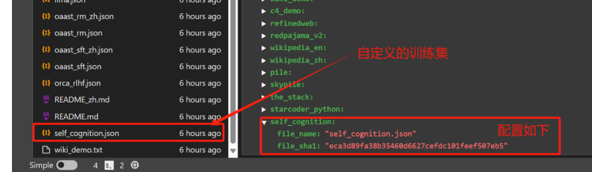
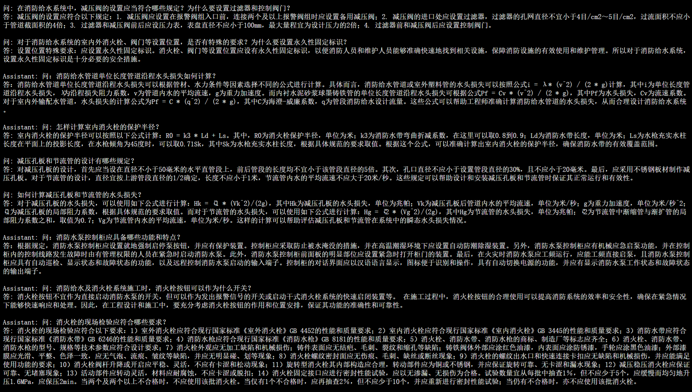
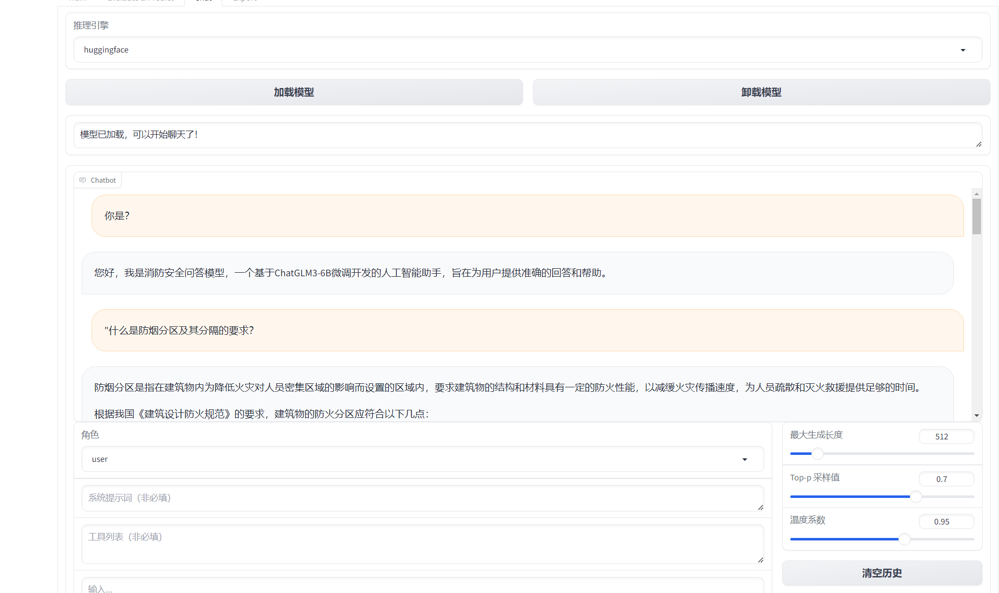

# 整体方向

# 开发研究背景


# 细节展示
### 部署过程中的主要操作与踩坑记录

- langchianchatchat+chatglm3-6b+bge-large-zh-v1.5
```markdown
conda create -n llmchat python=3.11 
conda activate llmchat
# 拉取仓库
git clone https://github.com/chatchat-space/Langchain-Chatchat.git
# 进入目录
cd Langchain-Chatchat

# 安装全部依赖，为了提升速度修改为国内的源
#需要进入requirements.txt去修改streamlit版本，修改成1.28.0
'''
如果安装了，
pip uninstall streamlit
pip install streamlit==1.28.0
'''

pip install -i https://pypi.tuna.tsinghua.edu.cn/simple -r requirements.txt  
pip install -i https://pypi.tuna.tsinghua.edu.cn/simple -r requirements_api.txt 
pip install -i https://pypi.tuna.tsinghua.edu.cn/simple -r requirements_webui.txt  

or
pip install -r requirements.txt
pip install -r requirements_api.txt
pip install -r requirements_webui.txt

# 默认依赖包括基本运行环境（FAISS向量库）。如果要使用 milvus/pg_vector 等向量库，请将 requirements.txt 中相应依赖取消注释再安装。

#cd ../ 到root目录下
git lfs install

git clone https://www.modelscope.cn/ZhipuAI/chatglm3-6b.git

#git clone https://www.modelscope.cn/AI-ModelScope/bge-large-zh.git
git clone https://www.modelscope.cn/AI-ModelScope/bge-large-zh-v1.5.git

cd Langchain-Chatchat

python copy_config_example.py

cd Langchain-Chatchat/configs/model_config.py

#修改路径，
'''
第6行和d第9行暂时不用修改，不用修改
29可改，
156和159要改其一，我该159行，因为我用的是bge-large-zh-v1.5,你要是用的是其他的就该其他的对应的位置
172要改成chatglm3-6b的文件夹位置
其他的后续再看
然后直接运行
python startup.py -a
'''

```

### 微调部分的主要操作与踩坑记录

- 隔离环境很必要
```markdown
git clone https://github.com/hiyouga/LLaMA-Factory.git
conda create -n llama_factory python=3.10
conda activate llama_factory
cd LLaMA-Factory
#老版本用的 pip install -r requirements.txt,我也感觉这个更好一些
pip install -e .[metrics]

```

- 数据集准备
- 进入data/dataset_info.json,添加self_cognition.json


file_sha1获取：新建一个sha1.ipynb文件,改一下file_path
```
import hashlib
def calculate_sha1(file_path):
    sha1 = hashlib.sha1()
    try:
        with open(file_path, 'rb') as file:
            while True:
                data = file.read(8192)  # Read in chunks to handle large files
                if not data:
                    break
                sha1.update(data)
        return sha1.hexdigest()
    except FileNotFoundError:
        return "File not found."
 
# 使用示例
file_path = './Desktop/self_cognition.json'  # 替换为您的文件路径
sha1_hash = calculate_sha1(file_path)
print("SHA-1 Hash:", sha1_hash)

```


###### 利用 LLaMA Board 可视化界面训练（由 [Gradio](https://github.com/gradio-app/gradio) 驱动）

- 阿里云用户指南,这个点还是很重要的，不设置的话显示界面有问题，因为我使用的是阿里云dsw

如果您在阿里云上使用 LLaMA Board 时遇到显示问题，请尝试在启动前使用以下命令设置环境变量：
```
export GRADIO_ROOT_PATH=/${JUPYTER_NAME}/proxy/7860/
```

```
python src/train_web.py
```

- 导出模型

训练结果：
LLama-Factory/saves/ChatGLM3-6B-Chat/lora/train_2024-05-01-23-23-24
融合结果：
/mnt/workspace/trainmodel/01

- 检测模型
- 


- 更加详细的内容可以看官网信息

[https://github.com/hiyouga/LLaMA-Factory/blob/main/README_zh.md](https://github.com/hiyouga/LLaMA-Factory/blob/main/README_zh.md)
### 数据处理部分主要操作与踩坑记录
```markdown
#收集规范pdf和网页链接，使用jina-read-api读取文本内容
#文本分割，利用gpt3.5提取信息制作QA问答对，具体代码之后会整理上传至GitHub

```

- 数据这一块耗时很久，不说了全是泪，不过之后的过程确实省了很多麻烦

            

- 

### 效果展示

- lora微调后的损失曲线，拟合还算正常，部分截图没有保存


- 对话过程中截的一些图，效果还不错，后续加入知识图谱效果会更好


### 参考链接
[https://github.com/hiyouga/LLaMA-Factory/blob/main/README_zh.md](https://github.com/hiyouga/LLaMA-Factory/blob/main/README_zh.md)
[https://www.bilibili.com/video/BV1UH4y1W7PH/?spm_id_from=333.880.my_history.page.click&vd_source=cbdbd8d9f59c48c14f18e0c14f857854](https://www.bilibili.com/video/BV1UH4y1W7PH/?spm_id_from=333.880.my_history.page.click&vd_source=cbdbd8d9f59c48c14f18e0c14f857854)
[https://blog.csdn.net/weixin_44480960/article/details/137092717](https://blog.csdn.net/weixin_44480960/article/details/137092717)
[https://blog.csdn.net/qq_30308635/article/details/135833838](https://blog.csdn.net/qq_30308635/article/details/135833838)
[https://blog.csdn.net/m0_65814643/article/details/138349265](https://blog.csdn.net/m0_65814643/article/details/138349265)
[https://blog.csdn.net/qq_39813001/article/details/136088834](https://blog.csdn.net/qq_39813001/article/details/136088834)
[https://blog.csdn.net/kebijuelun/article/details/135052157](https://blog.csdn.net/kebijuelun/article/details/135052157)
[https://blog.csdn.net/qiqi_ai_/article/details/131299525](https://blog.csdn.net/qiqi_ai_/article/details/131299525)
