小白花了两天时间学习了一下[K210](https://so.csdn.net/so/search?q=K210&spm=1001.2101.3001.7020)，将在线训练的模型部署在K210（**代码后面给出**）上，能够识别卡皮巴拉水杯（没错，卡皮巴拉，情绪稳定，真的可爱！）。[数据集](https://so.csdn.net/so/search?q=%E6%95%B0%E6%8D%AE%E9%9B%86&spm=1001.2101.3001.7020)是**用K210拍摄的图片存储在SD卡**中（**拍照采集数据集代码后面会给出**），然后传至云端训练。将过程记录作为笔记学习，希望能对大家的学习有所帮助。
本文分为**在线训练**和**部署代码**两部分。
## 在线训练
在线训练进入[MaiHub](https://maix.sipeed.com/home)官网（需要注册账号）。

点击开始训练
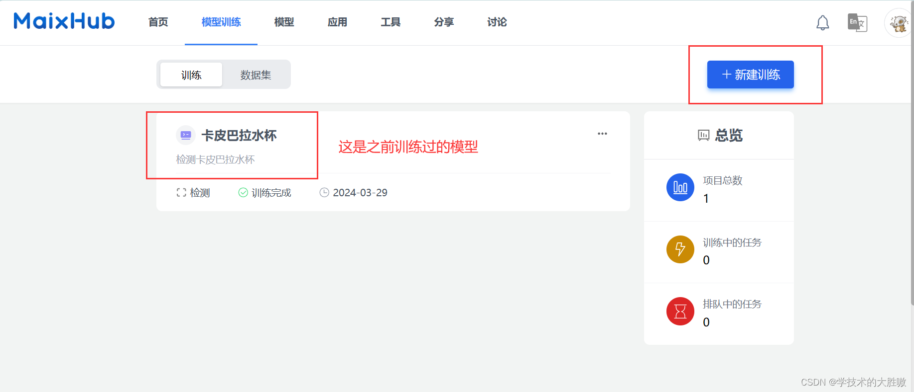如果之前没用过的话，点击新建训练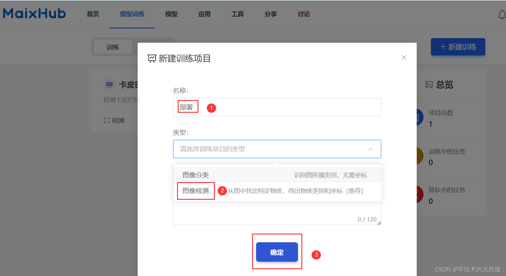
我是检测卡皮巴拉水杯，所以选的图像检测，只是想试试的小伙伴建议跟我选一样，后面给出的代码可以直接运行。
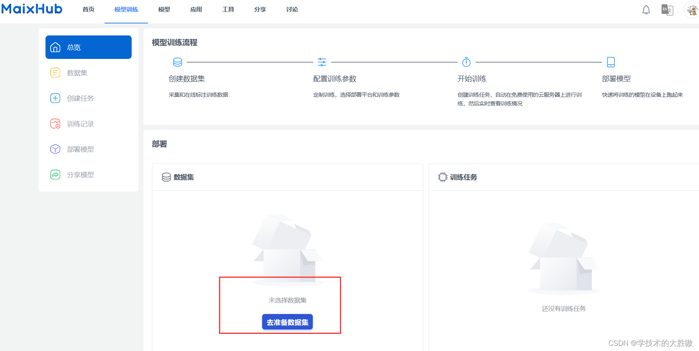
此时点击准备数据集
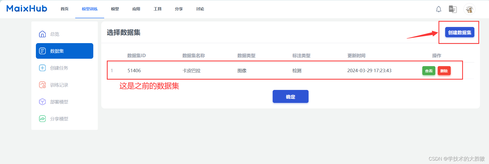没使用过的伙伴直接点击创建数据集就行
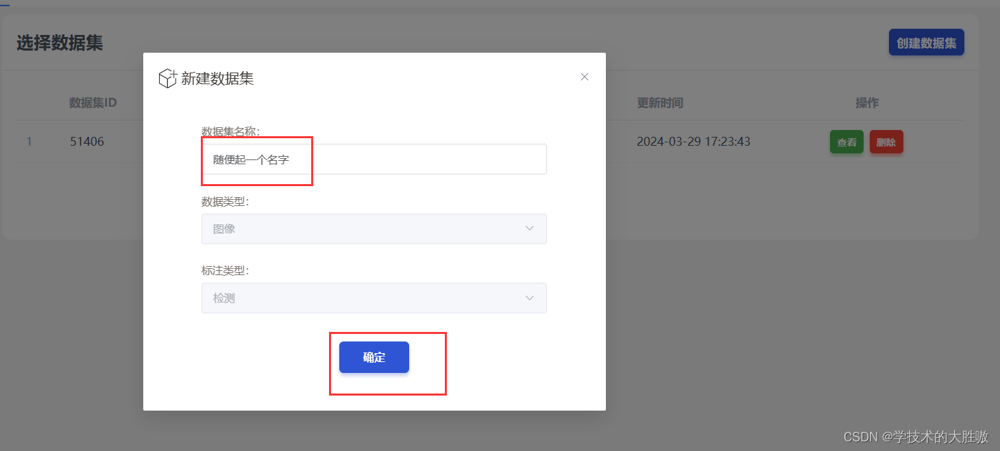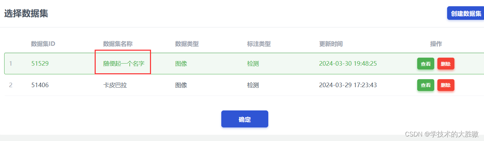新建好数据集后会发现多出了新建那个名字，选择该数据集点击确定就行。
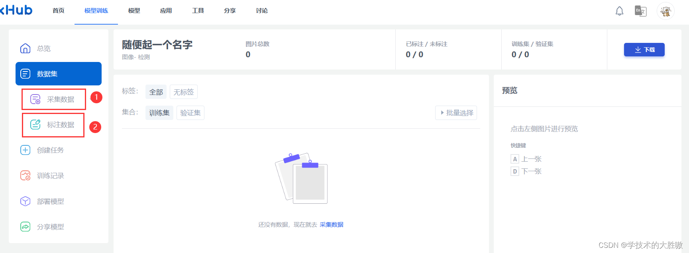数据集下面有采集数据和标注数据两个步骤，先点击采集数据。
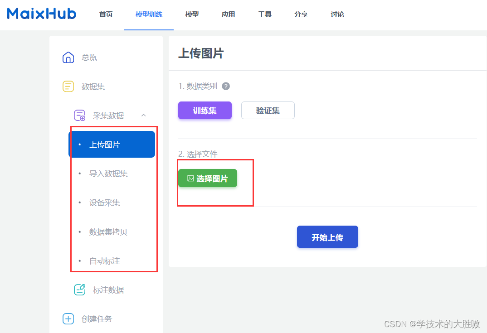
采集数据下面出现5个选项，我采用的是上传图片，因为是用K210搭配摄像头拍摄的图片。然后点击选择图片，会弹出文件框，将采集的图片全选上传。
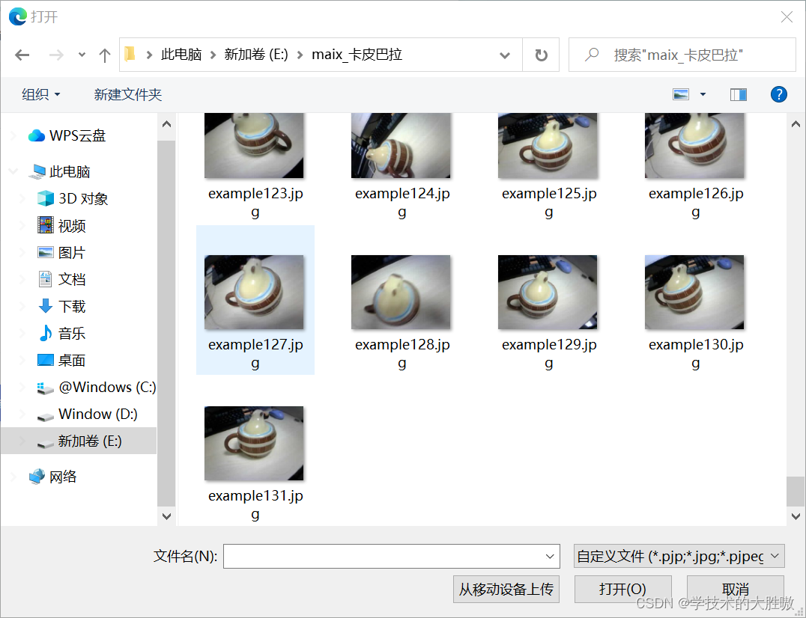
这个图片我建议用K210搭配摄像头拍摄采集，因为这样的图片更符合实际摄像头读取的图片。
采集代码如下，每按一次按键就拍摄一张图片：
```
import sensor, lcd, image


from Maix import GPIO


from fpioa_manager import fm


from machine import UART


import time


 


# 配置LED蓝、红引脚


fm.register(12, fm.fpioa.GPIO0, force=True)


fm.register(14, fm.fpioa.GPIO1, force=True)


LED_B = GPIO(GPIO.GPIO0, GPIO.OUT, value=1) # 构建LED对象


LED_R = GPIO(GPIO.GPIO1, GPIO.OUT, value=1) # 构建LED对象


 


# 配置按键引脚


fm.register(16, fm.fpioa.GPIO1)


KEY = GPIO(GPIO.GPIO1, GPIO.IN)


 


# 摄像头初始化


sensor.reset()


sensor.set_pixformat(sensor.RGB565)


sensor.set_framesize(sensor.QVGA)


sensor.set_vflip(1) # 设置为后置模式


 


lcd.init() # LCD初始化


 


# clock = time.clock()


 


i = 0 # 图像命名索引


 


while True:


    # clock.tick()


    img = sensor.snapshot()  # 拍摄照片


    lcd.display(img) # 实时显示摄像头图像


    # print(clock.fps()) #打印 FPS


    if KEY.value() == 0: # 按键按下


        # 蓝灯亮提示正在拍照


        LED_B.value(0)


        print(i)


        # 拍摄并保存相关文件，按顺序命名


        file_name = "/sd/example{}.jpg".format(i)


        img.save(file_name)


        LED_B.value(1) # 蓝灯灭提示拍照完成


        i += 1 # 索引递增


        time.sleep(0.5) # 添加短暂延时，防止按键抖动
```
我拍了131张图片，前121张作为训练集，后10张作为验证集。
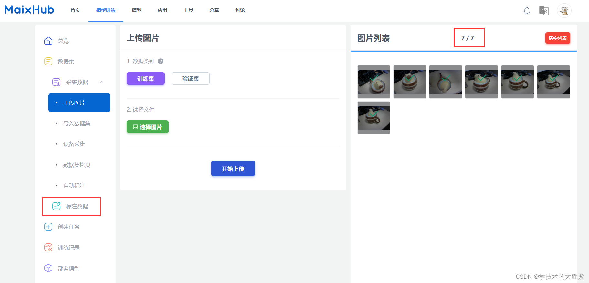
图片上传完成之后就标注数据
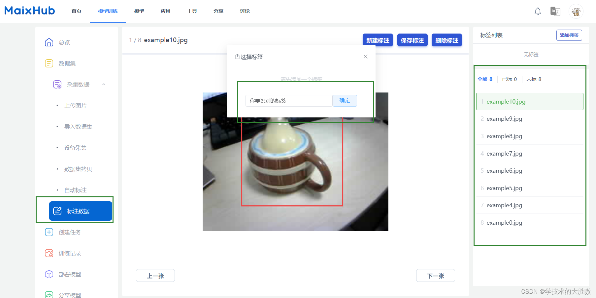将所有的标签标注完就可以了
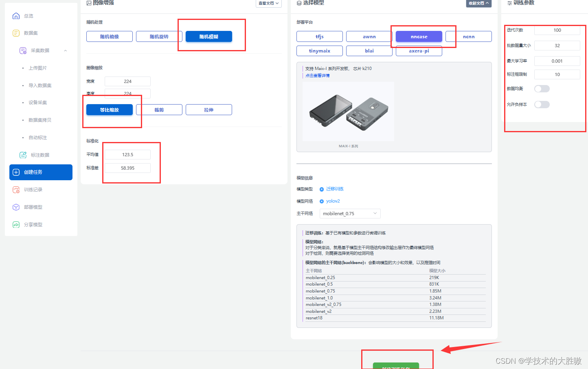
基本上都是默认设置，但我使用的是K210，所以部署平台是nncase，之后创建任务开始训练。
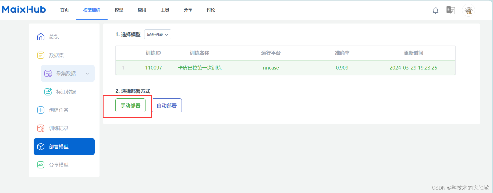
## 部署代码
训练完成后选择手动部署，会下载一个压缩包。压缩包解压后有3个文件如下：
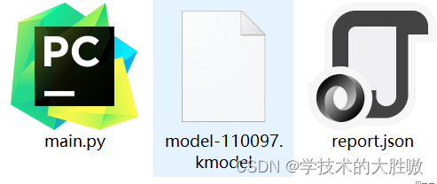
一开始我是将这三个文件放在SD卡进行运行，后来老是报错运行内存不足，试了很多办法（没错，你们试过的方法我都试过，包括增大GC内存，降低分辨率等等）都没用，就自己写了个调用.kmodel的代码，可以直接运行。代码如下：

```
import sensor,lcd,time


import KPU as kpu


 


#设置摄像头


sensor.reset()


sensor.set_pixformat(sensor.RGB565)


sensor.set_framesize(sensor.QVGA)


input_size = (224, 224)


sensor.set_windowing(input_size)


sensor.set_vflip(1)    #设置摄像头后置


 


# 新添加


input_size = (224, 224)


labels = ['卡皮巴拉']


 


lcd.init() #LCD初始化


 


clock = time.clock()


 


#1、从Flash加载模型。将模型烧录到开发板Flash。烧录方法参考pdf教程。


#task = kpu.load(0x300000)


 


#2、从SD加载模型卡上。将kmodel文件通过读卡器拷贝到SD卡。


# task = kpu.load("/sd/facedetect.kmodel")


task = kpu.load("/sd/model-110097.kmodel")


#模型描参数


# anchor = (1.889, 2.5245, 2.9465, 3.94056, 3.99987, 5.3658, 5.155437, 6.92275, 6.718375, 9.01025)


anchor = [2.69, 3.02, 3.28, 2.98, 4.56, 4.03, 2.0, 1.72, 3.72, 3.66]


#初始化yolo2网络


a = kpu.init_yolo2(task, 0.5, 0.3, 5, anchor)


 


while(True):


    clock.tick()


    img = sensor.snapshot()


    code = kpu.run_yolo2(task, img) #运行yolo2网络


 


    #识别到卡皮巴拉就画矩形表示


    if code:


        for i in code:


            print(i)


            #b = img.draw_rectangle(i.rect())


            pos = i.rect()


            img.draw_rectangle(pos)


            img.draw_string(pos[0], pos[1] + pos[3] + 5, "ka pi ba la", scale=2, color=(255, 0, 0))  # 在方框下方显示标签名字


            img.draw_string(pos[0], pos[1], "%.2f" %(i.value()), scale=2, color=(255, 0, 0), mono_space = False)


 


    #LCD显示


    lcd.display(img)


 


    print(clock.fps())   #打印FPS
```
代码很简单，不懂的地方可以评论交流。
运行效果如下：
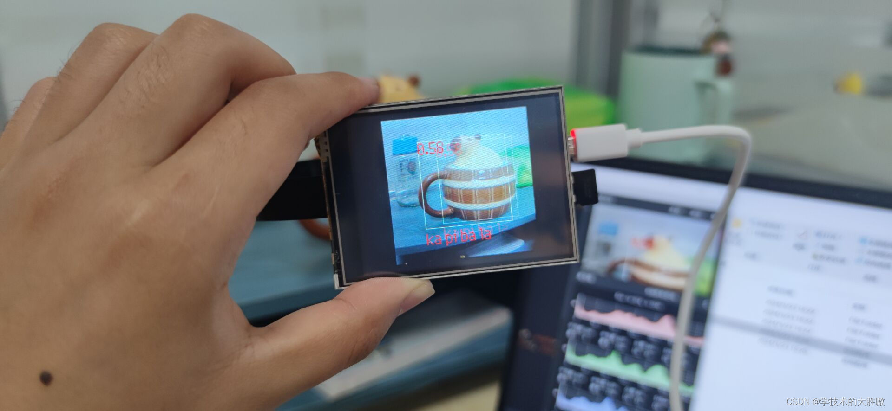

> 来自: [手把手在K210上部署自己在线训练的YOLO模型_yolo物体检测部署到k210上-CSDN博客](https://blog.csdn.net/weixin_44115575/article/details/137180642#comments_32169447)

