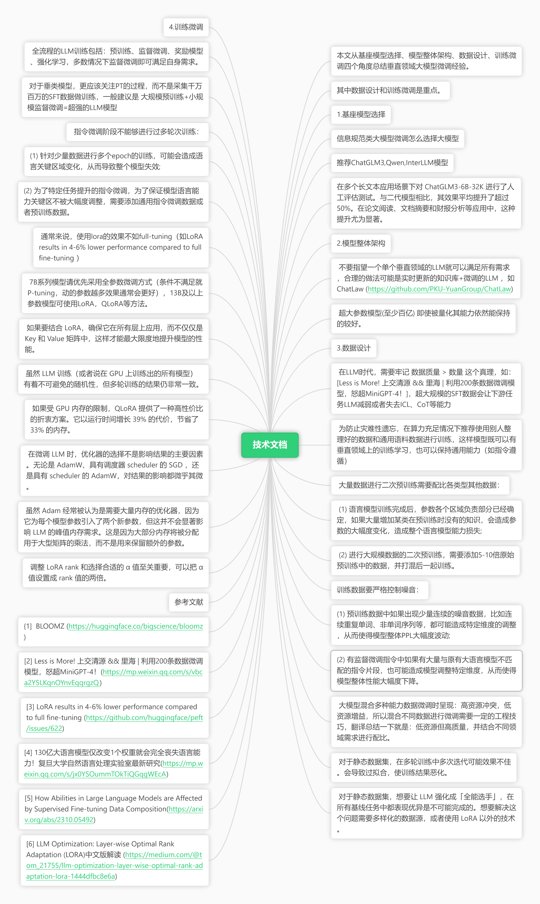

本文从基座模型选择、模型整体架构、数据设计、训练微调四个角度总结垂直领域大模型微调经验。

- 其中数据设计和训练微调是重点。
### 1.基座模型选择

1. 信息规范类大模型微调怎么选择大模型
- 推荐ChatGLM3,Qwen,InterLLM模型

在多个长文本应用场景下对 ChatGLM3-6B-32K 进行了人工评估测试。与二代模型相比，其效果平均提升了超过 50%。在论文阅读、文档摘要和财报分析等应用中，这种提升尤为显著。
### 2.模型整体架构

1.  不要指望一个单个垂直领域的LLM就可以满足所有需求，合理的做法可能是实时更新的知识库+微调的LLM ，如 ChatLaw ([https://github.com/PKU-YuanGroup/ChatLaw](https://github.com/PKU-YuanGroup/ChatLaw)) 
2.  超大参数模型(至少百亿) 即使被量化其能力依然能保持的较好。 

### 3.数据设计

1.  在LLM时代，需要牢记 数据质量 > 数量 这个真理，如：[Less is More! 上交清源 && 里海 | 利用200条数据微调模型，怒超MiniGPT-4！]，超大规模的SFT数据会让下游任务LLM减弱或者失去ICL、CoT等能力 
2.  为防止灾难性遗忘，在算力充足情况下推荐使用别人整理好的数据和通用语料数据进行训练，这样模型既可以有垂直领域上的训练学习，也可以保持通用能力（如指令遵循） 
3.  大量数据进行二次预训练需要配比各类型其他数据： 
>  (1) 语言模型训练完成后，参数各个区域负责部分已经确定，如果大量增加某类在预训练时没有的知识，会造成参数的大幅度变化，造成整个语言模型能力损失;
>  (2) 进行大规模数据的二次预训练，需要添加5-10倍原始预训练中的数据，并打混后一起训练。

4. 训练数据要严格控制噪音：
> (1) 预训练数据中如果出现少量连续的噪音数据，比如连续重复单词、非单词序列等，都可能造成特定维度的调整，从而使得模型整体PPL大幅度波动;
> (2) 有监督微调指令中如果有大量与原有大语言模型不匹配的指令片段，也可能造成模型调整特定维度，从而使得模型整体性能大幅度下降。

5.  大模型混合多种能力数据微调时呈现：高资源冲突，低资源增益，所以混合不同数据进行微调需要一定的工程技巧，翻译总结一下就是：低资源但高质量，并结合不同领域需求进行配比。 
6.  对于静态数据集，在多轮训练中多次迭代可能效果不佳。会导致过拟合，使训练结果恶化。 
7.  对于静态数据集，想要让 LLM 强化成「全能选手」，在所有基线任务中都表现优异是不可能完成的。想要解决这个问题需要多样化的数据源，或者使用 LoRA 以外的技术。 

### 4.训练微调

1.  全流程的LLM训练包括：预训练、监督微调、奖励模型、强化学习，多数情况下监督微调即可满足自身需求。 
2.  对于垂类模型，更应该关注PT的过程，而不是采集千万百万的SFT数据做训练，一般建议是 大规模预训练+小规模监督微调=超强的LLM模型 
3.  指令微调阶段不能够进行过多轮次训练： 
> (1) 针对少量数据进行多个epoch的训练，可能会造成语言关键区域变化，从而导致整个模型失效;

> (2) 为了特定任务提升的指令微调，为了保证模型语言能力关键区不被大幅度调整，需要添加通用指令微调数据或者预训练数据。

4.  通常来说，使用lora的效果不如full-tuning（如LoRA results in 4-6% lower performance compared to full fine-tuning ） 
5.  7B系列模型请优先采用全参数微调方式（条件不满足就P-tuning，动的参数越多效果通常会更好），13B及以上参数模型可使用LoRA，QLoRA等方法。 
6.  如果要结合 LoRA，确保它在所有层上应用，而不仅仅是 Key 和 Value 矩阵中，这样才能最大限度地提升模型的性能。 
7.  虽然 LLM 训练（或者说在 GPU 上训练出的所有模型）有着不可避免的随机性，但多轮训练的结果仍非常一致。 
8.  如果受 GPU 内存的限制，QLoRA 提供了一种高性价比的折衷方案。它以运行时间增长 39% 的代价，节省了 33% 的内存。 
9.  在微调 LLM 时，优化器的选择不是影响结果的主要因素。无论是 AdamW、具有调度器 scheduler 的 SGD ，还是具有 scheduler 的 AdamW，对结果的影响都微乎其微。 
10.  虽然 Adam 经常被认为是需要大量内存的优化器，因为它为每个模型参数引入了两个新参数，但这并不会显著影响 LLM 的峰值内存需求。这是因为大部分内存将被分配用于大型矩阵的乘法，而不是用来保留额外的参数。 
11.  调整 LoRA rank 和选择合适的 α 值至关重要，可以把 α 值设置成 rank 值的两倍。 

参考文献

> {1]  BLOOMZ ([https://huggingface.co/bigscience/bloomz](https://huggingface.co/bigscience/bloomz))
> [2] Less is More! 上交清源 && 里海 | 利用200条数据微调模型，怒超MiniGPT-4！([https://mp.weixin.qq.com/s/vbca2Y5LKqnOYnvEqqrgzQ](https://mp.weixin.qq.com/s/vbca2Y5LKqnOYnvEqqrgzQ))
> [3] LoRA results in 4-6% lower performance compared to full fine-tuning ([https://github.com/huggingface/peft/issues/622](https://github.com/huggingface/peft/issues/622))
> [4] 130亿大语言模型仅改变1个权重就会完全丧失语言能力！复旦大学自然语言处理实验室最新研究([https://mp.weixin.qq.com/s/jx0YSOummTOkTiQGqgWEcA](https://mp.weixin.qq.com/s/jx0YSOummTOkTiQGqgWEcA))
> [5] How Abilities in Large Language Models are Affected by Supervised Fine-tuning Data Composition([https://arxiv.org/abs/2310.05492](https://arxiv.org/abs/2310.05492))
> [6] LLM Optimization: Layer-wise Optimal Rank Adaptation (LORA)中文版解读 ([https://medium.com/@tom_21755/llm-optimization-layer-wise-optimal-rank-adaptation-lora-1444dfbc8e6a](https://medium.com/@tom_21755/llm-optimization-layer-wise-optimal-rank-adaptation-lora-1444dfbc8e6a))

