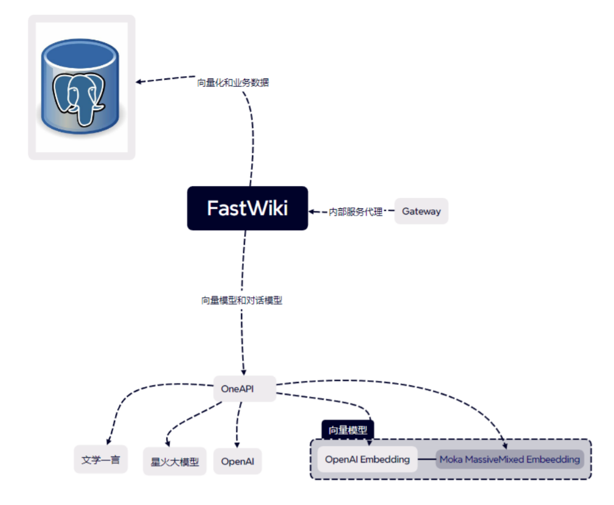

- 默认情况下，FastGPT 只配置了 GPT 的模型，如果你需要接入其他模型，需要进行一些额外配置。
- [One API](https://github.com/songquanpeng/one-api) 是一个 OpenAI 接口管理 & 分发系统，可以通过标准的 OpenAI API 格式访问所有的大模型，开箱即用。
- FastGPT 可以通过接入 OneAPI 来实现对不同大模型的支持。OneAPI 的部署方法也很简单。
:::info
阿里云搭建的OneApi
[http://47.96.138.211:3080/channel](http://47.96.138.211:3080/channel)
详细教程看[https://www.cnblogs.com/hejiale010426/p/18054498](https://www.cnblogs.com/hejiale010426/p/18054498)
先以讯飞星火为例，进行api接口的统一化
:::
