AtomGit 测评赛已经发布一段时间了，很多开发者和开源爱好者们已经评测起来了，甚至有的已经完成了测评，提交了在CR给到官方，官网也很快就合并到主仓库了。然而刚开始接触的有些朋友说不知如何参与。那么本教程会手把手的教你如何参与测评赛。让我们开始吧。
要参与“AtomGit 开源协作平台测评赛”只需要三大步，六小步。如下图所示。
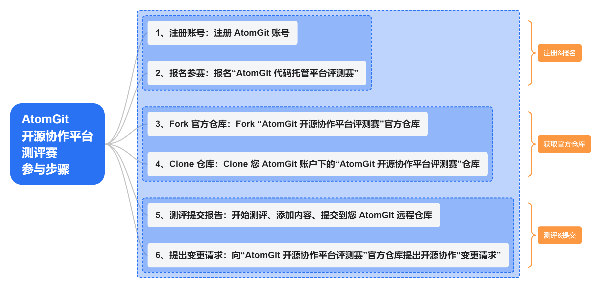
## 注册&报名

---

## 1.注册 AtomGit 账号
> 如果已经注册过 AtomGit 账号，请忽略这一步骤，直接到`2.报名“AtomGit 代码托管平台评测赛”`

地址：[https://atomgit.com/](https://atomgit.com/)，输入手机号验证码快速注册。
### 电脑端点击右上角的“注册”
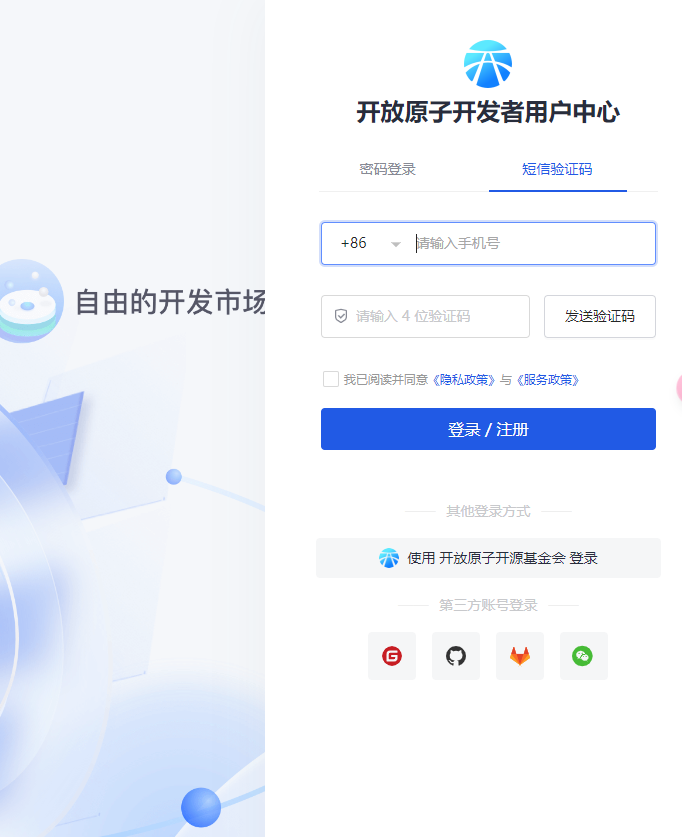
### 移动端点击右上角的“注册”
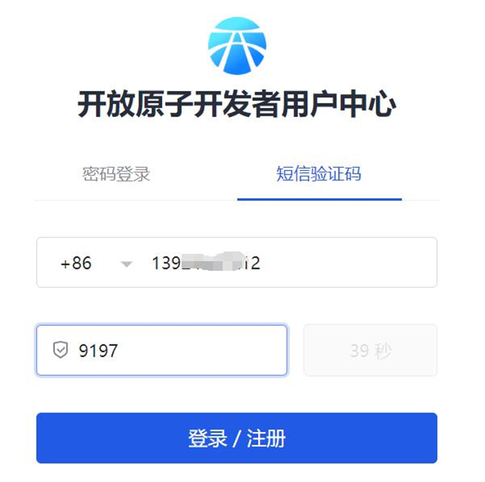
注册登录成功之后，我们访问“AtomGit 代码托管平台评测赛”地址。
## 2.报名“AtomGit 代码托管平台评测赛”
访问地址：[AtomGit 代码托管平台评测赛-开放原子开源大赛](https://competition.atomgit.com/competitionInfo?id=c530456caa482629a127efdcfcfef512&utm_source=colleges_universities)
选择“点击报名”按钮，进入报名页面。
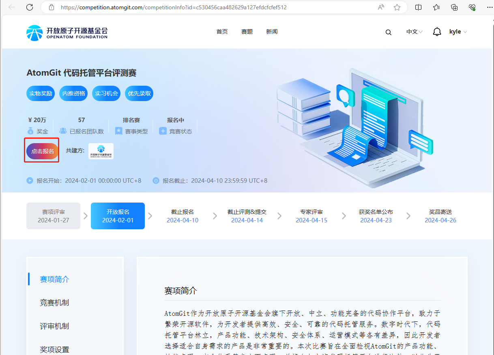
同意协议，选择“我要报名”
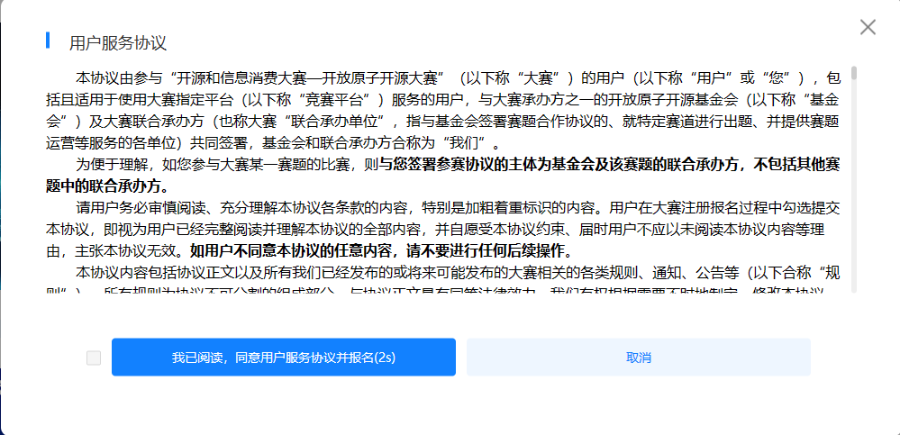
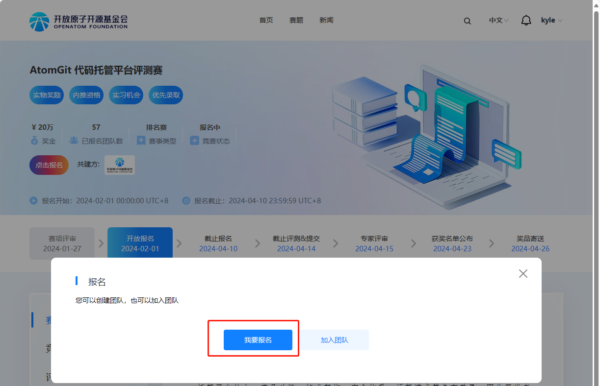
填写报名信息，注：请填写有效的“联系电话”和“邮箱地址”；如果选择的是“个人参赛”，则“单位”部门可以填写“无”；红色星号的项目都要填写。
确保红色必填项目都填写完毕，请点击“立即报名”。
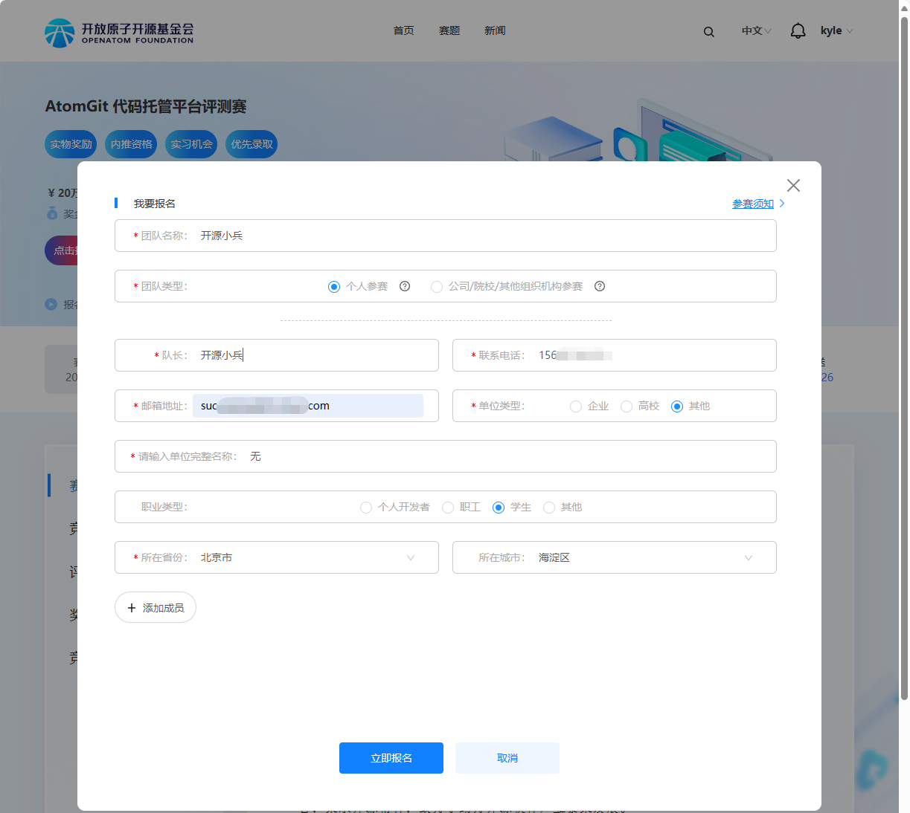
报名成功：当看到页面最上端弹出的“报名成功”，表示报名成功。
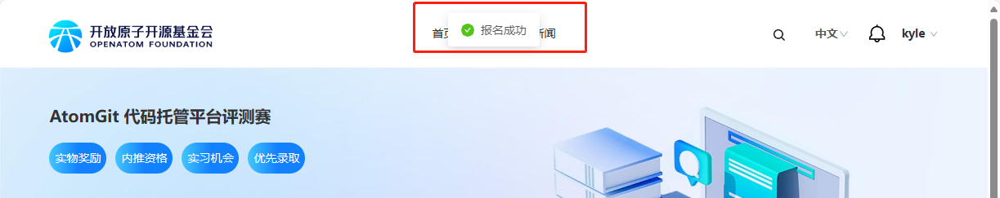
## 获取官方仓库

---

## 3、Fork “AtomGit 代码托管平台评测赛”官方仓库
在登录 AtomGit 的前提下，访问“AtomGit 代码托管平台评测赛”官方仓库。
仓库地址：[https://atomgit.com/evaluation/atomgit_evaluation](https://atomgit.com/evaluation/atomgit_evaluation)
### 3.1、点击如下图右上的“Fork”按钮。
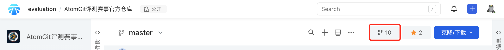
### 3.2、将“Fork 代码库”到自己的 AtomGit 账户下。
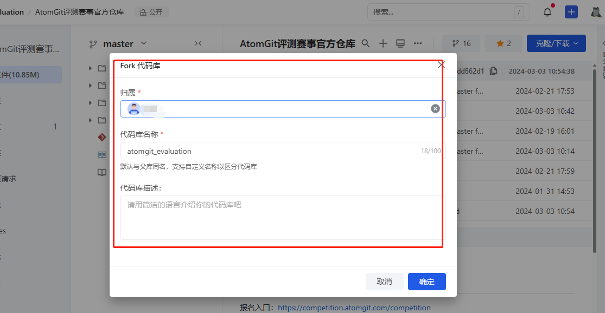
## 4、下载/Clone 您 AtomGit 账户下的“AtomGit 代码托管平台评测赛”仓库。
### 4.1、安装 Git 客户端，在本地安装Git。
#### Windows 端

- 地址：[https://github.com/git-for-windows/git/releases/download/v2.44.0.windows.1/Git-2.44.0-64-bit.exe](https://github.com/git-for-windows/git/releases/download/v2.44.0.windows.1/Git-2.44.0-64-bit.exe)
- 备用地址：[https://atomgit.com/atomgit_operate/quick_link_software/blob/master/git/](https://atomgit.com/atomgit_operate/quick_link_software/blob/master/git/)

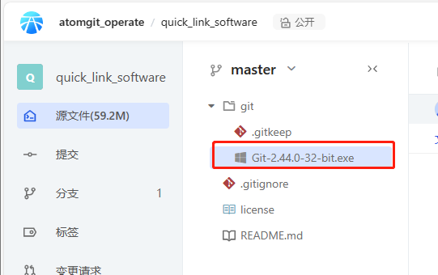
#### macOS 端
系统有自带的 Git 工具，请通过终端自行使用。
### 4.2 配置你的 AtomGit SSH
参考指南[https://docs.atomgit.com/user/sshkey](https://docs.atomgit.com/user/sshkey)
#### Windows

- 生成本地的 SSH Key 的公私密钥对。
在命令行执行 ，一直回车.
```
ssh-keygen.exe
```
默认生成的密钥对存放在用户目录 `C:\Users\OpenAtom\.ssh\`下，注意：该路径中的“OpenAtom”每个人不一样，实际以你自己电脑的当前登录的用户名为主。
公钥文件名：`id_rsa.pub`
私钥文件名：`id_rsa`

- 复制公钥
```
clip < ~/.ssh/id_rsa.pub
```

- 在 AtomGit 平台设置：`个人头像`->`个人设置`->`SSH Key`，在这里添加一个 SSH 公钥。

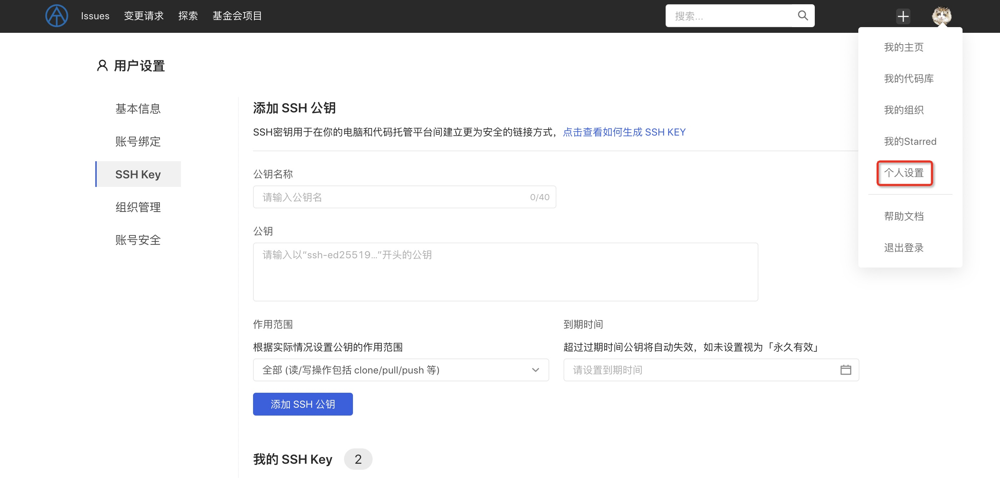
#### macOS

- 生成本地的 SSH Key 的公私密钥。
```
ssh-keygen
```

- 复制公钥
```
pbcopy < ~/.ssh/id_rsa.pub
```

- 在 AtomGit 平台设置：个人头像->个人设置->SSH Key，在这里添加一个 SSH 公钥。


### 4.3、Clone 克隆
参考链接[https://docs.atomgit.com/user/git/quickstart](https://docs.atomgit.com/user/git/quickstart)
在上面“4.2”步骤中已经设置好了 SSH，那么现在只要在你的 AtomGit 账户的“AtomGit 代码托管平台评测赛”仓库中选择“克隆/下载”按钮->“SSH”->复制SSH地址，如下图
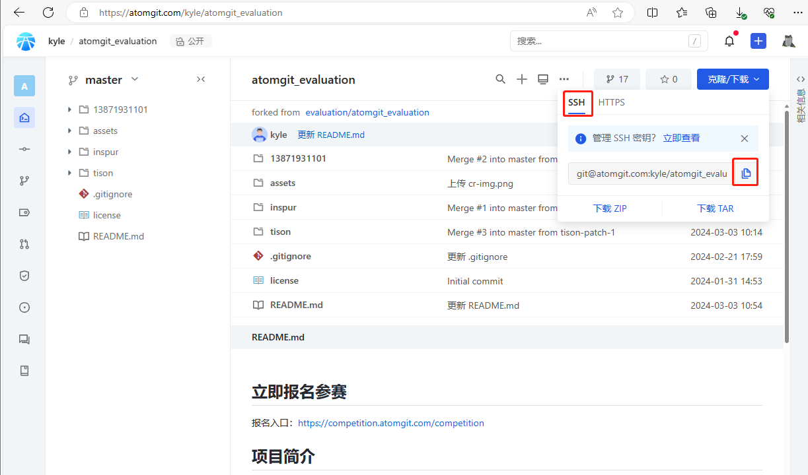
#### Windows端
打开刚才安装的 Git 客户端，如下图。
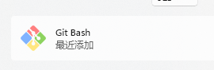
输入下面命令，确认之后会Clone仓库到你的电脑本地。
```
git clone git@atomgit.com:UserID/atomgit_evaluation.git
```
注意：这里的地址中“UserID”会有差异，这主要取决于你的AtomGit 上的用户的UserID确定的。
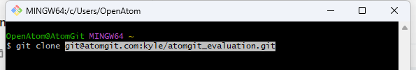
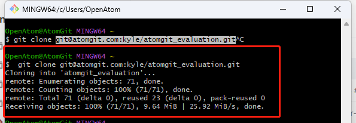
#### macOS 端
系统有自带的 Git 工具，请通过终端自行使用。
## 测评&提交

---

## 5、开始测评、添加内容、提交到 AtomGit 远程仓库
### 5.1、开始测评
接下来可以有目的的通过不同的角度来使用 AtomGit，把使用过程的内容以截图加文字的形式保存到你的测评报告中，最后全部提交到测评仓库中。
现在假如你已经完成了 AtomGit 的测评，要把测评的内容提交。那么接下来这么做将会顺利提交内容。
### 5.2、在你克隆下来的代码仓库中的下新建一个你自己的文件夹，请用你的 AtomGit 用户名来命名这个文件夹的名字。
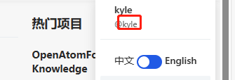
把你的测评中的所有内容都放到这个文件夹中。
### 5.3、打开Git 客户端，配置 AtomGit 的用户名和邮箱，这样在提交代码时可以标识作者信息。在命令行中执行以下命令：
```
git config --global user.name "Your Name"
git config --global user.email "your_email@example.com"
```
### 5.4、提交测评内容到远端 AtomGit 你的账户下“AtomGit 代码托管平台评测赛”仓库中。在Git 客户端命令行中执行以下命令：
```
git add ./
git commit -s -m "测评内容提交"
git push origin master
```
至此，你的测评内容已经提交到你的 AtomGit 远程仓库中了，赶紧告诉赛事官方吧。
## 6、向“AtomGit 代码托管平台评测赛”官方仓库提出开源协作“变更请求”。
参赛者在自己fork的仓库中，向官方仓库发起变更请求，创建change request，参考如图操作。
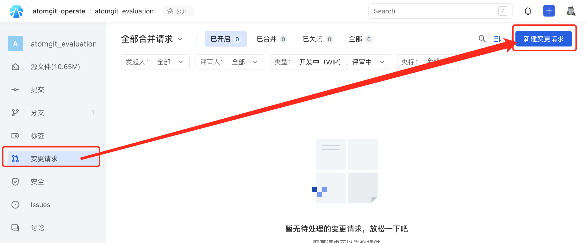
在change request中注明其参赛作品名称、参赛者姓名/昵称等信息。

---

**恭喜你，到这里你已经顺利的完成了“AtomGit 代码托管平台评测赛”，与获奖更进一步了。__**
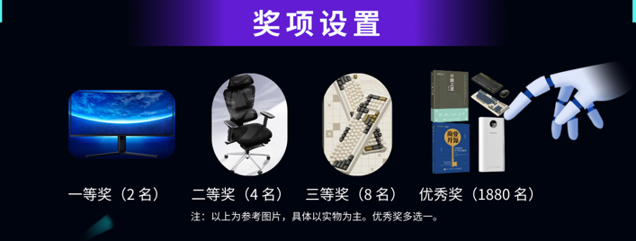

> 来自: [文档 · AtomGit评测赛事官方仓库 · AtomGit](https://atomgit.com/evaluation/atomgit_evaluation/wiki/%E6%89%8B%E6%8A%8A%E6%89%8B%E6%95%99%E4%BD%A0%E5%8F%82%E4%B8%8E%20AtomGit%20%E5%BC%80%E6%BA%90%E5%8D%8F%E4%BD%9C%E5%B9%B3%E5%8F%B0%E6%B5%8B%E8%AF%84%E8%B5%9B)

