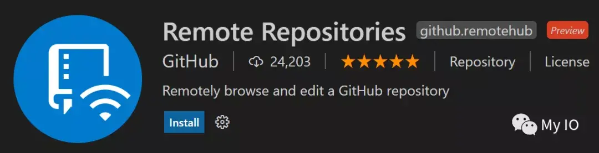
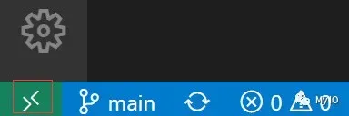
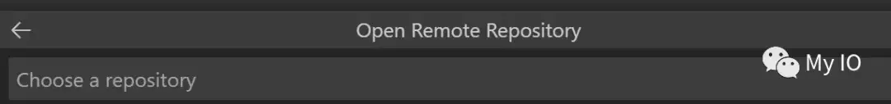
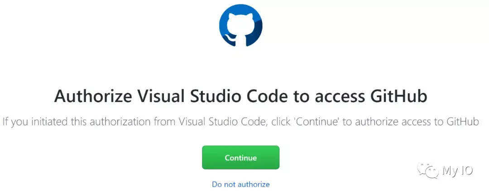
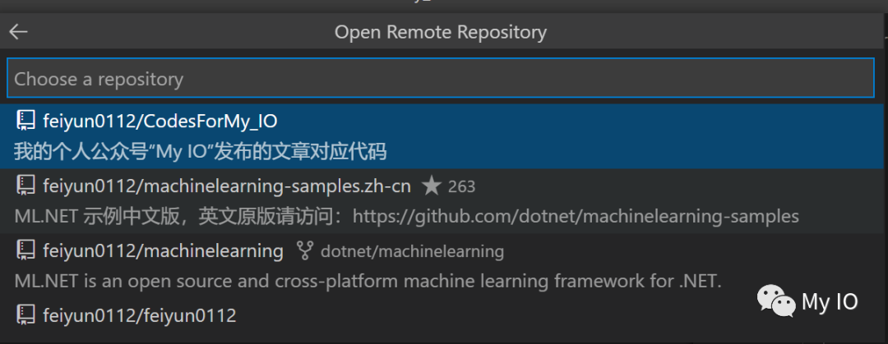
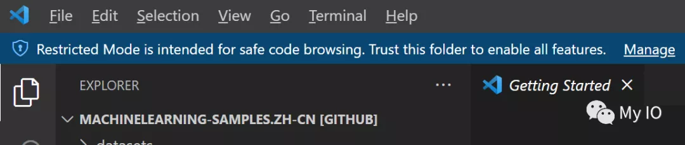
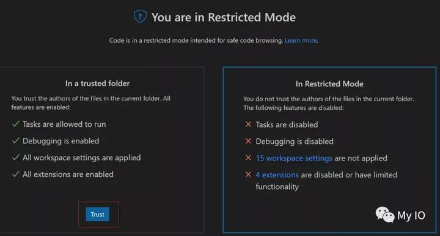
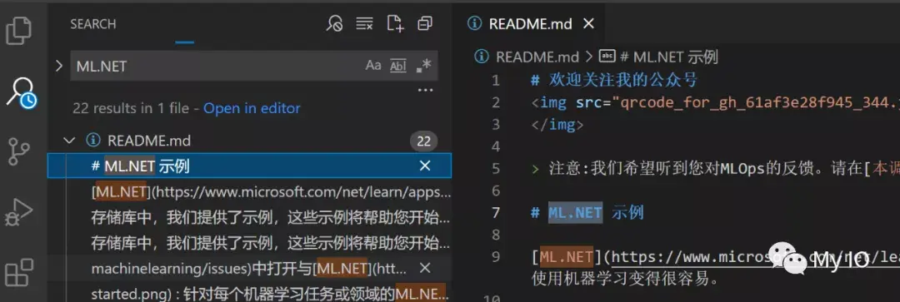
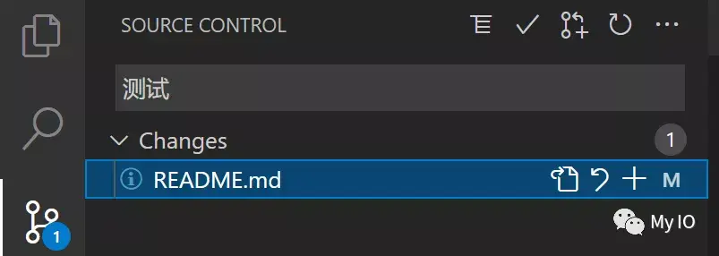

# 无需Clone！VS Code直接操作远程GitHub仓库
以前，我们要修改GitHub仓库中的代码时，必须要使用`git clone`下载代码到本地，修改后`commit`再`push`到GitHub。
本地代码库如果不定期提取更改，很快就会过时。而且，`git clone`操作需要等待比较长的时间，如果超时还要重来，费时费力。
**不过，现在好了，可以使用VS Code直接操作远程GitHub仓库，无需Clone哦！**
## **Remote Repositories**
`Remote Repositories`是VS Code的一个扩展，目前还处于preview状态。 

它允许你直接在VS Code中快速浏览、搜索、编辑和提交到任何远程GitHub仓库。
现在，让我们来实际体验一下`Remote Repositories`的强大之处吧。
## **功能一瞥**
安装好扩展后，点击VS Code窗口左下角新增的绿色图标: 

在窗口中间弹出的窗口选择"Open Remote Repository" -> "Open Repository from GitHub": 

如果第一次访问，需要GitHub网站授权允许VS Code操作: 

授权成功后，就可以选择一个有权限的远程GitHub仓库: 

VS Code会以受限模式打开新窗口，受限模式试图通过禁用或限制几个VS Code功能的操作来阻止自动代码执行，比如调试，你可以在受限模式下安全的浏览仓库： 

如果需要更高权限，可以点击“Manage”，然后选择“Trust”，这样就可以使用全部VS Code功能： 

现在，你可以搜索： 

还可以修改代码后直接提交到远程仓库： 

## **结论**
利用`Remote Repositories`，以后操作GitHub仓库更方便了，无需Clone，就可以直接在VS Code中查看代码和调试，还可以提交修改，岂不美哉！

> 来自: [无需Clone！VS Code直接操作远程GitHub仓库 - 知乎](https://zhuanlan.zhihu.com/p/387412873)

