## 介绍`FastWiki`
FastWiki是一个高性能、基于最新技术栈的知识库系统，旨在为大规模信息检索和智能搜索提供解决方案。它采用微软Semantic Kernel进行深度学习和自然语言处理，在后端使用`MasaFramework`，前端采用`MasaBlazor`框架，实现了一个高效、易用、可扩展的智能向量搜索平台。其目标是帮助用户快速准确地获取所需信息，具有智能搜索、高性能、现代化前端、强大的后端等特点。除此之外，`FastWiki`是开源和社区驱动的项目，采用Apache-2.0许可证，鼓励开发者和企业使用和贡献。
## 部署`FastWiki`
下面部署`FastWiki`将使用docker-compose进行部署，如果不存在环境则先安装docker和docker-compose的环境，由于postgresql需要使用向量插件，自己打包向量插件会过于麻烦，所以FastWiki提供了一键docker-compose的文件，内部提供的postgresql自带了`vector`插件了，我们只需要执行脚本即可
### 部署One-Api
One-Api是干什么的：

- One-Api用于AI的中转站，由于大部分的AI工具仅支持openai的api格式，但是国内的AI的接口格式五花八门，所以我们需要通过One-Api将国内的AI转换成openai的接口格式下面我们开始部署我们的One-Api

将下面的内容复制到一个`docker-compose.yml`文件中
```
version: '3.8'
services:
  one-api:
    image: justsong/one-api
    container_name: one-api
    restart: always
    ports:
      - "3000:3000"
    environment:
      - TZ=Asia/Shanghai
    volumes:
      - ./data/one-api:/data
```
我们使用最轻量级的Sqlite版本，启动容器以后打开浏览器访问：`http://localhost:3000/`
登录系统，默认账号为 `root`，密码为 `123456`。

1. 添加渠道
   1. 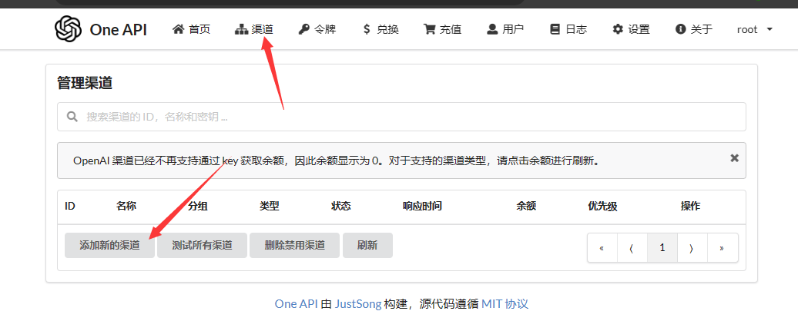
2. 添加星火大模型的渠道
   1. 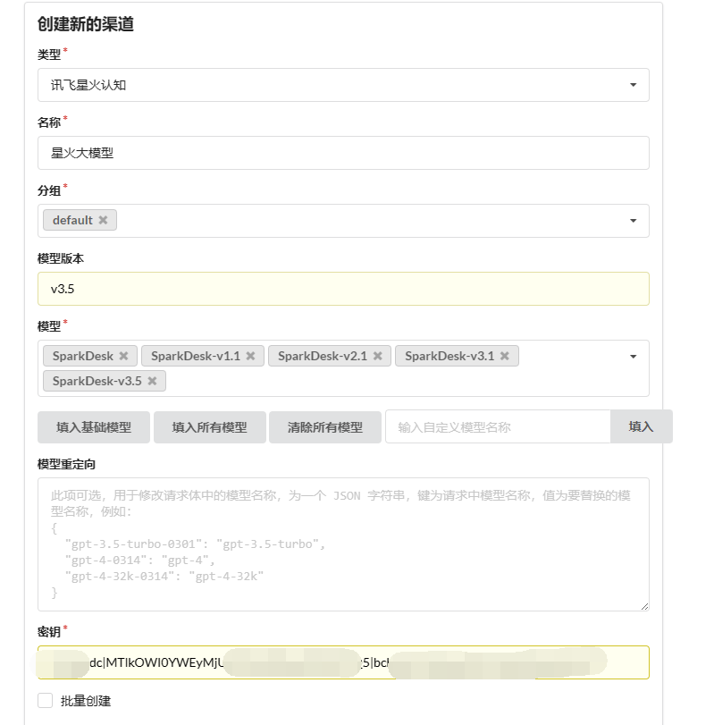
3. 获取星火大模型的密钥
   1. [控制台-讯飞开放平台 (xfyun.cn)](https://console.xfyun.cn/services/bm35) 在这里申请一个应用和产品，3.5个人用户可以免费领取200万的Token对于测试基本是够用的
4. 获取到密钥 安装APPID|APISecret|APIKey的格式填写到上面One-Api的密钥当中即可，
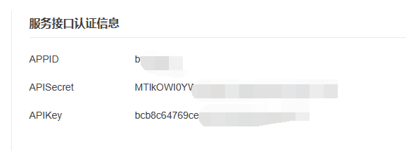
5. 创建One-Api的Token，设置无限额度，然后点击提交。
   1. 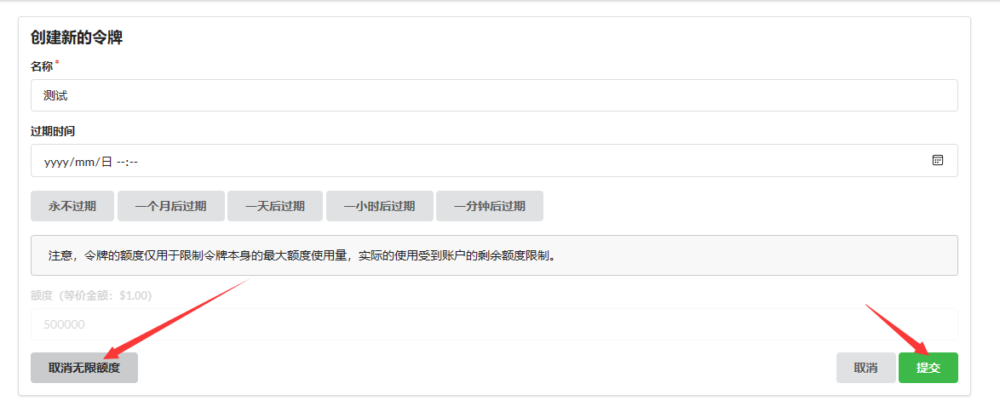
6. 点击复制key，然后将key修改下面的compose文件中的OPENAI_CHAT_TOKEN的环境变量的值，OPENAI_CHAT_ENDPOINT的地址则修改成fast-wiki-service能访问的地址，比如你局域网的ip加端口 `OPENAI_CHAT_ENDPOINT=http://ip:端口` 这样即可。
   1. 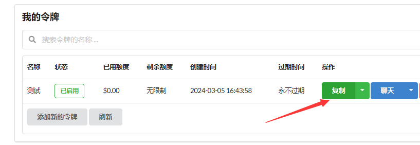

下载`docker-compose.yml`
```
curl -o docker-compose.yml https://raw.githubusercontent.com/239573049/fast-wiki/master/docker-compose.yml
```
然后打开下载的`docker-compose.yml`文件，知识库依赖了第三方服务所以不能直接运行，需要修改部分参数。
```
version: '3.8'  # 可以根据需要使用不同的版本
services:
  fast-wiki-service:
    image: registry.cn-shenzhen.aliyuncs.com/fast-wiki/fast-wiki-service
    container_name: fast-wiki-service
    user: root
    restart: always
    ports:
      - "8080:8080"
    build: 
      context: .
      dockerfile: ./src/Service/FastWiki.Service/Dockerfile
    volumes:
      - ./wwwroot:/app/wwwroot/
    environment:
      - OPENAI_CHAT_ENDPOINT=https://api.openai.com
      - OPENAI_CHAT_EMBEDDING_ENDPOINT=https://ai-api.token-ai.cn/
      - OPENAI_CHAT_TOKEN={您的TokenKey}
      - OPENAI_CHAT_MODEL=gpt-3.5-turbo
      - OPENAI_EMBEDDING_MODEL=text-embedding-3-small
      - ASPNETCORE_ENVIRONMENT=Development
      - OPENAI_EMBEDDING_TOKEN=sk-CpKIlADEESeOdoXnF58e72A2C8Af4e0c8b52Eb6eE7116c7a

  postgres: # 当前compose服务名
    image: registry.cn-shenzhen.aliyuncs.com/fast-wiki/pgvector:v0.5.0 # 拉取的数据库镜像
    container_name: postgres  # 容器运行的容器名称
    restart: always  # 开机自启动
    environment:  # 环境变量
      POSTGRES_USER: token  # 默认账号
      POSTGRES_PASSWORD: dd666666 # 默认密码
      POSTGRES_DB: wiki # 默认数据库
      TZ: Asia/Shanghai  # 数据库时区
    volumes:
      - ./postgresql:/var/lib/postgresql/data # 将PostgreSql数据持久化

  fast-wiki-server:
    image: registry.cn-shenzhen.aliyuncs.com/fast-wiki/fast-wiki-server
    container_name: fast-wiki-server
    restart: always 
    ports:
      - "2180:8080"
    build: 
      context: .
      dockerfile: ./src/Web/FastWiki.Web.Server/Dockerfile
    environment:
      - FAST_WIKI_SERVICE=http://知识库api的ip:8080 
    volumes:
      - ./model.json:/app/model.json
```
FastWikiService环境变量参数：

- QUANTIZE_MAX_TASK：量化任务的最大并发数，默认为3
- OPENAI_CHAT_ENDPOINT：OpenAI API的地址
- OPENAI_CHAT_EMBEDDING_ENDPOINT： Embedding API的地址
- OPENAI_CHAT_TOKEN： OpenAI API的Token
- OPENAI_CHAT_MODEL： 对话的模型，默认gpt-3.5-turbo
- OPENAI_EMBEDDING_MODEL： Embedding的模型，默认text-embedding-3-small
- OPENAI_EMBEDDING_TOKEN: Embedding的Token, 默认为空，为空则使用对话的Token

FastWiki.Web.Server环境变量参数：

- FAST_WIKI_SERVICE：FastWikiService的地址，默认为[http://localhost:5124](https://gitee.com/link?target=http%3A%2F%2Flocalhost%3A5124)

请注意FAST_WIKI_SERVICE环境变量一定是得外网能访问到的地址，否则在回复知识库内容的时候会导致引用的文件出现404.
FastWiki为你提供了免费的向量Api，这个地址和token仅支持向量（并且对于ip进行限流）。
创建自定义模型的json以便支持国产模型，文件需要于docker-compose.yml同级：
`model.json`
```
{
  "ChatModel": [
    {
      "label": "gpt-3.5-turbo",
      "value": "gpt-3.5-turbo"
    },
    {
      "label": "gpt-4-0125-preview",
      "value": "gpt-4-0125-preview"
    },
    {
      "label": "gpt-4-1106-preview",
      "value": "gpt-4-1106-preview"
    },
    {
      "label": "gpt-4-1106-vision-preview",
      "value": "gpt-4-1106-vision-preview"
    },
    {
      "label": "gpt-4",
      "value": "gpt-4"
    },
    {
      "label": "gpt-4-32k",
      "value": "gpt-4-32k"
    },
    {
      "label": "gpt-3.5-turbo-0125",
      "value": "gpt-3.5-turbo-0125"
    },
    {
      "label": "SparkDesk-v3.5",
      "value": "SparkDesk-v3.5"
    }
  ],
  "EmbeddingModel": [
    {
      "label": "text-embedding-3-small",
      "value": "text-embedding-3-small"
    }
  ]
}
```
`SparkDesk-v3.5`则是星火大模型。
上面文件创建好了以后执行，然后就可以访问`http://localhost:2180/`
```
docker-compose up -d
```
登录系统默认账号admin密码Aa123456
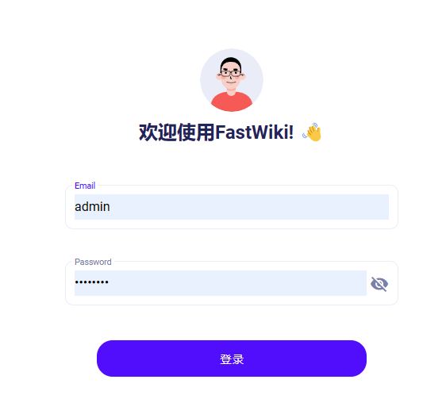
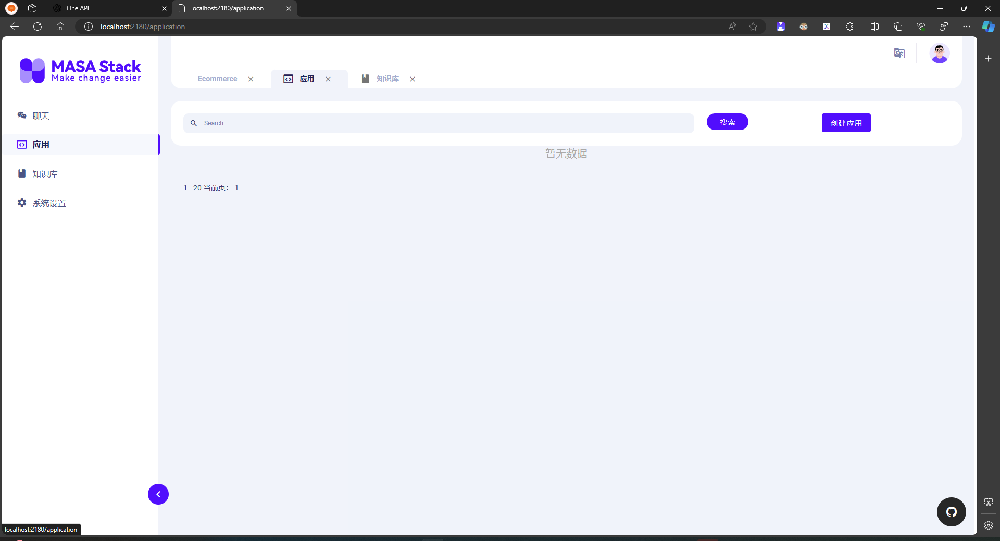

1. 点击知识库->创建知识库 点击添加。
   1. 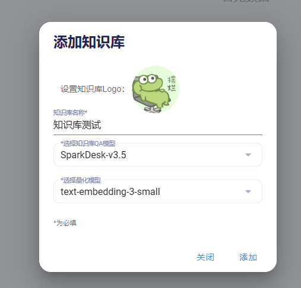
2. 点击创建的知识库：
   1. 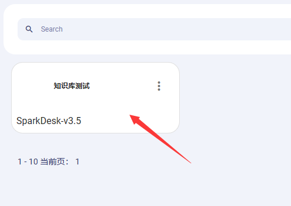
3. 点击导入文件
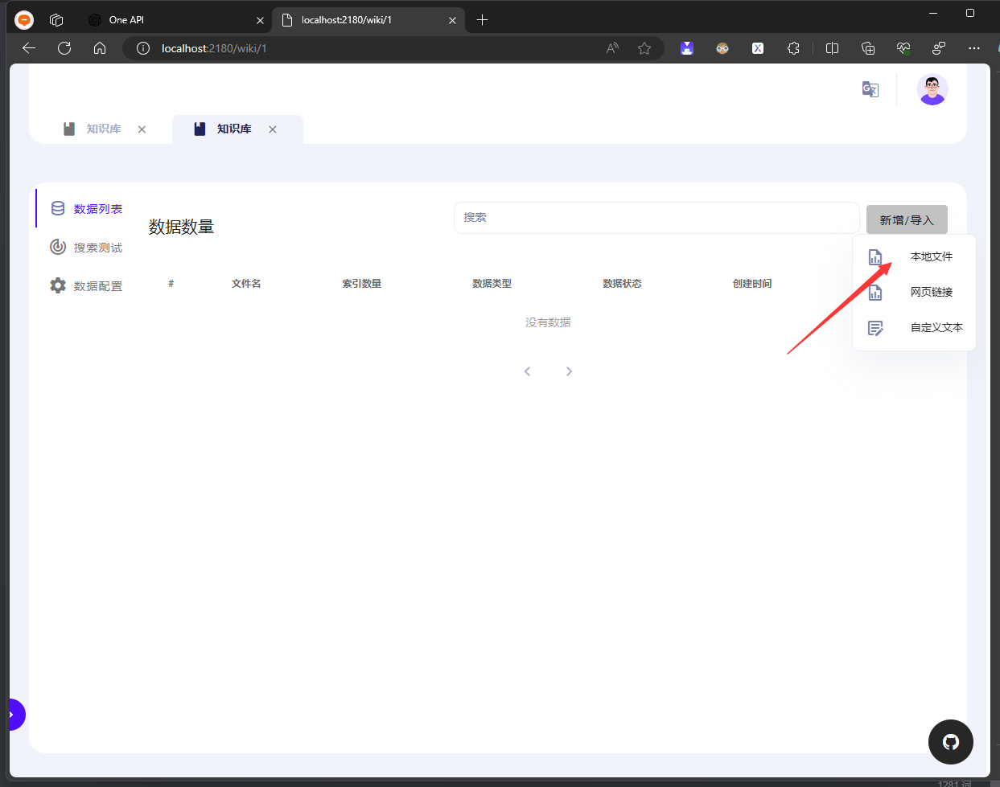
4. 拖动需要上传的.md/.pdf/.txt的文件到这里，然后点击下一步，一直到上传数据，
   1. 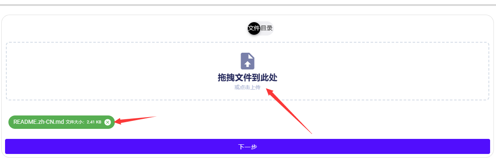
5. 上传数据，点击上传，上传完成关闭弹窗。
   1. 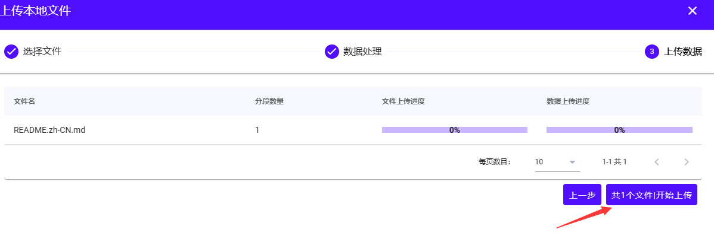
6. 数据上传以后服务会在后台进行量化，等待上传完成以后点击应用，然后创建应用
   1. 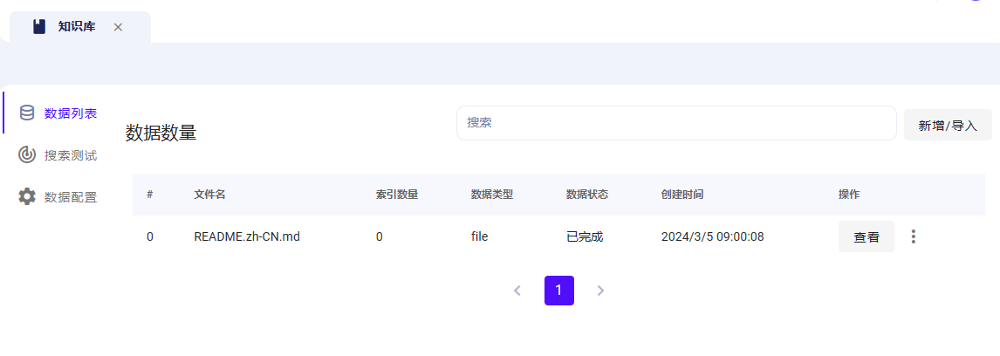
7. 创建应用，然后打开创建的应用
1.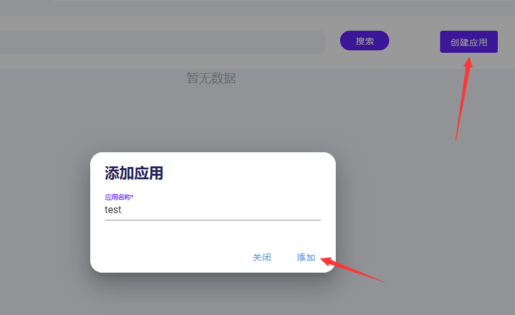
8. 绑定知识库，点击选择知识库然后点击需要绑定的知识库，在关闭弹窗，然后点击保存修改即可。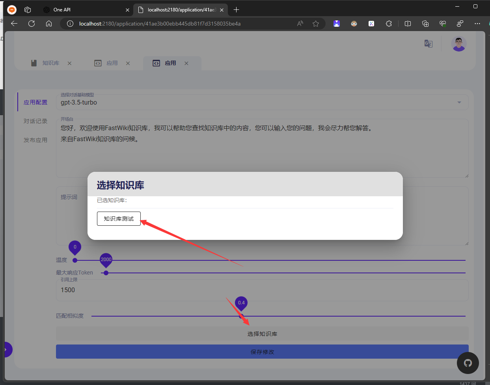
9. 修改电话基础模型，修改为添加的`SparkDesk-v3.5`然后点击保存修改即可
   1. 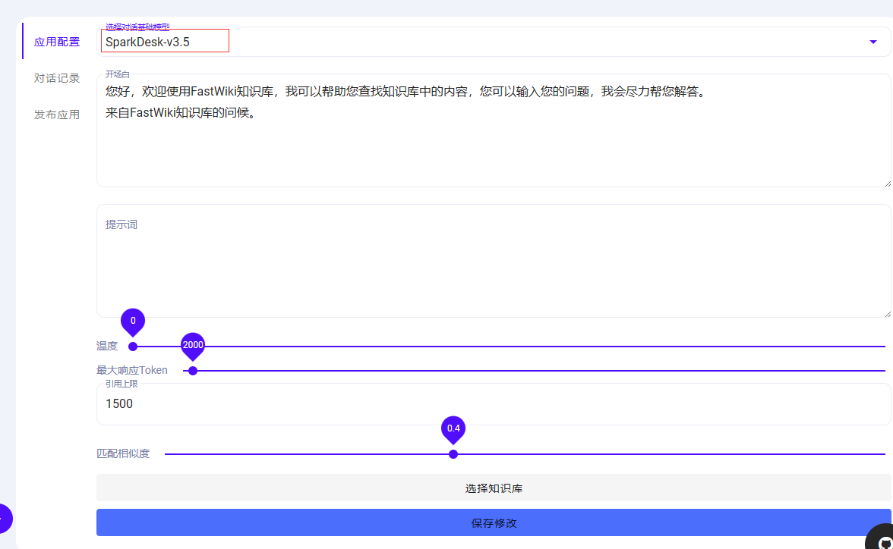
10. 打开聊天然后提问上传的文档的内容，这样就可以针对性规范AI了，还可以设置超出知识库返回的时候回复内容！
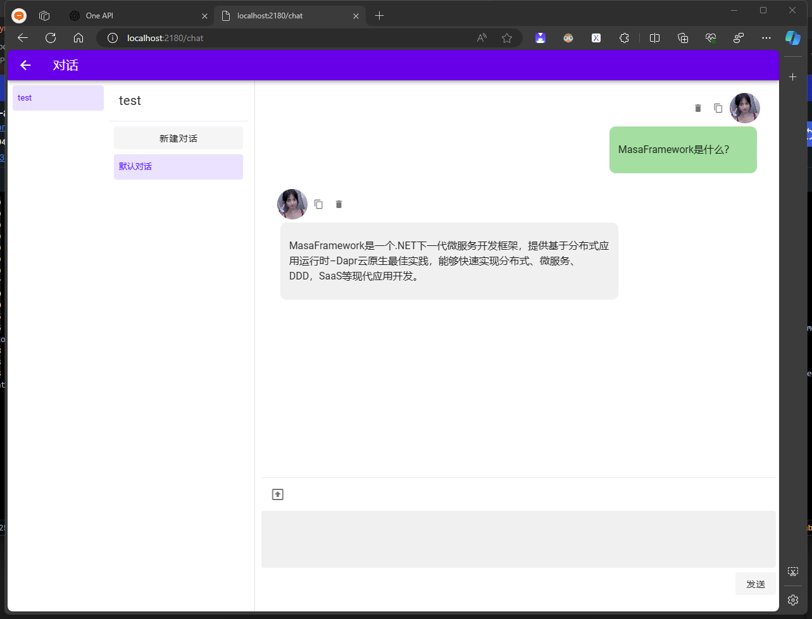
## 开源地址
Github: [https://github.com/239573049/fast-wiki](https://github.com/239573049/fast-wiki)
Gitee: [https://gitee.com/hejiale010426/fast-wiki](https://gitee.com/hejiale010426/fast-wiki)
在线文档：[https://docs.token-ai.cn/](https://docs.token-ai.cn/)
体验地址：[https://chat.token-ai.cn/chat/share-chat?id=939b3ad2f853422db0d781bcb19a8bf1](https://chat.token-ai.cn/chat/share-chat?id=939b3ad2f853422db0d781bcb19a8bf1)
知识库微信交流群加：

本文作者：tokengo
本文链接：https://www.cnblogs.com/hejiale010426/p/18054498
版权声明：本作品采用知识共享署名-非商业性使用-禁止演绎 2.5 中国大陆[许可协议](https://www.cnblogs.com/hejiale010426/p/18054498)进行许可。

> 来自: [智能AI知识库，增强AI知识的开源项目 - tokengo - 博客园](https://www.cnblogs.com/hejiale010426/p/18054498)

