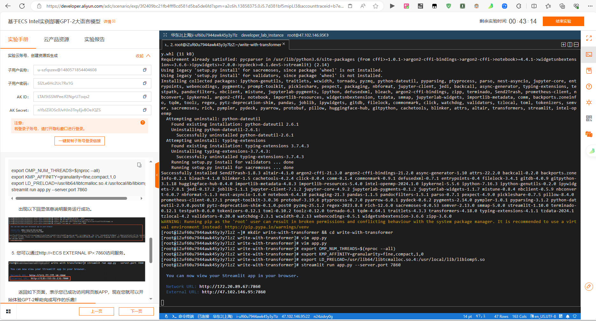
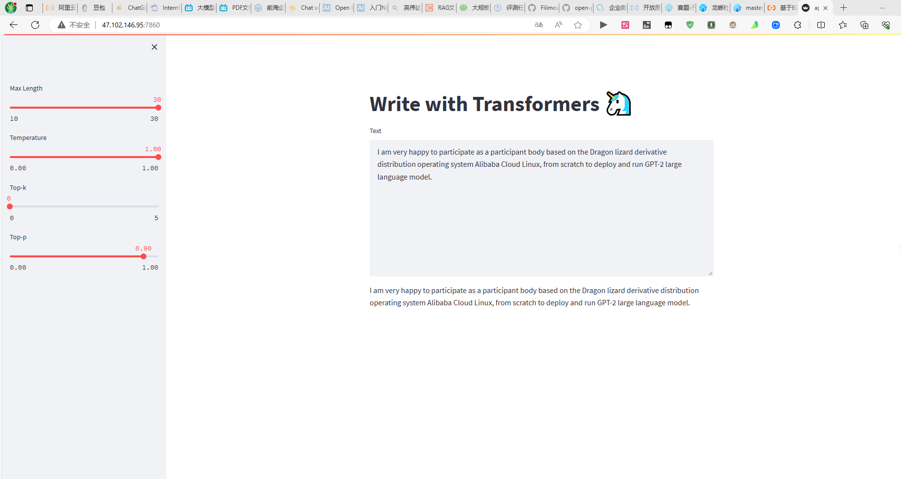

#### 大赛报名姓名：comefly
#### 阿里云账号：aliyun4051250644

#### 具体操作

- 操作步骤

        1.选择免费资源

- 软件安装配置

        1.安装anolis-epao-release包，再安装依赖，更新pip，安装 git lfs以便于大文件传输
```
yum install -y anolis-epao-release
```
```
yum install -y git git-lfs wget curl gcc gcc-c++ tar unzip pytorch gperftools-libs
```
```
python -m pip install --upgrade pip
```
```
git lfs install
```

- 下载模型，部署

          1.因为已经安装好了gpt-2预训练模型，所以暂时不用下载

1. 部署运行环境
```
pip install --ignore-installed pyyaml==5.1
pip install transformers streamlit intel-openmp
```
3.执行命令创建文件夹
```
mkdir write-with-transformer && cd write-with-transformer
```
4.运行
```
vim app.py
```
5.粘贴代码
```
import streamlit as st
from transformers import AutoTokenizer, AutoModelWithLMHead

tokenizer = AutoTokenizer.from_pretrained("../gpt2-large")
model = AutoModelWithLMHead.from_pretrained("../gpt2-large")

def infer(input_ids, max_length, temperature, top_k, top_p):
    output_sequences = model.generate(input_ids=input_ids,max_length=max_length,temperature=temperature,
        top_k=top_k,top_p=top_p,do_sample=True,num_return_sequences=1)
    return output_sequences

default_value = "Hello, I'm a language model,"

st.title("Write with Transformers 🦄")
sent = st.text_area("Text", default_value, height = 275)
max_length = st.sidebar.slider("Max Length", min_value = 10, max_value=30)
temperature = st.sidebar.slider("Temperature", value = 1.0, min_value = 0.0, max_value=1.0, step=0.05)
top_k = st.sidebar.slider("Top-k", min_value = 0, max_value=5, value = 0)
top_p = st.sidebar.slider("Top-p", min_value = 0.0, max_value=1.0, step = 0.05, value = 0.9)

encoded_prompt = tokenizer.encode(sent, add_special_tokens=False, return_tensors="pt")
if encoded_prompt.size()[-1] == 0:
    input_ids = None
else:
    input_ids = encoded_prompt

output_sequences = infer(input_ids, max_length, temperature, top_k, top_p)

for generated_sequence_idx, generated_sequence in enumerate(output_sequences):
    print(f"=== GENERATED SEQUENCE {generated_sequence_idx + 1} ===")
    generated_sequences = generated_sequence.tolist()
    text = tokenizer.decode(generated_sequence, clean_up_tokenization_spaces=True)
    total_sequence = (
        sent + text[len(tokenizer.decode(encoded_prompt[0], clean_up_tokenization_spaces=True)) :]
    )
    generated_sequences.append(total_sequence)
    print(total_sequence)

st.write(generated_sequences[-1])
```
```
export OMP_NUM_THREADS=$(nproc --all)
export KMP_AFFINITY=granularity=fine,compact,1,0
export LD_PRELOAD=/usr/lib64/libtcmalloc.so.4:/usr/local/lib/libiomp5.so
streamlit run app.py --server.port 7860
```
#### 实验操作完成截图


#### 对实验的反馈或建议

- 模型性能过于弱小，适量增加服务器配置，最好是GPU服务，
- 增加实验环节，


