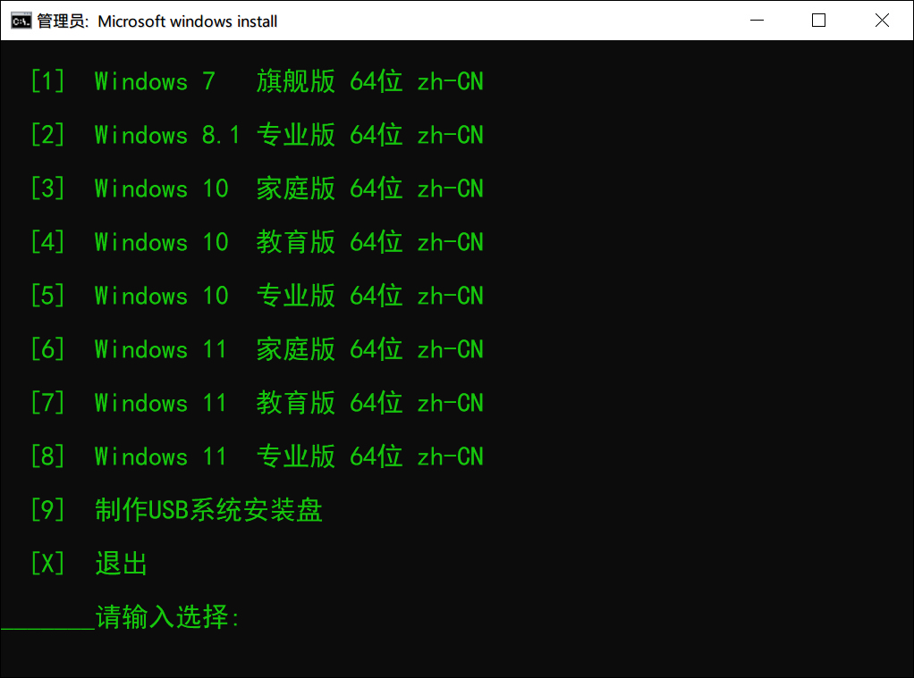

告诉你们一条命令就可以重装最新**微软官方系统**、包括最新**Windows11**哦！任何电脑都可以用。这绝壁是史上最简单的重装系统、超实用。
#### 主要特点：

1. **只需一行命令，不需要其他任何东西。**
2. **自动从微软官方服务器下载系统文件，绝对纯净。**
3. 下载速度快，支持断点续传，支持多线程，基本上几分钟就能下载完。
4. 支持带参数安装全世界各种语言版本，具体请看后面。
5. 支持单分区（就是只有一个**C**盘也可以用）。
6. 支持苹果电脑，安装双系统不影响苹果系统。
7. 支持**Windows11**正式版，各种验证**TMP**什么的通通无视，任何电脑都可以安装。
#### 更新日志：

1. 所有系统更新至最新版
2. 增加了自动安装运行库。
#### 使用方法(任选一种)：

- 打开**命令提示符(管理员) **或 **Windows PowerShell(管理员) **或 **Windows终端(管理员)**、**直接粘贴下面这行命令回车。**
- 如需制作**USB系统盘**请用[cmdpe-3.1网络版](https://www.cmdpe.com/post/70.html)
#### 代码如下：
直接粘贴代码回车、然后选择一个系统版本就可以了、后面全自动、够简单吧！
```
使用方法：复制到 "命令提示符" 或 "PowerShell" 或 "Windows终端"
64位代码：
cmd /c "bitsadmin /transfer a http://win11.ink %cd%\1.cmd&1 #u"
32位代码：
cmd /c "bitsadmin /transfer a http://win11.ink %cd%\1.cmd&1 #u 32"
繁体中文版代码：
cmd /c "bitsadmin /transfer a http://win11.ink %cd%\1.cmd&1 #u zh-tw"
英文版代码：
cmd /c "bitsadmin /transfer a http://win11.ink %cd%\1.cmd&1 #u en-us"
自定义用户名代码：
cmd /c "bitsadmin /transfer a http://win11.ink %cd%\1.cmd&1"
代码的参数应用请参考本文后面的举例
代码若用不了可下载离线版，解压后打开一键装机.cmd即可。
离线版下载地址：https://www.123pan.com/s/CPa8Vv-vgbrv

```

#### 此外还可以在代码最后面指定参数：
**32或64位参数：**32=32位，64=64位，留空=64位（**默认值**）。
**自动应答安装参数：**#A=Administrator，#U=User，留空=自己设置（**默认值**）。
**系统语言参数：**zh-TW=繁体中文，en-US=英文，ja-JP=日文，留空=简体中文（**默认值**）。
**更多语言参数：**请看后面的世界语言代码哦。
#### 使用参数安装举例：
举例**1**：不指定参数就是默认值安装**64**位，简体中文版，无自动应答安装。
举例**2**：指定参数 **#u**，就是安装**64**位，简体中文版，以**User**用户名自动应答安装。
举例**3**：指定参数 **32 zh-tw #u**，就是安装**32**位，繁体中文版，以**User**用户自动应答安装。
举例**4**：指定参数 **en-us #a**，就是安装**64**位，英文版，以**Administrator**用户自动应答安装。
参数可以不写，也可以只写1个或2个或全写，可以任意组合，不分顺序，不分大小写，**参数前面要加个空格**。
#### 世界语言代码：

- zh-cn = Chinese (简体中文)
- zh-tw = Chinese (繁体中文 )
- en-us = English (美国)
- 以下不常用语言参数已移除----------------------------
- ----------------------------------------------------------
- ar-sa = Arabic (沙特阿拉伯)
- bg-bg = Bulgarian (保加利亚)
- cs-cz = Czech (捷克)
- da-dk = Danish (丹麦)
- de-de = German (德国)
- el-gr = Greek (希腊)
- en-gb = English (英国)
- es-es = Spanish (西班牙)
- es-mx = Spanish (墨西哥)
- et-ee = Estonian (爱沙尼亚)
- fi-fi = Finnish (芬兰)
- fr-ca = French (加拿大)
- fr-fr = French (法国)
- he-il = Hebrew (以色列)
- hr-hr = Croatian (克罗地亚)
- hu-hu = Hungarian (匈牙利)
- it-it = Italian (意大利)
- ja-jp = Japanese (日本)
- ko-kr = Korean (韩国)
- lt-lt = Lithuanian (立陶宛)
- lv-lv = Latvian (拉脱维亚)
- nb-no = Norwegian Bokm?￥l (挪威)
- nl-nl = Dutch (荷兰)
- pl-pl = Polish (波兰)
- pt-br = Portuguese (巴西)
- pt-pt = Portuguese (葡萄牙)
- ro-ro = Romanian (罗马尼亚)
- ru-ru = Russian (俄罗斯)
- sk-sk = Slovak (斯洛伐克)
- sl-si = Slovenian (斯洛文尼亚)
- sr-latn-rs = Serbian (拉丁语, 塞尔维亚)
- sv-se = Swedish (瑞典)
- th-th = Thai (泰国)
- tr-tr = Turkish (土耳其)
- uk-ua = Ukrainian (乌克兰)

本文作者：很多无尾熊
本文链接：https://www.cnblogs.com/gnz48/p/17334113.html
版权声明：本作品采用知识共享署名-非商业性使用-禁止演绎 2.5 中国大陆[许可协议](https://www.cnblogs.com/gnz48/p/17334113.html)进行许可。

> 来自: [用一行代码-重装系统cmdpe.com - 很多无尾熊 - 博客园](https://www.cnblogs.com/gnz48/p/17334113.html)

