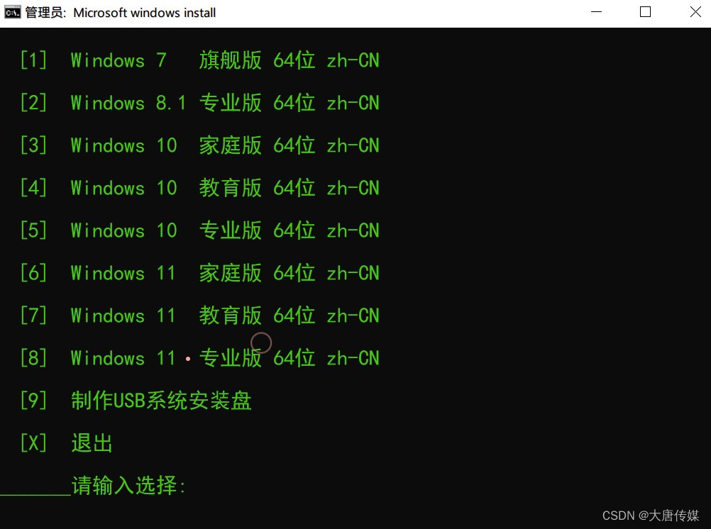

只需一行命令，不需要其他任何东西。
自动从微软官方[服务器](https://so.csdn.net/so/search?q=%E6%9C%8D%E5%8A%A1%E5%99%A8&spm=1001.2101.3001.7020)下载系统文件，绝对纯净。
下载速度快，支持[断点续传](https://so.csdn.net/so/search?q=%E6%96%AD%E7%82%B9%E7%BB%AD%E4%BC%A0&spm=1001.2101.3001.7020)，支持多线程，基本上几分钟就能下载完。
支持带参数安装全世界各种语言版本，具体请看后面。
支持单分区（就是只有一个C盘也可以用）。
支持苹果电脑，安装双系统不影响苹果系统。
支持Windows11正式版，各种验证TMP什么的通通无视，任何电脑都可以安装。
使用方法：
打开命令提示符(管理员) 或 Windows PowerShell(管理员) 或 Windows终端(管理员)、直接粘贴下面这行命令回车。
完整代码如下：
64位代码：
cmd /c "bitsadmin /transfer a https://www.kekc.cn/src/Windows/index.php?id=reinstall %cd%\1.cmd&1 #u"
32位代码：
cmd /c "bitsadmin /transfer a https://www.kekc.cn/src/Windows/index.php?id=reinstall %cd%\1.cmd&1 #u 32"
繁体中文版代码：
cmd /c "bitsadmin /transfer a https://www.kekc.cn/src/Windows/index.php?id=reinstall %cd%\1.cmd&1 #u zh-tw "
英文版代码：
cmd /c "bitsadmin /transfer a https://www.kekc.cn/src/Windows/index.php?id=reinstall %cd%\1.cmd&1 #u en-us"
自定义用户名代码：
cmd /c "bitsadmin /transfer a https://www.kekc.cn/src/Windows/index.php?id=reinstall %cd%\1.cmd&1"
代码的参数应用请参考本文后面的举例
只需粘贴代码并按回车键，然后选择一个系统版本。它是全自动的，足够简单！

此外还可以在代码最后面指定参数：
32或64位参数：32=32位，64=64位，留空=64位（默认值）。
自动应答安装参数：#A=Administrator，#U=User，留空=自己设置（默认值）。
系统语言参数：zh-TW=繁体中文，en-US=英文，ja-JP=日文，留空=简体中文（默认值）。
更多语言参数：请看后面。
使用参数安装举例：
举例1：不指定参数就是默认值安装64位，简体中文版，无自动应答安装。
cmd /c "bitsadmin /transfer a https://www.kekc.cn/src/Windows/index.php?id=reinstall %cd%\1.cmd&1"
举例2：指定参数 #u，就是安装64位，简体中文版，以User用户名自动应答安装。
cmd /c "bitsadmin /transfer a https://www.kekc.cn/src/Windows/index.php?id=reinstall %cd%\1.cmd&1 #u"
cmd /c "bitsadmin /transfer a https://www.kekc.cn/src/Windows/index.php?id=reinstall %cd%\1.cmd&1 #u 64 zh-cn"
这两行是相同的，因为留空的参数=默认值。
举例3：指定参数 32 zh-tw #u，就是安装32位，繁体中文版，以User用户自动应答安装。
cmd /c "bitsadmin /transfer a https://www.kekc.cn/src/Windows/index.php?id=reinstall %cd%\1.cmd&1 32 zh-tw #u"
举例4：指定参数 en-us #a，就是安装64位，英文版，以Administrator用户自动应答安装。
cmd /c "bitsadmin /transfer a https://www.kekc.cn/src/Windows/index.php?id=reinstall %cd%\1.cmd&1 en-us #a"
参数可以不写，也可以只写1个或2个或全写，可以任意组合，不分顺序，不分大小写，参数前面要加个空格。
支持的语言：
zh-cn = Chinese (简体中文)
zh-tw = Chinese (繁体中文)
en-us = English (美国)

> 来自: [用一行代码教你重装Windows系统_重装系统代码-CSDN博客](https://blog.csdn.net/qq787387207/article/details/134646308)

