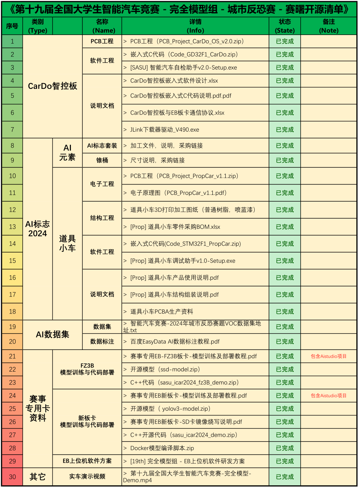

## 第十九届全国大学生智能汽车竞赛-赛曙科技开源学习资料
#### 介绍

- [第十九届全国大学生智能汽车竞赛，完全模型组，北京赛曙科技有限公司开源学习资料仓库。](https://gitee.com/bjsstech/SASU-ICAR-Match2024-Kits)
- 开源资料如下：

#### 资料说明
		赛事开源方案基于Edgeboard赛事专用卡开发，包括FZ3B板卡和EB新板卡两套方案，EB上位机软件（C++）仅AI部署代码（detection.hpp）存在差异（封装API一致），其余内容完全相互兼容平替。
		鉴于往届参赛选手对C++多线程代码的学习较为吃力，本届开源方案特简化软件架构，不降低车辆控制频率（24FPS），提升代码可读性，单线程完成AI推理、图像处理和车辆控制任务。
	由于时间紧任务重，暂时部分软件使用说明文档还未完善（后续跟上），若学习过程遇到诸多不顺请及时与广大参赛车友共同探讨交流，并随时求助至QQ群或其它渠道赛事运营同学，我们将努力为各位辛勤调车的战友保驾护航！
		开源资料不易，仅望诸位车友耐心品鉴，批评指正！！！

> 来自: [第十九届全国大学生智能汽车竞赛-赛曙科技开源学习资料: 第十九届全国大学生智能汽车竞赛，完全模型组，北京赛曙科技有限公司开源学习资料仓库](https://gitee.com/bjsstech/SASU-ICAR-Match2024-Kits)

