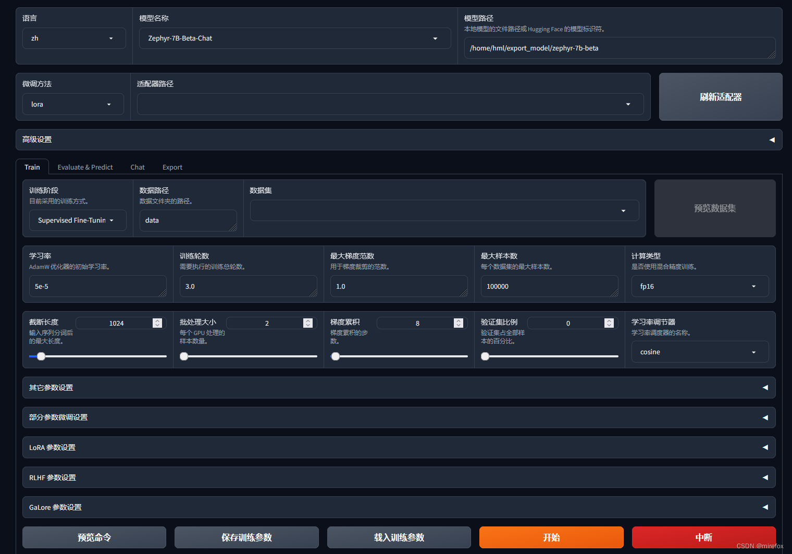
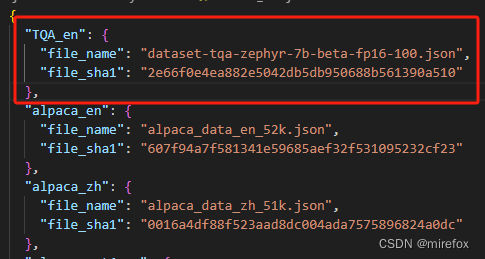
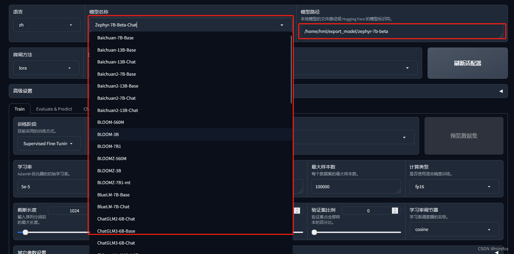
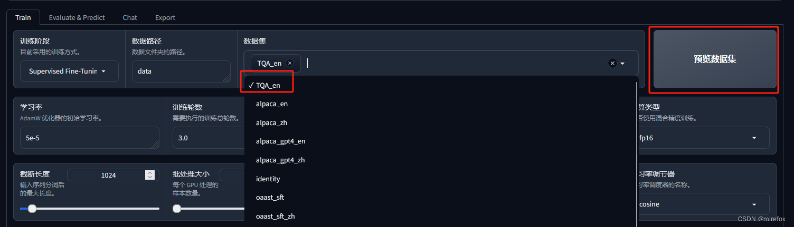
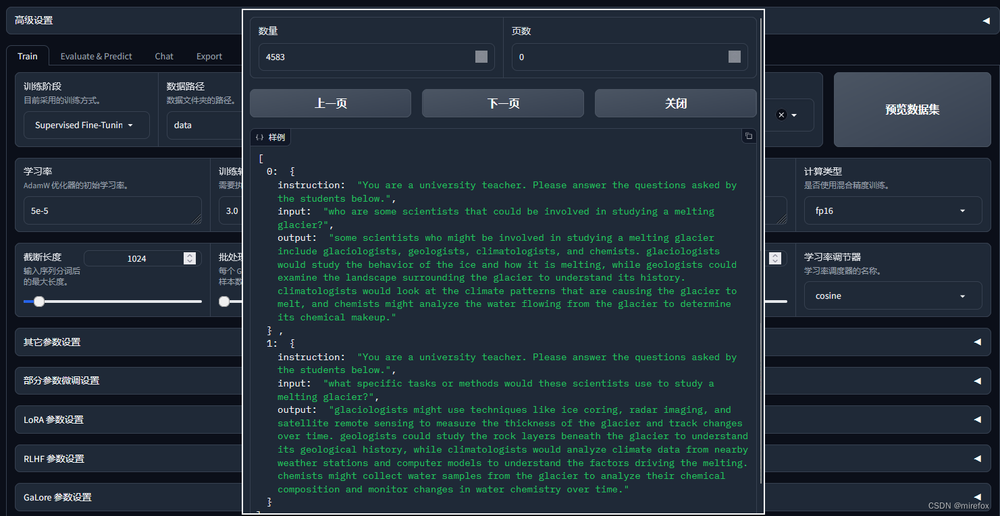
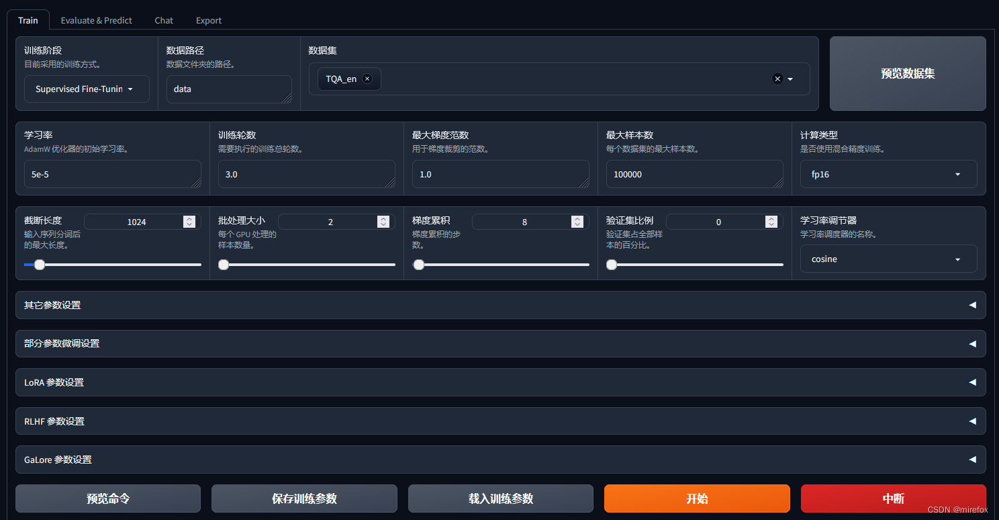
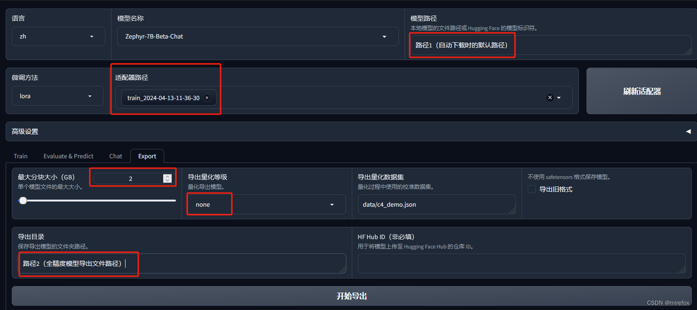
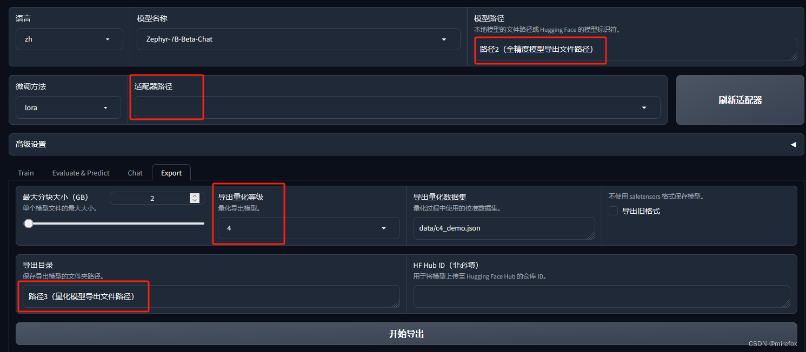
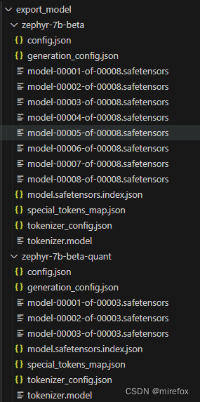
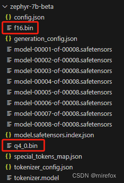

_本文所有操作均在linux系统下完成_
### llama_factory安装
参考github的安装命令
```
git clone https://github.com/hiyouga/LLaMA-Factory.git


conda create -n llama_factory python=3.10


conda activate llama_factory


cd LLaMA-Factory


pip install -e .[metrics]
```
### llama_factory运行
参考github，使用以下命令启动LLaMA Factory [web页面](https://so.csdn.net/so/search?q=web%E9%A1%B5%E9%9D%A2&spm=1001.2101.3001.7020)：（web ui界面只支持单卡运行，如需多卡微调请参考github相关部分）
此外可以选择模型下载源，这里推荐国内用户使用魔搭社区下载渠道。
```
export CUDA_VISIBLE_DEVICES=0 # `set CUDA_VISIBLE_DEVICES=0` for Windows


export USE_MODELSCOPE_HUB=1 # 使用魔搭社区下载渠道


python src/train_web.py # or python -m llmtuner.webui.interface
```
成功启动后会进入web操作界面：

### 微调数据集准备
首先按照alpaca格式准备训练数据，格式范例如下：
```
[


  {


    "instruction": "你好",


    "input": "",


    "output": "您好，我是XX大模型，一个由XXX开发的 AI 助手，很高兴认识您。请问我能为您做些什么？"


  },


  {


    "instruction": "你好",


    "input": "",


    "output": "您好，我是XX大模型，一个由XXX打造的人工智能助手，请问有什么可以帮助您的吗？"


  }


  ]
```
其中，instruction和input可以都填充进内容，如把问题作为input，把“回答问题这一要求”作为instruction。据说这种指令微调数据集的格式效果比较好。
准备数据之后，应上传所用到的数据集至项目路径下data文件夹。同时需要将新数据集在dataset_info.json下进行登记注册。

其中“**TQA_en**”是数据集的自定义名称，“**file_name**”是同文件夹路径下，数据集json的文件名，“**file_sha1**”需要通过计算获得，该字段要求并不严格，有即可，主要为了区分重复文件，作uuid使用。计算方法如下：
```
import hashlib


 


def calculate_sha1(file_path):


    sha1 = hashlib.sha1()


    try:


        with open(file_path, 'rb') as file:


            while True:


                data = file.read(8192)  # Read in chunks to handle large files


                if not data:


                    break


                sha1.update(data)


        return sha1.hexdigest()


    except FileNotFoundError:


        return "File not found."


 


# 使用示例


file_path = r'C:\Users\12258\Desktop\xxx.json'  # 替换为您的文件路径


sha1_hash = calculate_sha1(file_path)


print("SHA-1 Hash:", sha1_hash)
```
如此，数据集的准备工作就完成了。
### 微调过程
首先选择想要微调的模型，然后默认模型路径，这样无需额外操作，在之后启动训练时，就会自动下载模型相关文件至本地。

选择自己的数据集，并可以通过预览数据集查看自己的数据内容。



如此点击最下方“开始”按键后，模型就会开始进行微调训练。底部会有日志刷新并可视化loss曲线，直至训练结束。
### 模型导出
导出需要注意，只能先导出全精度版本模型，然后再导出量化版本模型，具体操作如下：
#### 1.全精度导出
“模型路径”：不用改动，默认是刚才选择模型后自动生成的那个路径。
“适配器路径”：选择刚才训练结束生成的保存文件。
“最大分块大小”：按自己喜好选择大小。
“导出量化等级”：此阶段选择none，否则无法成功导出。
“导出目录”：填写全精度模型导出的目标路径。

点击“开始导出”后，模型开始导出。
#### 2.量化导出
“模型路径”：需要改成路径2，也就是上一步全精度模型导出文件的路径。
“适配器路径”：取消选择
“导出量化等级”：选择想要的等级。
“导出路径”：填写新的量化模型导出的目标路径

如此便可顺利导出量化模型，导出后的模型文件为safetensors格式，图示如下，两个文件夹，上方为全精度模型，下方为量化模型：

### 微调模型转化格式并量化
ollama不支持直接导入safetensors格式的模型文件，所以需要使用ollama的量化工具将模型文件进行转化，我这里直接使用了ollama/quantize的docker工具，一行命令行即可调用实现，非常方便，命令如下：
```
docker run --rm -v /path/to/model/repo:/repo ollama/quantize -q q4_0 /repo
```
“**/path/to/model/repo**”：替换成自己的模型文件路径即可。
“**q4_0**”：设置为自己想要的量化精度。
建议量化上文llama_factory导出的全精度模型，因为ollama/quantize除了会将模型文件转化成一个指定量化等级的模型文件还会生成一个无量化的全精度模型文件，如下图所示：

### 微调模型导入ollama
_本人使用的是ollama docker，不保证其他方式的ollama也可同样操作，ollama github中对于模型导入写的很详细，具体请查阅_[github](https://github.com/ollama/ollama/blob/main/docs/import.md)_。_
完成以上步骤后，我们就可以直接从ollama [github教程](https://so.csdn.net/so/search?q=github%E6%95%99%E7%A8%8B&spm=1001.2101.3001.7020)中的第三步“Write a Modefile”继续进行。
首先要创建一个“Modelfile”文件，按照模板在其中填入导入模型的相应信息，官方模板如下：
```
FROM llama2


# sets the temperature to 1 [higher is more creative, lower is more coherent]


PARAMETER temperature 1


# sets the context window size to 4096, this controls how many tokens the LLM can use as context to generate the next token


PARAMETER num_ctx 4096


 


# sets a custom system message to specify the behavior of the chat assistant


SYSTEM You are Mario from super mario bros, acting as an assistant.
```
最重要的还是第一行，指定模型文件的存储路径。如果ollama中已经pull过与微调模型同类型的模型（比如我微调的模型是zephyr，而我之前在ollama中已经用过zephyr），那可以直接使用
```
ollama show --modelfile zephyr
```
命令查阅该模型官方的Modelfile配置详情，然后直接复制到自己微调模型Modelfile配置中即可。
最终我的Modelfile配置如下，除了第一行是模型文件路径，后面内容都是直接复制官方配置：
```
FROM /root/.ollama/models/blobs/zephyr_q4_0.bin


TEMPLATE """{{- if .System }}


<|system|>


{{ .System }}


</s>


{{- end }}


<|user|>


{{ .Prompt }}


</s>


<|assistant|>


"""


PARAMETER stop "<|system|>"


PARAMETER stop "<|user|>"


PARAMETER stop "<|assistant|>"


PARAMETER stop "</s>
```
保存文件之后，执行如下命令，就完成了ollama的自定义微调模型导入：
```
ollama create choose-a-model-name -f <location of the file e.g. ./Modelfile>'
```
使用如下命令进行测试，如果成功运行，代表模型导入成功：
```
ollama run choose-a-model-name
```
### 参考
[从零开始的LLaMA-Factory的指令增量微调_llama-factory和llama有什么关系-CSDN博客](https://blog.csdn.net/qq_43128256/article/details/136738734)
[单卡 3 小时训练专属大模型 Agent：基于 LLaMA Factory 实战 - 知乎](https://zhuanlan.zhihu.com/p/678989191)
[使用LLaMA Factory对大型语言模型进行微调 - 知乎](https://zhuanlan.zhihu.com/p/684989699)
[GitHub - hiyouga/LLaMA-Factory: Unify Efficient Fine-Tuning of 100+ LLMs](https://github.com/hiyouga/LLaMA-Factory/tree/main)
[https://hub.docker.com/r/ollama/quantize](https://hub.docker.com/r/ollama/quantize)
[Ollama教程——模型：如何将模型高效导入到ollama框架_ollama模型学习-CSDN博客](https://blog.csdn.net/walkskyer/article/details/137491321)
[ollama/docs/import.md at main · ollama/ollama · GitHub](https://github.com/ollama/ollama/blob/main/docs/import.md)

> 来自: [自定义数据集使用llama_factory微调模型并导入ollama_ollama下载的模型能通过llamafactory训练吗-CSDN博客](https://blog.csdn.net/weixin_53162188/article/details/137754362?spm=1001.2101.3001.6650.3&utm_medium=distribute.pc_relevant.none-task-blog-2%7Edefault%7EYuanLiJiHua%7EPosition-3-137754362-blog-138755776.235%5Ev43%5Epc_blog_bottom_relevance_base8&depth_1-utm_source=distribute.pc_relevant.none-task-blog-2%7Edefault%7EYuanLiJiHua%7EPosition-3-137754362-blog-138755776.235%5Ev43%5Epc_blog_bottom_relevance_base8&utm_relevant_index=4)

