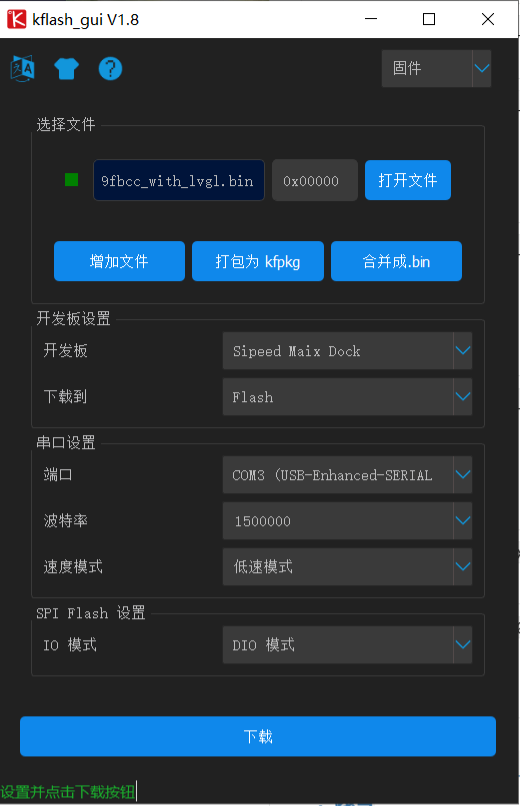
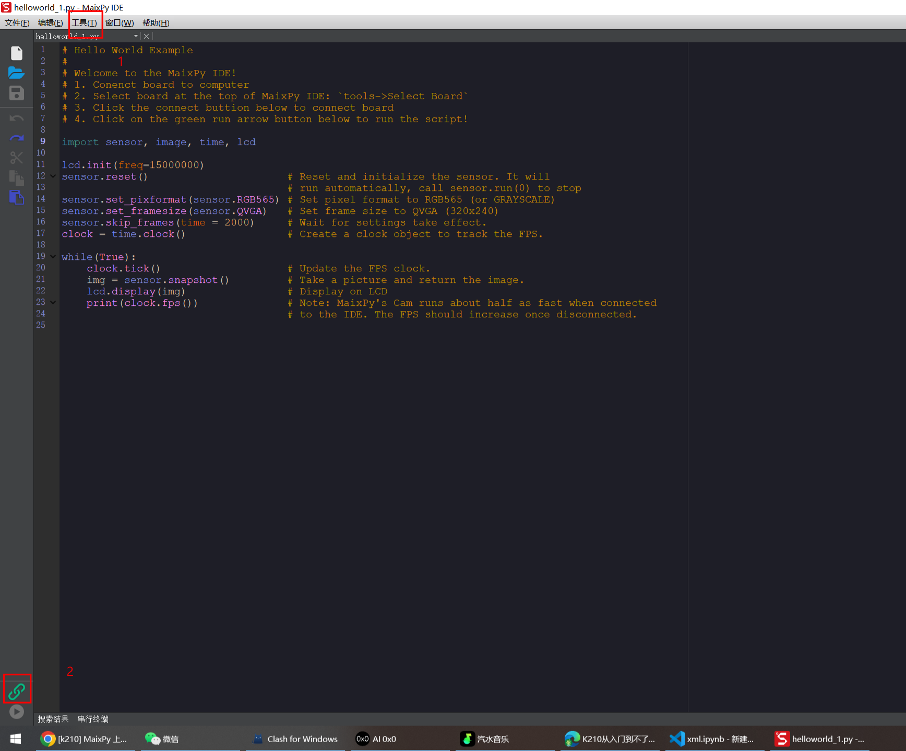
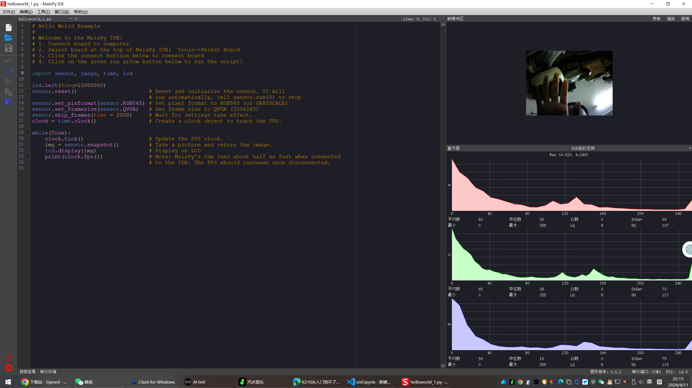

板子：pyAI-k210（```Maix Dock```）

- 下载Maixpy IDE 

        链接：见官网文档[https://wiki.sipeed.com/soft/maixpy/zh/index.html](https://wiki.sipeed.com/soft/maixpy/zh/index.html)

- 下载烧录软件kflash_gui

       链接：[https://github.com/sipeed/kflash_gui/releases](https://github.com/sipeed/kflash_gui/releases)

- 安装CH340 的驱动

       百度搜索一下，官网也有

- 下载固件

       链接：[https://dl.sipeed.com/shareURL/MAIX/MaixPy/release/master](https://dl.sipeed.com/shareURL/MAIX/MaixPy/release/master)

- 固件注意事项
| 文件名 | 说明 | 备注 |
| --- | --- | --- |
| `maixpy_vx.y.z_x_xxx*.bin` | 默认版本的 MaixPy 固件，包含了大多数功能, 支持连接 `MaixPy IDE`
, | - |
| `maixpy_vx.y.z_x_xxx*_m5stickv.bin` | 针对 M5Stickv 定制的固件, 支持连接 `MaixPy IDE` | — |
| `maixpy_vx.y.z_x_xxx*_with_lvgl.bin` | MaixPy 固件, 支持连接 `MaixPy IDE`
, 带 LVGL 版本.(LVGL是嵌入式 GUI 框架, 写界面的时候需要用到) | — |
| `maixpy_vx.y.z_x_xxx*_minimum.bin` | MaixPy 固件最小集合，不支持 `MaixPy IDE`
, 不包含`OpenMV`
的相关算法和各种外设模块 | — |
| `maixpy_vx.y.z_x_xxx*_minimum_with_ide_support.bin` | MaixPy 固件最小集合, 支持连接 `MaixPy IDE`
, 不包含`OpenMV`
的相关算法和各种外设模块 | 运行各种模型，建议使用这个 |
| `elf_maixpy_vx.y.z_x_xxx*.7z` | elf 文件，普通用户不用关心，用于死机调试 | — |
| `face_model_at_0x300000.kfpkg` | 人脸模型，放置在地址位 0x300000, 可以和`.bin`
分开多次下载，不冲突 | — |

我下载了 **maixpy_v0.6.2_85_g23d09fbcc_openmv_kmodel_v4_with_ide_support.bin**
**也有看见下载openmv_v4_with_kmodel的，后面要是保存再看吧**

- **烧录**
- 

- Maixpy IDE 使用
```
1.打开工具，选择开发板，选择Sipeed Maix Dock

2.点击连接，选择串口，这里我就一个串口com3，所以直接就连接了，然后点击连接下面的三角运行按钮，就可以看到有右边的画面了
```

- 

- 

> 
> [https://blog.csdn.net/qq_46554815/article/details/122811678](https://blog.csdn.net/qq_46554815/article/details/122811678)
> [https://blog.csdn.net/qq_38961840/article/details/130758836](https://blog.csdn.net/qq_38961840/article/details/130758836)
> [https://qichenxi.blog.csdn.net/article/details/121044449](https://qichenxi.blog.csdn.net/article/details/121044449)
> [https://blog.csdn.net/qq_51963216/article/details/125956308](https://blog.csdn.net/qq_51963216/article/details/125956308)
> [https://blog.csdn.net/weixin_55504804/article/details/125711002?utm_medium=distribute.pc_relevant.none-task-blog-2~default~baidujs_baidulandingword~default-1-125711002-blog-110549498.235^v43^pc_blog_bottom_relevance_base8&spm=1001.2101.3001.4242.2&utm_relevant_index=2](https://blog.csdn.net/weixin_55504804/article/details/125711002?utm_medium=distribute.pc_relevant.none-task-blog-2~default~baidujs_baidulandingword~default-1-125711002-blog-110549498.235^v43^pc_blog_bottom_relevance_base8&spm=1001.2101.3001.4242.2&utm_relevant_index=2)
> 


:::info
找到的唯一型号合适的，但是其他的都大同小异，呵呵
[https://blog.csdn.net/small_po_kid/article/details/113762110](https://blog.csdn.net/small_po_kid/article/details/113762110)
:::
:::info
_Pytorch——》ONNX——》KModel——》Run
我还想用yolov9，模型都训练好了，但是先用这个吧，后续再看_
[https://blog.csdn.net/u014798590/article/details/110549498](https://blog.csdn.net/u014798590/article/details/110549498)
[https://www.amrzs.net/2022/04/25/kmodel/](https://www.amrzs.net/2022/04/25/kmodel/)
[https://ask.csdn.net/questions/7984100](https://ask.csdn.net/questions/7984100)
[https://blog.csdn.net/weixin_42815846/article/details/111727761](https://blog.csdn.net/weixin_42815846/article/details/111727761)
:::

:::info
脱机boot.py必须要，不然每次就得重烧了
[https://blog.csdn.net/qq_42733748/article/details/124124451?spm=1001.2101.3001.6650.8&utm_medium=distribute.pc_relevant.none-task-blog-2%7Edefault%7EBlogCommendFromBaidu%7ERate-8-124124451-blog-113172455.235%5Ev43%5Epc_blog_bottom_relevance_base8&depth_1-utm_source=distribute.pc_relevant.none-task-blog-2%7Edefault%7EBlogCommendFromBaidu%7ERate-8-124124451-blog-113172455.235%5Ev43%5Epc_blog_bottom_relevance_base8&utm_relevant_index=15](https://blog.csdn.net/qq_42733748/article/details/124124451?spm=1001.2101.3001.6650.8&utm_medium=distribute.pc_relevant.none-task-blog-2%7Edefault%7EBlogCommendFromBaidu%7ERate-8-124124451-blog-113172455.235%5Ev43%5Epc_blog_bottom_relevance_base8&depth_1-utm_source=distribute.pc_relevant.none-task-blog-2%7Edefault%7EBlogCommendFromBaidu%7ERate-8-124124451-blog-113172455.235%5Ev43%5Epc_blog_bottom_relevance_base8&utm_relevant_index=15)


[https://blog.csdn.net/moshanghuaw/article/details/113172455](https://blog.csdn.net/moshanghuaw/article/details/113172455)


[https://blog.csdn.net/weixin_63472329/article/details/131926423?spm=1001.2101.3001.6650.3&utm_medium=distribute.pc_relevant.none-task-blog-2%7Edefault%7ECTRLIST%7ERate-3-131926423-blog-124124451.235%5Ev43%5Epc_blog_bottom_relevance_base8&depth_1-utm_source=distribute.pc_relevant.none-task-blog-2%7Edefault%7ECTRLIST%7ERate-3-131926423-blog-124124451.235%5Ev43%5Epc_blog_bottom_relevance_base8&utm_relevant_index=4](https://blog.csdn.net/weixin_63472329/article/details/131926423?spm=1001.2101.3001.6650.3&utm_medium=distribute.pc_relevant.none-task-blog-2%7Edefault%7ECTRLIST%7ERate-3-131926423-blog-124124451.235%5Ev43%5Epc_blog_bottom_relevance_base8&depth_1-utm_source=distribute.pc_relevant.none-task-blog-2%7Edefault%7ECTRLIST%7ERate-3-131926423-blog-124124451.235%5Ev43%5Epc_blog_bottom_relevance_base8&utm_relevant_index=4)

:::


:::info
[https://blog.csdn.net/weixin_46185705/article/details/129371662](https://blog.csdn.net/weixin_46185705/article/details/129371662)
:::
:::info
[https://pan.baidu.com/s/1Gl3Qfw5s8LZuu2wc1GTITg?pwd=dvsf#list/path=%2F](https://pan.baidu.com/s/1Gl3Qfw5s8LZuu2wc1GTITg?pwd=dvsf#list/path=%2F)
:::
:::info
[https://blog.csdn.net/weixin_44115575/article/details/137180642?utm_medium=distribute.pc_relevant.none-task-blog-2~default~baidujs_baidulandingword~default-0-137180642-blog-127453312.235^v43^pc_blog_bottom_relevance_base8&spm=1001.2101.3001.4242.1&utm_relevant_index=1](https://blog.csdn.net/weixin_44115575/article/details/137180642?utm_medium=distribute.pc_relevant.none-task-blog-2~default~baidujs_baidulandingword~default-0-137180642-blog-127453312.235^v43^pc_blog_bottom_relevance_base8&spm=1001.2101.3001.4242.1&utm_relevant_index=1)
:::
