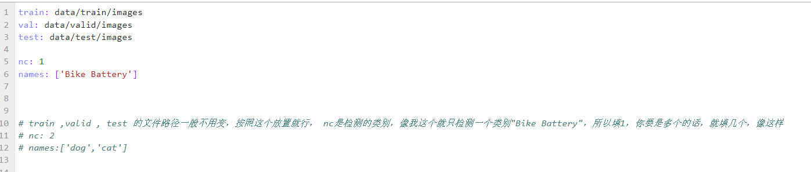
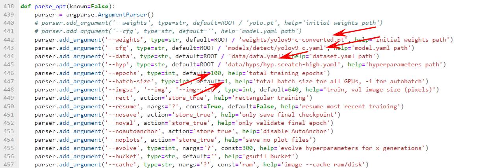
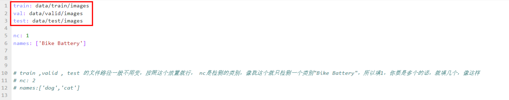
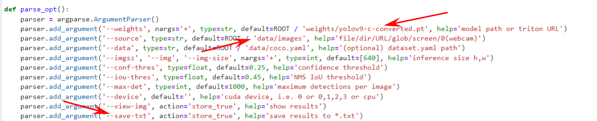

- yolov9介绍
- 论文：[YOLOv9: Learning What You Want to Learn Using Programmable Gradient Information](https://arxiv.org/abs/2402.13616)


yolov9文件夹说明.
├── LICENSE.md
├── README.md
├── __pycache__
│   └── export.cpython-38.pyc
├── benchmarks.py
├── classify
│   ├── predict.py
│   ├── train.py
│   └── val.py
├── data
│   ├── README.dataset.txt
│   ├── README.roboflow.txt
│   ├── coco.yaml
│   ├── data.yaml
│   ├── hyps
│   │   └── hyp.scratch-high.yaml
│   ├── images
│   │   └── horses.jpg
│   ├── test
│   │   ├── images
│   │   └── labels
│   ├── train
│   │   ├── images
│   │   └── labels
│   └── valid
│       ├── images
│       └── labels
├── detect.py
├── detect_dual.py
├── export.py
├── figure
│   ├── horses_prediction.jpg
│   ├── multitask.png
│   └── performance.png
├── hubconf.py
├── models
│   ├── __init__.py
│   ├── __pycache__
│   │   ├── __init__.cpython-38.pyc
│   │   ├── common.cpython-38.pyc
│   │   ├── experimental.cpython-38.pyc
│   │   └── yolo.cpython-38.pyc
│   ├── common.py
│   ├── detect
│   │   ├── gelan-c.yaml
│   │   ├── gelan-e.yaml
│   │   ├── gelan.yaml
│   │   ├── yolov7-af.yaml
│   │   ├── yolov9-c.yaml
│   │   ├── yolov9-e.yaml
│   │   └── yolov9.yaml
│   ├── experimental.py
│   ├── hub
│   │   ├── anchors.yaml
│   │   ├── yolov3-spp.yaml
│   │   ├── yolov3-tiny.yaml
│   │   └── yolov3.yaml
│   ├── panoptic
│   │   ├── gelan-c-pan.yaml
│   │   └── yolov7-af-pan.yaml
│   ├── segment
│   │   ├── gelan-c-dseg.yaml
│   │   ├── gelan-c-seg.yaml
│   │   ├── yolov7-af-seg.yaml
│   │   └── yolov9-c-dseg.yaml
│   ├── tf.py
│   └── yolo.py
├── panoptic
│   ├── predict.py
│   ├── train.py
│   └── val.py
├── requirements.txt
├── runs
│   └── detect
│       └── exp
│           └── horses.jpg
├── scripts
│   └── get_coco.sh
├── segment
│   ├── predict.py
│   ├── train.py
│   ├── train_dual.py
│   ├── val.py
│   └── val_dual.py
├── tools
│   └── reparameterization.ipynb
├── train.py
├── train_dual.py
├── train_triple.py
├── tree.txt
├── utils
│   ├── __init__.py
│   ├── __pycache__
│   │   ├── __init__.cpython-38.pyc
│   │   ├── augmentations.cpython-38.pyc
│   │   ├── dataloaders.cpython-38.pyc
│   │   ├── downloads.cpython-38.pyc
│   │   ├── general.cpython-38.pyc
│   │   ├── lion.cpython-38.pyc
│   │   ├── metrics.cpython-38.pyc
│   │   ├── plots.cpython-38.pyc
│   │   └── torch_utils.cpython-38.pyc
│   ├── activations.py
│   ├── augmentations.py
│   ├── autoanchor.py
│   ├── autobatch.py
│   ├── callbacks.py
│   ├── coco_utils.py
│   ├── dataloaders.py
│   ├── downloads.py
│   ├── general.py
│   ├── lion.py
│   ├── loggers
│   │   ├── __init__.py
│   │   ├── clearml
│   │   │   ├── __init__.py
│   │   │   ├── clearml_utils.py
│   │   │   └── hpo.py
│   │   ├── comet
│   │   │   ├── __init__.py
│   │   │   ├── comet_utils.py
│   │   │   ├── hpo.py
│   │   │   └── optimizer_config.json
│   │   └── wandb
│   │       ├── __init__.py
│   │       ├── log_dataset.py
│   │       ├── sweep.py
│   │       ├── sweep.yaml
│   │       └── wandb_utils.py
│   ├── loss.py
│   ├── loss_tal.py
│   ├── loss_tal_dual.py
│   ├── loss_tal_triple.py
│   ├── metrics.py
│   ├── panoptic
│   │   ├── __init__.py
│   │   ├── augmentations.py
│   │   ├── dataloaders.py
│   │   ├── general.py
│   │   ├── loss.py
│   │   ├── loss_tal.py
│   │   ├── metrics.py
│   │   ├── plots.py
│   │   └── tal
│   │       ├── __init__.py
│   │       ├── anchor_generator.py
│   │       └── assigner.py
│   ├── plots.py
│   ├── segment
│   │   ├── __init__.py
│   │   ├── __pycache__
│   │   │   ├── __init__.cpython-38.pyc
│   │   │   └── general.cpython-38.pyc
│   │   ├── augmentations.py
│   │   ├── dataloaders.py
│   │   ├── general.py
│   │   ├── loss.py
│   │   ├── loss_tal.py
│   │   ├── loss_tal_dual.py
│   │   ├── metrics.py
│   │   ├── plots.py
│   │   └── tal
│   │       ├── __init__.py
│   │       ├── anchor_generator.py
│   │       └── assigner.py
│   ├── tal
│   │   ├── __init__.py
│   │   ├── __pycache__
│   │   │   ├── __init__.cpython-38.pyc
│   │   │   └── anchor_generator.cpython-38.pyc
│   │   ├── anchor_generator.py
│   │   └── assigner.py
│   ├── torch_utils.py
│   └── triton.py
├── val.py
├── val_dual.py
├── val_triple.py
└── weights
    ├── yolov9-c-converted.pt
    └── yolov9-e-converted.pt

42 directories, 938 files

## 训练部分
### 初级教程

- 自定义数据集
> 1.需要自定义训练的话，上传自己的数据集，文件位置/root/yolov9/data
> 2.data文件夹中有train ，valid ，test文件夹，各自文件夹下有images和labels文件夹
> 3.上传的话文件夹名称最好不要变，如果你不会设置的话，如果想自定义的话，请看进阶教程


- 修改data.yaml文件
> 上传完数据集之后，请到/root/yolov9/data/data.yaml文件中修改路径 ，nc ，names ，



- 自定义训练轮数
> 在train_dual.py第446行修改，如果想训练n轮，请填n+1,


- 自定义批量大小
> 在train_dual.py第447行修改，配置不行的话，建议填1-4之间，根据实际情况调整




- 开始训练
> 激活yolov9环境，(如果你没有更改文件名称)，直接运行/root/yolov9/train_dual.py，开始训练，代码如下

```
source activate yolov9

cd /root/yolov9
python train_dual.py
```


### 进阶教程

- 自定义数据集
> 数据集名称啥的可以自定义，但是不建议，改的话，就把对应的data.yaml也要改，如果data.yaml名称也要修改，那么train_dual.py 444行也需要改，




- 自定义预训练权重
> 预训练权重我已经上传了yolov9-c-converted.pt和yolov9-e-converted.pt这两个到/root/yolov9/weights文件夹中，如果需要其他权重，请到yolov9的GitHub项目下下载，并上传
> 默认使用的是yolov9-c-converted.pt权重，如果想更改，请到train_dual.py 442行修改，同时修改443行，修改成对应的yaml文件，可以在/root/yolov9/models/detect文件夹中找到


## 检测部分
> 将你想检测的图片的放入/root/yolov9/data/images文件夹里，如果想检测测试集，请在detect.py第
> 192行修改为测试集路径，默认是/data/test/images
> 如下图所示，默认使用的是yolov9-c-converted.pt权重，此处大家应该都想用的是自己训练过的模型权重，
> 所以请修改权重路径，你训练的权重默认都在runs/train/，请修改detect.py第191行，设置为对应的路径，
> 运行detect.py，进行检测，

```
source activate yolov9

cd /root/yolov9
python detect.py
```

```
#如果想保留labels标签，请运行
python detect.py --save-txt
```

