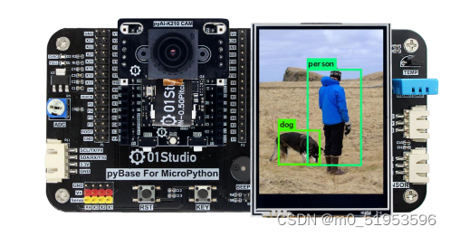
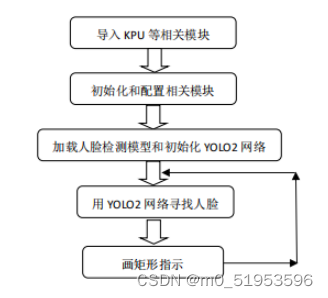
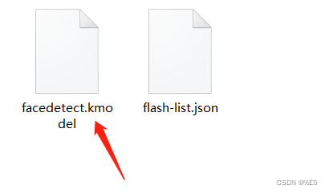
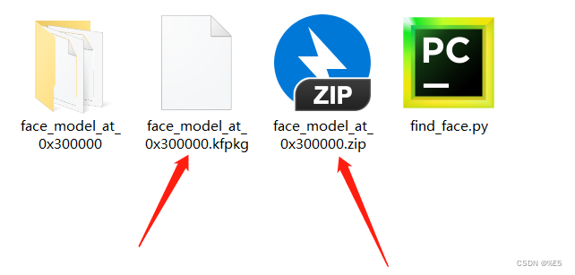
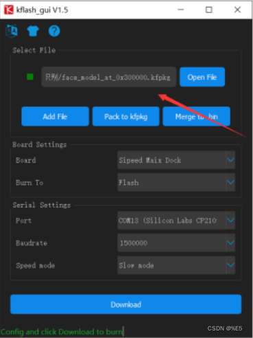

### 简介
[人脸识别](https://so.csdn.net/so/search?q=%E4%BA%BA%E8%84%B8%E8%AF%86%E5%88%AB&spm=1001.2101.3001.7020)成为最有潜力的生物身份验证手段，这种应用背景要求自动人脸识别系统能够对一般图象具有一定的识别能力。
今天，[人脸检测](https://so.csdn.net/so/search?q=%E4%BA%BA%E8%84%B8%E6%A3%80%E6%B5%8B&spm=1001.2101.3001.7020)的应用背景已经远远超出了人脸识别系统的范畴，在基于内容的检索、数字视频处理、视频检测等方面有着重要的应用价值。
### 一、实验目的
通过MicroPython编程快速实现人脸检测，将摄像头拍摄到的画面中的人脸用矩形框表示出来。
### 二、实验套件
K210开发板、LCD显示屏、OpenCV

### 三、实验原理
KPU是K210 内部一个神经网络处理器，它可以在低功耗的情况下实现卷积神经网络计算，实时获取被检测目标的大小、坐标和种类，对人脸或者物体进行检测和分类。 
**KPU 具备以下几个特点：**
①支持主流训练框架按照特定限制规则训练出来的定点化模型。
②对网络层数无直接限制，支持每层卷积神经网络参数单独配置，包括输入输出通道数目、输入输出行、宽、列、高。
③支持两种卷积内核 1x1 和 3x3
④支持任意形式的激活函数。
⑤实时工作时最大支持神经网络参数大小为 5.5MB 到 5.9MB。
⑥非实时工作时最大支持网络参数大小为（Flash 容量-软件体积）
简单来说就是 KPU 能加载和运行各种现成的 AI 算法模型，实现各种机器视觉等功能。 MaixPy 中人脸识别本质是目标检测，主要通过在 K210 的 KPU 上跑 YOLO（You Only Look Once）目标检测算法来实现。
### 四、构造函数
| > import KPU as kpu

 | 常用的 KPU 模块导入方法 |
| --- | --- |
| > 【offset】

 | 模型存放在 flash 的偏移量 |
| > 【file_path】

 | 模型在文件系统为文件名 |
| > 【kpu_net】

 | kpu 网络对象 |
| > 【threshold】

 | 概率阈值 |
| > 【nms_value】

 | box_iou 门限 |
| > 【anchor_num】

 | 描点数 |
| > 【anchor】

 | 描点参数与模型参数一致 |
| > 【kpu_net】

 | 从 kpu_load()中返回的网络对象 |
| > 【image】

 | 从 sensor 中采集到的图像 |
| > 【kpu_net】

 | kpu 网络对象 |

具体编程思路如下：

### 五、参考代码
```
#实验名称：人脸检测


 


import sensor,lcd,time


import KPU as kpu


 


#设置摄像头


sensor.reset()


sensor.set_pixformat(sensor.RGB565)


sensor.set_framesize(sensor.QVGA)


#sensor.set_vflip(1)    #设置摄像头后置


 


lcd.init() #LCD初始化


clock = time.clock()


 


#模型放在文件系统中


#介绍的两个方法任选其一


#################


 


#方法1、从Flash加载模型。将模型（face.kfpkg）烧录到开发板flash 的 0x300000 位置 


#task = kpu.load(0x300000) 


 


#方法2、从SD加载模型卡上。将kmodel文件通过读卡器拷贝到SD卡。


#task = kpu.load("/sd/facedetect.kmodel") 


 


#################


 


#模型描参数


anchor = (1.889, 2.5245, 2.9465, 3.94056, 3.99987, 5.3658, 5.155437, 6.92275, 6.718375, 9.01025)


 


#初始化yolo2网络


a = kpu.init_yolo2(task, 0.5, 0.3, 5, anchor)


 


while(True):


    clock.tick()


    img = sensor.snapshot()


    code = kpu.run_yolo2(task, img) #运行yolo2网络


 


    #识别到人脸就画矩形表示


    if code:


        for i in code:


            print(i)


            b = img.draw_rectangle(i.rect())


 


    #LCD显示


    lcd.display(img)


 


    print(clock.fps())   #打印FPS
```
### 六、模型烧录方法
上述代码中讲述了两种方法，我们具体分析一下。 

#### 1.将模型放在 SD 卡中
在程序路径中可以看到有1个件夹face_model_at_0x300000，将里面的 facedetect.kmodel 文件移动到SD卡，运行上述代码即可。

#### 2.将模型烧录到 K210 的 Flash 中
打开示例程序路径的件夹face_model_at_0x300000里面flash-list.json文件，直接将kmodel 和json这两个文件用 zip 方式压缩，然后将zip后缀名改成** .kfpkg **，得到一个可以用 K210 固件烧录工具烧录的文件再使用K210。
            
固件烧录工具烧录直接烧录该文件即可。
#### 七、实验结果
运行代码，将摄像头正对人脸，可以看到将人脸检测出来。系统默认摄像头是前置。注要将开发板竖起来，即 LCD 横屏显示。
去识别图片时候，可以将摄像头设置成后置，sensor 初始化时增加以下代码：
```
sensor.set_vflip(1) #设置摄像头后置
```

---

具体资料我已放入百度网盘中，大家自行提取。
链接：https://pan.baidu.com/s/1ugEsq67OUYDSlWqNBn_NPQ 
提取码：t5ag

> 来自: [使用K210 开发板，轻松实现人脸检测（附代码）_k210开发板-CSDN博客](https://blog.csdn.net/m0_51953596/article/details/130518861?spm=1001.2101.3001.6650.8&utm_medium=distribute.pc_relevant.none-task-blog-2%7Edefault%7EBlogCommendFromBaidu%7ERate-8-130518861-blog-114642239.235%5Ev43%5Epc_blog_bottom_relevance_base8&depth_1-utm_source=distribute.pc_relevant.none-task-blog-2%7Edefault%7EBlogCommendFromBaidu%7ERate-8-130518861-blog-114642239.235%5Ev43%5Epc_blog_bottom_relevance_base8&utm_relevant_index=15)

