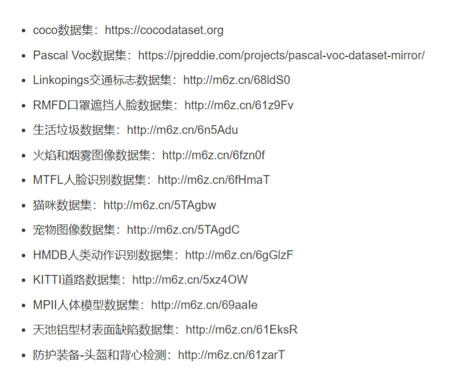
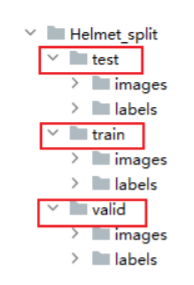
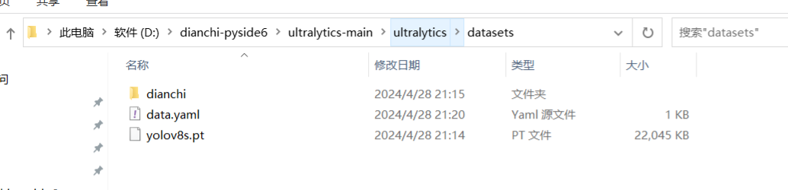
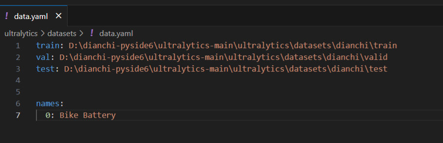
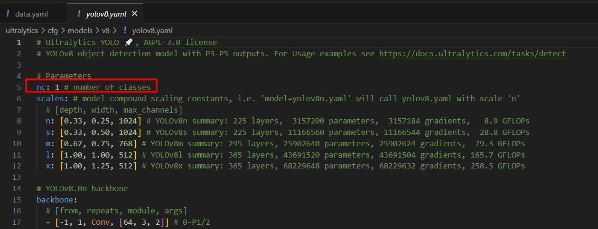
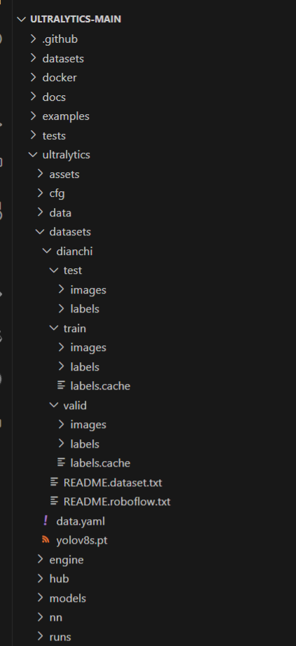
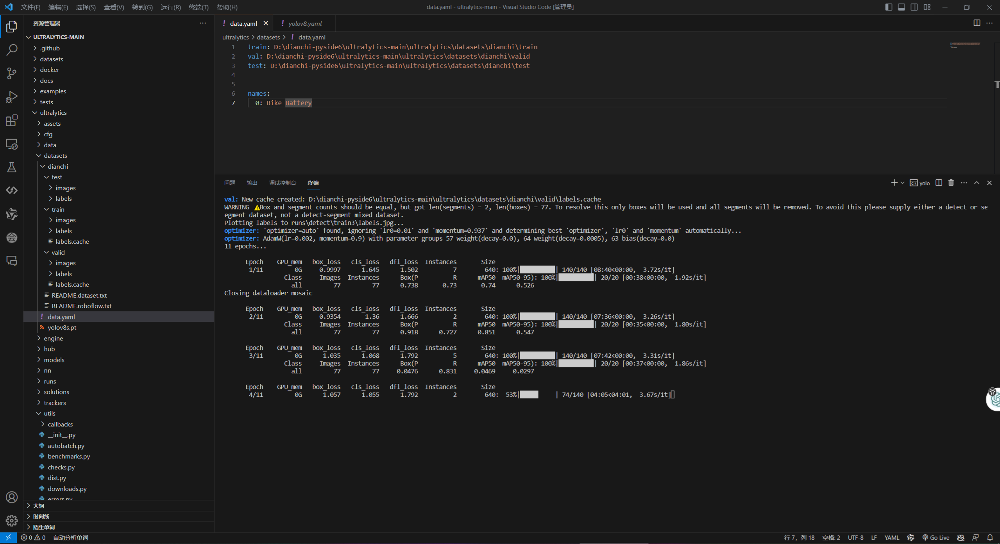

步骤：
```
#拉git clone https://github.com/ultralytics/ultralytics

#进入ultralytics文件夹
cd ultralytics-main/ultralytics
#安装依赖包
pip install ultralytics 
or 
pip install ultralytics  -i https://pypi.tuna.tsinghua.edu.cn/simple

#在ultralytics文件夹下创建datasets文件夹
mkdir datasets

cd datasets

#数据集，自己找或者找开源的roboflow,coco ，标注网站 Make Sense ,得到txt标签和images
#放train valid test文件夹，每个文件夹下分别放images和labels

#在datasets目录下创建yaml,名称任意
mkdir data.yaml

#填写数据集路径，绝对路径即可,names照写，类名改一下就行
#进入ultralytics/cfg/models/v8 ,修改yolov8.yaml，修改其中的类别数nc，检测几类就写几类

#下载预训练权重，https://github.com/ultralytics/assets/releases，我选了一个小一点的yolov8s.pt,放到datasets文件夹下

#开始训练，修改轮数，batch，model,yaml位置
yolo task=detect mode=train model=datasets/yolov8s.pt epochs=11 batch=1 data=datasets/data.yaml

#模型测试，用val或者是test数据集测试
yolo task=detect mode=val split=val model=runs/detect/train/weights/best.pt  data=datasets/data.yaml
yolo task=detect mode=val split=test model=runs/detect/train/weights/best.pt  data=datasets/data.yaml

#导出模型
yolo task=detect mode=export model=runs/detect/train/weights/best.pt


详细内容看
https://blog.csdn.net/xu1129005165/article/details/132666266

```








