转眼间~ [目标检测](https://so.csdn.net/so/search?q=%E7%9B%AE%E6%A0%87%E6%A3%80%E6%B5%8B&spm=1001.2101.3001.7020)经典模型Yolo的第八个版本就已经发布大半年了。在这篇文章中，笔者将一步一步详细实现使用Yolov8训练自己的数据集。具体步骤包含如下：

- 环境准备
- 准备数据集 
   - 数据采集
   - 数据标注
   - 数据拆分
- 配置文件
- 模型训练
- 模型预测
- 模型导出
### 环境准备
首先切换至指定目录，执行以下命令下载Yolov8项目代码。
```
git clone https://github.com/ultralytics/ultralytics
```
再切换至ultralytics，安装依赖包。
```
cd ultralytics
pip install -r requirements.txt
```
如果加快下载速度，可使用国内源，例如：
```
pip install -r requirements.txt -i https://pypi.tuna.tsinghua.edu.cn/simple
```
### 准备数据集
#### 数据采集
数据采集是深度学习和人工智能任务中至关重要的一步，它为模型提供了必要的训练样本和测试数据。在实际应用中，数据采集的方法多种多样，每种方法都有其独特的优势和适用场景。本文将介绍常见的数据采集方法，包括使用开源已标记数据集、爬取数据集、自己拍摄数据集以及使用数据增强[生成数据集](https://so.csdn.net/so/search?q=%E7%94%9F%E6%88%90%E6%95%B0%E6%8D%AE%E9%9B%86&spm=1001.2101.3001.7020)等。

1. 使用开源已标记数据集

使用开源数据集是一种常见且有效的数据采集方法。开源数据集通常已经过标记和验证，可大大节省数据采集和标注的时间和资源成本。例如ImageNet数据集，包含超过1400万张图像，可用于深度学习模型训练。此外，还有像Coco、DOTA数据集等，笔者在这里为大家整理了常见的深度学习开源数据集地址，具体如下，以供参考。

- coco数据集：https://cocodataset.org
- Pascal Voc数据集：https://pjreddie.com/projects/pascal-voc-dataset-mirror/
- Linkopings交通标志数据集：http://m6z.cn/68ldS0
- RMFD口罩遮挡人脸数据集：http://m6z.cn/61z9Fv
- 生活垃圾数据集：http://m6z.cn/6n5Adu
- 火焰和烟雾图像数据集：http://m6z.cn/6fzn0f
- MTFL人脸识别数据集：http://m6z.cn/6fHmaT
- 猫咪数据集：http://m6z.cn/5TAgbw
- 宠物图像数据集：http://m6z.cn/5TAgdC
- HMDB人类动作识别数据集：http://m6z.cn/6gGlzF
- KITTI道路数据集：http://m6z.cn/5xz4OW
- MPII人体模型数据集：http://m6z.cn/69aaIe
- 天池铝型材表面缺陷数据集：http://m6z.cn/61EksR
- 防护装备-头盔和背心检测：http://m6z.cn/61zarT
1. 爬取网络数据集

爬取网络数据集是指通过网络爬虫技术从网页、社交媒体、论坛等网络资源中获取数据。这种方法不仅可以获取大量的数据，而且还可以根据需求定制所需数据的类型和规模。
然而值得注意的是，爬取网络数据集也面临一些挑战和限制。其中之一是合法性和道德性问题。在爬取网络数据集时，我们必须遵守法律法规和隐私保护原则，确保数据的合法获取和使用。此外，网络数据的质量和准确性也是需要考虑的问题。互联网上的数据可能存在错误、噪声和伪造信息，需要进行数据清洗和验证。

1. 自己拍摄数据集

如果您的应用需要处理特定的场景和环境，那么通用的数据集可能无法涵盖所需数据，则需要自己拍摄数据集。例如，在无人驾驶领域，您可能需要收集和标注与您特定驾驶场景相关的图像和传感器数据，以训练自动驾驶模型。


1. 使用数据增强生成数据集

当数据集相对较小或不足以训练出具有良好性能的模型时，我们可以使用数据增强扩充数据集的规模。以下是一些常见的数据增强技术，可以用于生成数据集：

- 旋转
- 翻转
- 缩放
- 裁剪
- …

笔者在这里使用的是安全帽佩戴数据集。
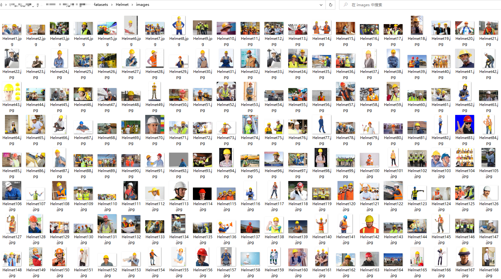
#### 标注数据集
> **什么是数据标注？**
数据标注是通过人工把需要识别和分辨的数据贴上标签。深度神经网络学习这些标注数据的特征，最终实现自主识别的功能。

常用的标注工具有labelImg、LabelMe等，但是这些图像标注软件安装和打开都比较麻烦。笔者在这里选用了一款在线标注数据集的工具[Make Sense](https://www.makesense.ai/)。
**标注通用规则**

- 贴边规则：标注框需紧贴目标物体的边缘进行画框标注，不可框小或框大。
- 重叠规则：当两个目标物体有重叠的时候，只要不是遮挡超过一半的就可以框的（遮挡范围需要根据算法识别情况制定），允许两个框有重叠的部分。如果其中一个物体挡住另一个物体一部分，框的时候就需要对另一个物体的形状进行脑补完整然后框起来即可。
- 独立规则：每一个目标物体均需要单独拉框，比如下图中三瓶水不能只拉一个框，而是要将三个目标分别拉框。
- 不框规则：图像模糊不清的不框，太暗和曝光过度的不框，不符合项目特殊规则的不框。
- 边界检查：确保框坐标不在图像边界上，防止载入数据或者数据扩展过程出现越界报错。
- 小目标规则：不同的算法对小目标的检测效果不同，对于小目标只要人眼能分清，都应该标出来。根据算法的需求，去决定是否启用这些样本参与训练。

**开始标注**
打开[Make Sense](https://www.makesense.ai/)点击Get Start即可开始标注。
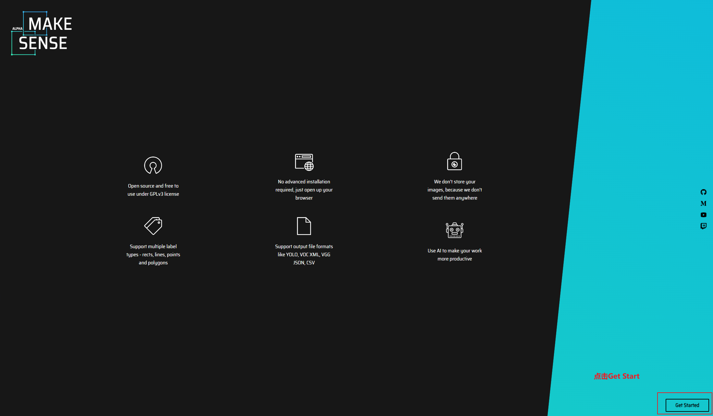
进入下一个页面，点击Drop images并选中所有数据集。
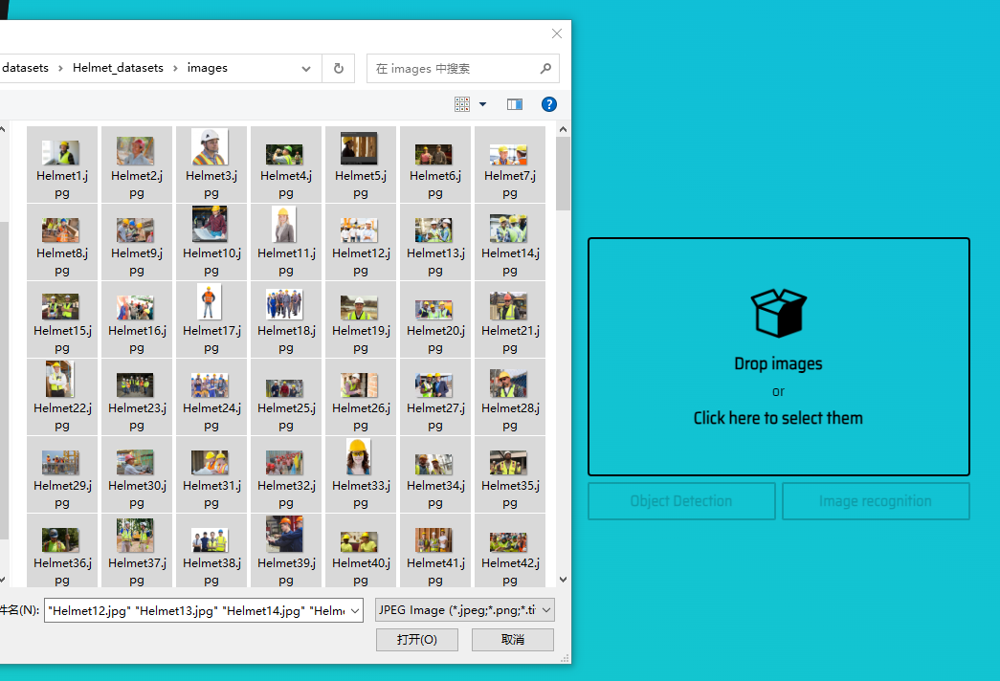
点击 Object Detection ，并添加标签，笔者这里以安全帽为例，所以创建标签Helmet。
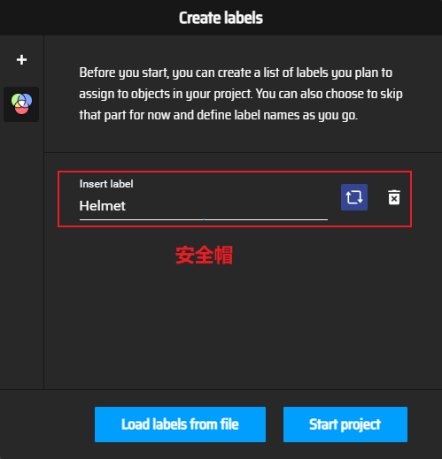
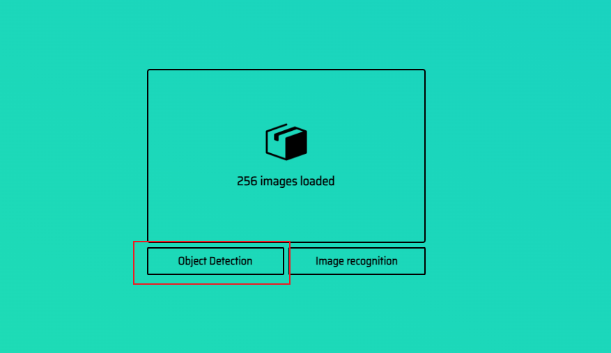
最后点击start project，便可以开始标注。
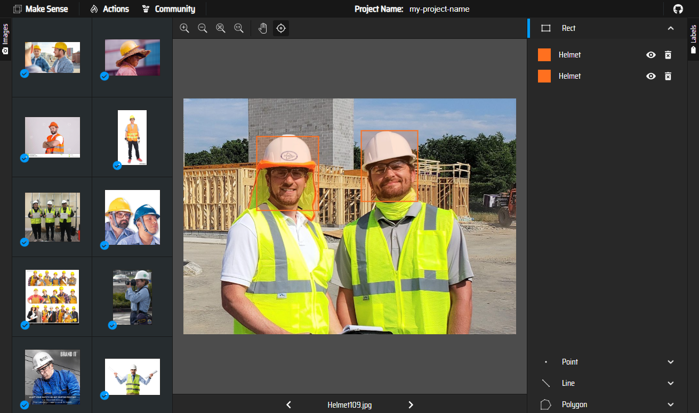
标注完成后，点击Action->Export Annotation，即可导出[Yolo](https://so.csdn.net/so/search?q=Yolo&spm=1001.2101.3001.7020)格式的标签。
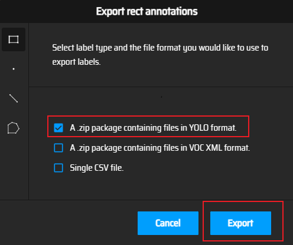
标签格式如下：
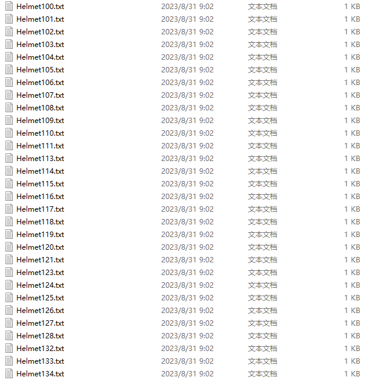
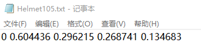
```
<object-class> <x> <y> <width> <height>
```
其中，x，y，width和height是指目标的中心点坐标及宽高信息。
#### 拆分数据集
将标注好的数据集拆分为训练集、验证集、测试集三部分，拆分后的数据集目录如下图所示。
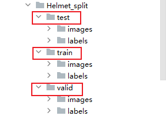
另外附上拆分数据集源代码，您只需要替换为自己的实际路径即可。
```
import os
import random
import shutil

# 原数据集目录
root_dir = 'datasets/Helmet_dataset'
# 划分比例
train_ratio = 0.8
valid_ratio = 0.1
test_ratio = 0.1

# 设置随机种子
random.seed(42)

# 拆分后数据集目录
split_dir = 'datasets/Helmet_split'
os.makedirs(os.path.join(split_dir, 'train/images'), exist_ok=True)
os.makedirs(os.path.join(split_dir, 'train/labels'), exist_ok=True)
os.makedirs(os.path.join(split_dir, 'valid/images'), exist_ok=True)
os.makedirs(os.path.join(split_dir, 'valid/labels'), exist_ok=True)
os.makedirs(os.path.join(split_dir, 'test/images'), exist_ok=True)
os.makedirs(os.path.join(split_dir, 'test/labels'), exist_ok=True)

# 获取图片文件列表
image_files = os.listdir(os.path.join(root_dir, 'images'))
label_files = os.listdir(os.path.join(root_dir, 'labels'))

# 随机打乱文件列表
combined_files = list(zip(image_files, label_files))
random.shuffle(combined_files)
image_files_shuffled, label_files_shuffled = zip(*combined_files)

# 根据比例计算划分的边界索引
train_bound = int(train_ratio * len(image_files_shuffled))
valid_bound = int((train_ratio + valid_ratio) * len(image_files_shuffled))

# 将图片和标签文件移动到相应的目录
for i, (image_file, label_file) in enumerate(zip(image_files_shuffled, label_files_shuffled)):
    if i < train_bound:
        shutil.move(os.path.join(root_dir, 'images', image_file), os.path.join(split_dir, 'train/images', image_file))
        shutil.move(os.path.join(root_dir, 'labels', label_file), os.path.join(split_dir, 'train/labels', label_file))
    elif i < valid_bound:
        shutil.move(os.path.join(root_dir, 'images', image_file), os.path.join(split_dir, 'valid/images', image_file))
        shutil.move(os.path.join(root_dir, 'labels', label_file), os.path.join(split_dir, 'valid/labels', label_file))
    else:
        shutil.move(os.path.join(root_dir, 'images', image_file), os.path.join(split_dir, 'test/images', image_file))
        shutil.move(os.path.join(root_dir, 'labels', label_file), os.path.join(split_dir, 'test/labels', label_file))
```
### 配置文件
将准备的数据集存放至Yolov8项目代码的ultralytics目录。
#### 创建yaml文件
在数据集同级目录创建 **Helmet.yaml** 文件。
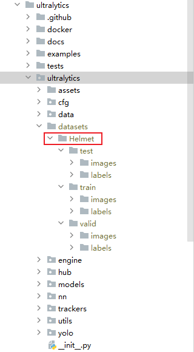
并填入以下内容，您可以根据自己的实际路径替换。
```
# Helmet
train: D:\aaa_my_own_xxj\code\my_own_test\ultralytics\ultralytics\datasets\Helmet\train
val: D:\aaa_my_own_xxj\code\my_own_test\ultralytics\ultralytics\datasets\Helmet\valid 
test: D:\aaa_my_own_xxj\code\my_own_test\ultralytics\ultralytics\datasets\Helmet\test

# Classes
names:
  0: Helmet
```
#### 配置Yolov8
切换至 cfg/models/v8 目录，修改yolov8.yaml文件（这里主要修改的是类别数nc）。
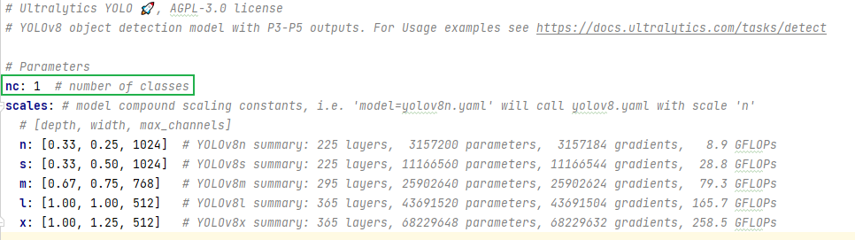
### 模型训练
#### 下载预训练模型
在Yolov8的GitHub开源库中下载对应版本的模型。我选的是yolo8s.pt。
https://github.com/ultralytics/assets/releases
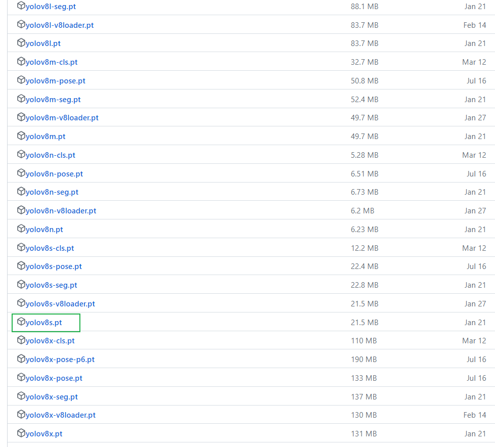
#### 训练
接下来就是训练模型了，笔者在这里选用的是从预训练的*.pt模型开始训练，执行命令如下：
```
yolo task=detect mode=train model=datasets/yolov8s.pt epochs=10 batch=1 data=datasets/Helmet.yaml
```
当然，你也可以选择其它两种方式：

1. 从yaml构建一个全新的模型，训练命令如下：
```
yolo task=detect mode=train model=yolov8s.yaml epochs=10 batch=1 data=datasets/Helmet.yaml
```

1. 从yaml中构建一个新模型，将预训练的权重转移到它并开始训练。
```
yolo task=detect mode=train model=yolov8s.yaml pretrained=yolov8s.pt epochs=10 batch=1 data=datasets/Helmet.yaml
```
其中，

- task：选择任务类型，可选[‘detect’, ‘segment’, ‘classify’, ‘init’]。
- mode: 选择是训练、验证还是预测的任务类型，可选[‘train’, ‘val’, ‘predict’]。
- model: 选择yolov8不同的模型配置文件，可选yolov8s、yolov8m、yolov8l、yolov8x、yolov8n。
- data: 选择生成的数据集配置文件。
- epochs：指的就是训练过程中整个数据集将被迭代多少次（我这里是cpu训练所以调的比较小）。
- batch：一次看完多少张图片才进行权重更新（同上）。
- pretrained：预训练模型。

训练ing…
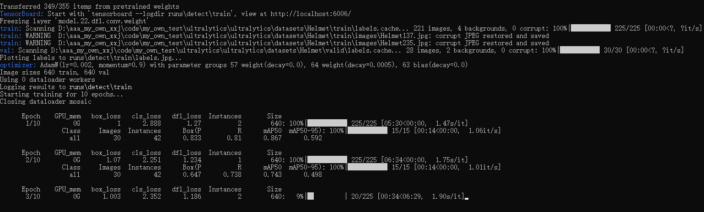
训练完成，会在.\runs\detect\train\weights文件夹生成best.pt和last.pt权重。
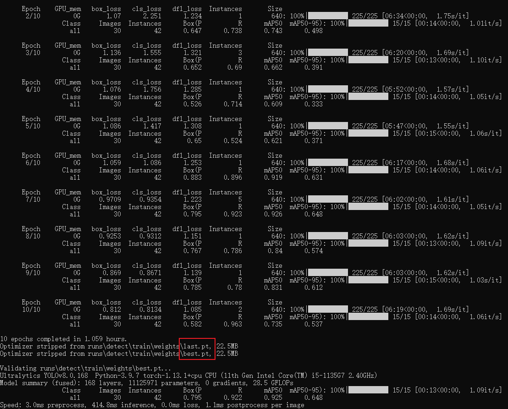
### 模型测试
设置val数据集进行模型验证，命令如下：
```
yolo task=detect mode=val split=val model=runs/detect/train/weights/best.pt  data=datasets/Helmet.yaml
```
验证完成后，打开.\runs\detect\val文件夹，即可看到模型验证效果如下图所示。
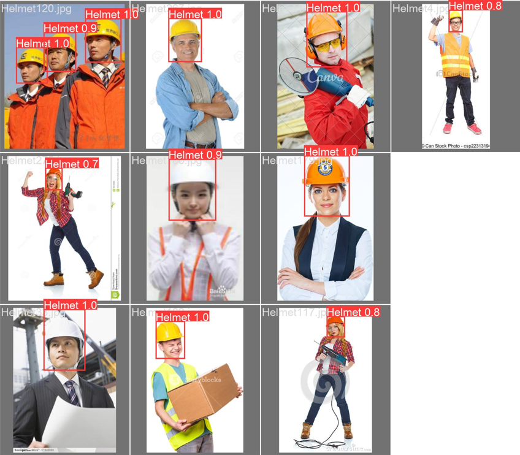
同理，设置test数据集进行模型预测，命令如下：
```
yolo task=detect mode=val split=test model=runs/detect/train/weights/best.pt  data=datasets/Helmet.yaml
```
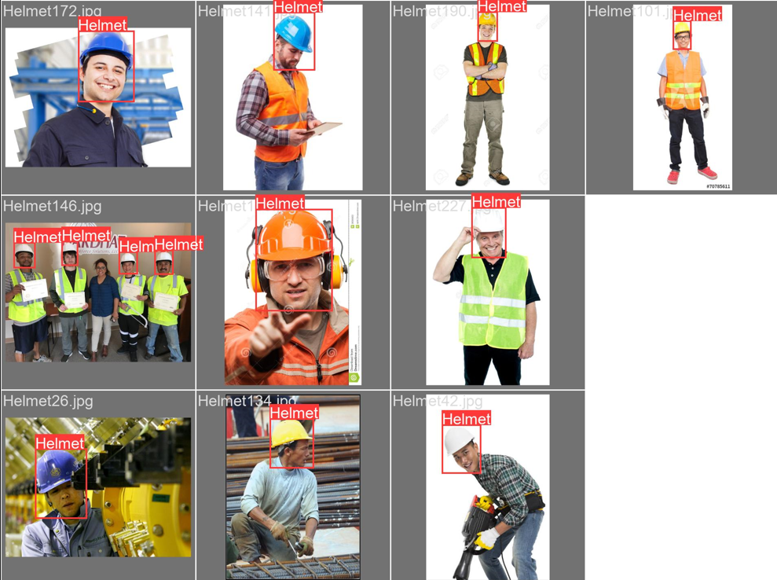
### 模型导出
执行以下命令，导出模型。
```
yolo task=detect mode=export model=runs/detect/train/weights/best.pt
```
至此，使用Yolov8训练自己的数据集就完成了。

> 来自: [手把手实现 | 使用Yolov8训练自己的数据集【环境配置-准备数据集(采集&标注&划分)-模型训练(多种方式)-模型预测-模型导出】-CSDN博客](https://blog.csdn.net/xu1129005165/article/details/132666266)

