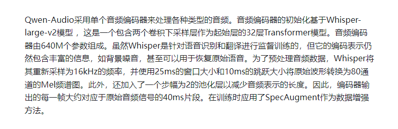
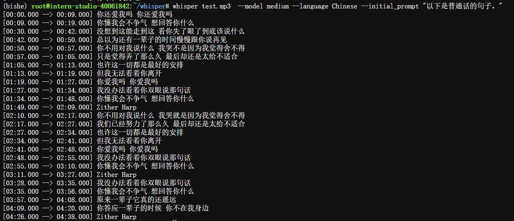
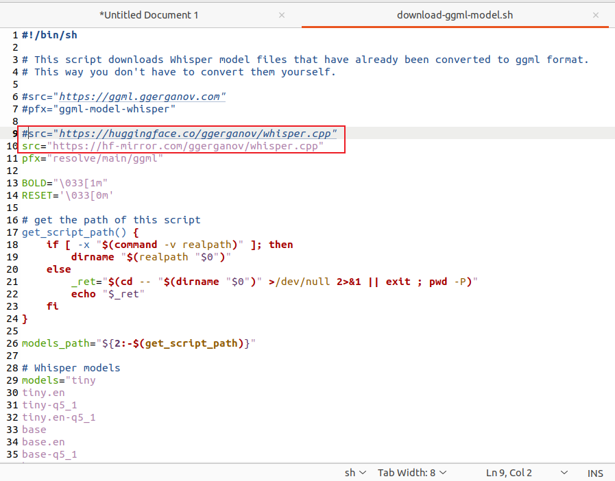
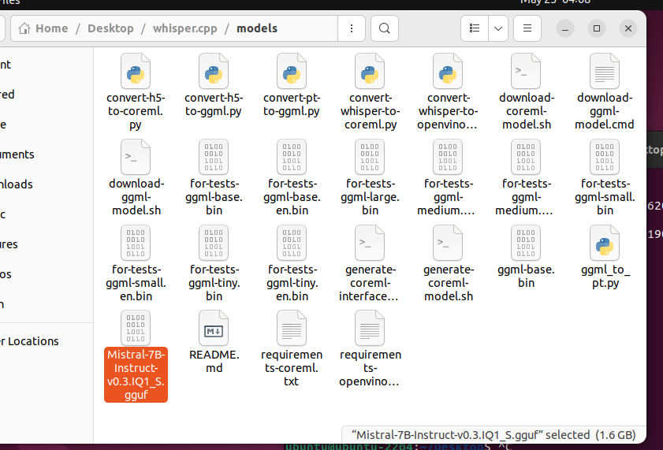

#### gradio部署可以用上
[https://huggingface.co/spaces/wenet/wenet_demo/tree/main](https://huggingface.co/spaces/wenet/wenet_demo/tree/main)

#### wenet GitHub地址
[https://github.com/wenet-e2e/wenet](https://github.com/wenet-e2e/wenet)

wenent 论文地址
[https://zhuanlan.zhihu.com/p/344748090](https://zhuanlan.zhihu.com/p/344748090)
[https://zhuanlan.zhihu.com/p/349586567](https://zhuanlan.zhihu.com/p/349586567)


#### Qwen-Audio
[https://zhuanlan.zhihu.com/p/667151872](https://zhuanlan.zhihu.com/p/667151872)

#### 百度云语音转文字识别接口
[https://zhuanlan.zhihu.com/p/65579443](https://zhuanlan.zhihu.com/p/65579443)


#### whisper
[https://zhuanlan.zhihu.com/p/631899440](https://zhuanlan.zhihu.com/p/631899440)
[https://www.zhihu.com/zvideo/1625779747656515584](https://www.zhihu.com/zvideo/1625779747656515584)
[https://zhuanlan.zhihu.com/p/618826760](https://zhuanlan.zhihu.com/p/618826760)
[https://zhuanlan.zhihu.com/p/668275615?utm_psn=1710920825354625024](https://zhuanlan.zhihu.com/p/668275615?utm_psn=1710920825354625024)
[https://zhuanlan.zhihu.com/p/595691785](https://zhuanlan.zhihu.com/p/595691785)


```markdown
 whisper test.mp3  --model medium --language Chinese --initial_prompt "以下是普通话的句子。" 
```


conda 环境whisper有问题，用不了，用bishe


## 整体步骤流程
[https://blog.csdn.net/zcxey2911/article/details/130482317](https://blog.csdn.net/zcxey2911/article/details/130482317)

配置Whisper.cpp
老规矩，运行git命令来克隆Whisper.cpp项目：

```
git clone https://github.com/ggerganov/whisper.cpp.git
```

随后进入项目的目录：

```
cd whisper.cpp
```

项目默认的基础模型不支持中文，这里推荐使用medium模型，通过shell脚本进行下载：

```
bash ./models/download-ggml-model.sh base
```
这里下载不了的，进入downlaod-ggml-model.sh 修改huggingface镜像站，或者手动下载上传


进入whisper.cpp根目录，做make编译，先安装make
```
apt update
apt install make
apt install make-guile

make
```
  可能提示缺少gcc和g++
```
apt install gcc g++
apt install build-essential
make
```
   
测试能否使用
```
./main -osrt -m ./models/ggml-base.bin -f samples/jfk.wav

```
安装ffmpeg
```
apt install ffmpeg
#ffmpeg可将MP3转为wav
#在根目录上传一个test1.MP3，转一下wav
ffmpeg -i ./test.mp3 -ar 16000 -ac 1 -c:a pcm_s16le ./test.wav
#测试一下，一般会转成繁体
./main -osrt -m ./models/ggml-base.bin -f samples/test.wav -l zh
#使用下面的可转简体，加上prompt即可
./main -osrt -m ./models/ggml-base.bin -f samples/test.wav -l zh --prompt "以下是普通话的句子。"
 
```
command编译
参考[https://github.com/ggerganov/whisper.cpp/blob/master/examples/command/README.md](https://github.com/ggerganov/whisper.cpp/blob/master/examples/command/README.md)

```
# install sdl2
sudo apt-get install libsdl2-dev
#编译
make command
# 运行测试
./command -m ./models/ggml-base.bin -t 8
```
talk-llama编译
参考[https://github.com/ggerganov/whisper.cpp/blob/master/examples/talk-llama/README.md](https://github.com/ggerganov/whisper.cpp/blob/master/examples/talk-llama/README.md)
```
sudo apt-get install libsdl2-dev
make talk-llama
#这一步很狗啊，他这个是⚠警告不是报错，我以为是报错，一直没进行下去，艹，最后才发现
# Run it
./talk-llama -mw ./models/ggml-base.bin -ml ../whisper.cpp/models/Mistral-7B-Instruct-v0.3.IQ1_S.gguf -p "Georgi" -t 8

```
我这里随便下了一哥mis的gguf模型，放一下位置就行了，没什么难的


还可以用它这个，
[https://zhuanlan.zhihu.com/p/668275615?utm_psn=1710920825354625024](https://zhuanlan.zhihu.com/p/668275615?utm_psn=1710920825354625024)

对了 ollama的post调用不能不会啊
[https://blog.csdn.net/luwei42768/article/details/138034137](https://blog.csdn.net/luwei42768/article/details/138034137)

简易版
[https://blog.csdn.net/dfBeautifulLive/article/details/134291088](https://blog.csdn.net/dfBeautifulLive/article/details/134291088)


对了，很重要的一件事，vm虚拟机直接下载vmx，直接导入，不要自己去下安装，特别慢
vmx下载链接放这里了[https://www.linuxvmimages.com/images/ubuntu-2204/#google_vignette](https://www.linuxvmimages.com/images/ubuntu-2204/#google_vignette)
